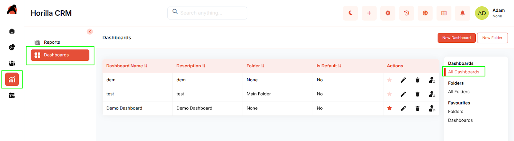
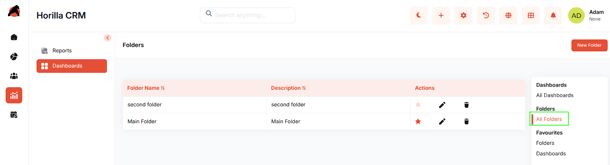
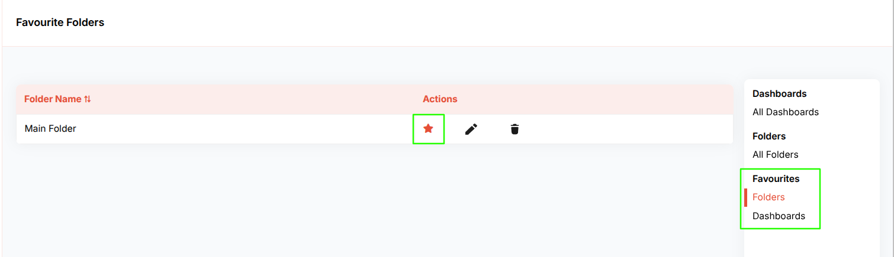
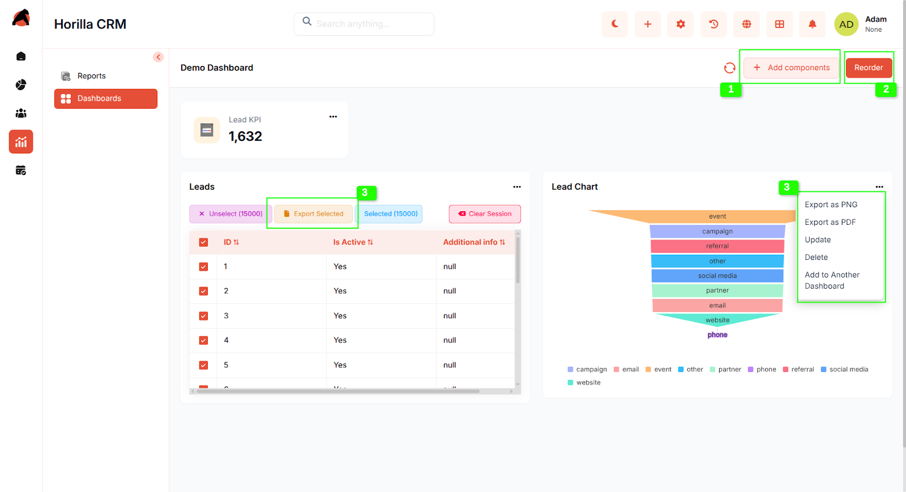
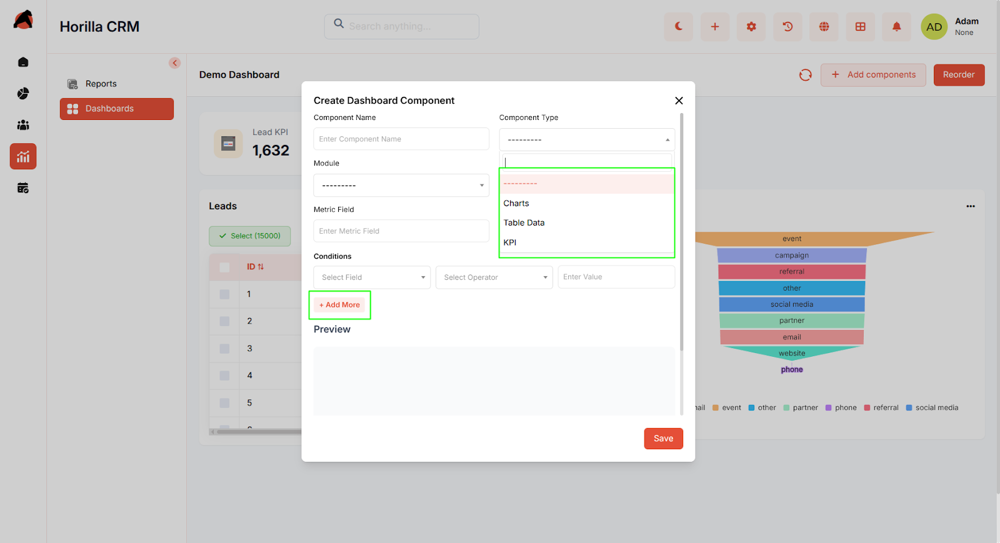
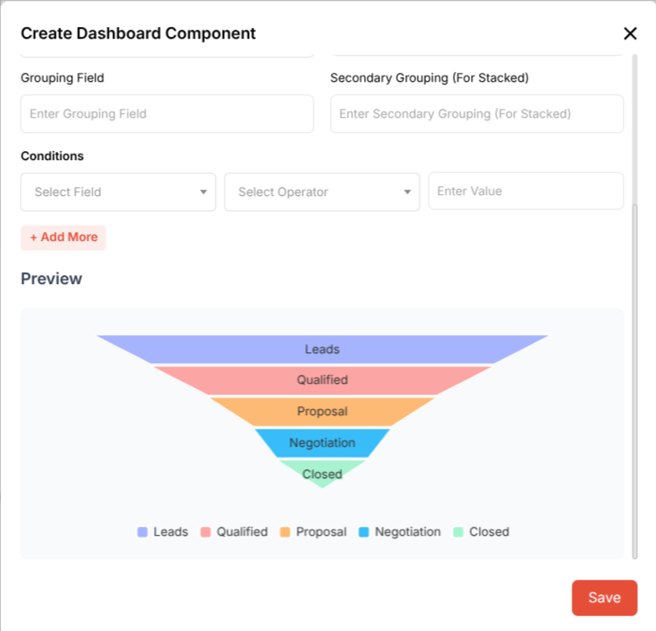
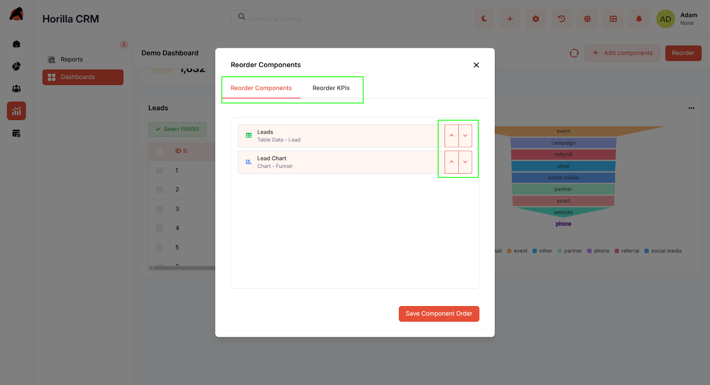
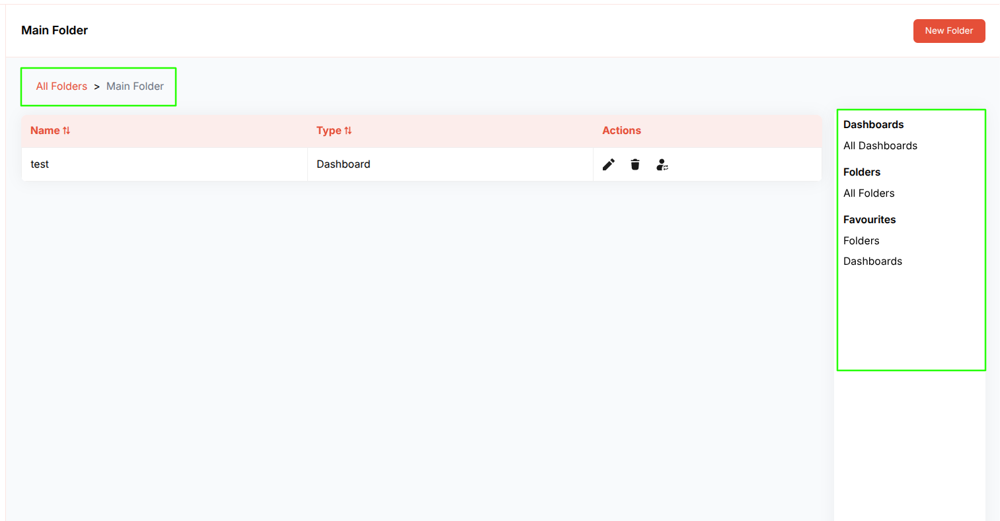
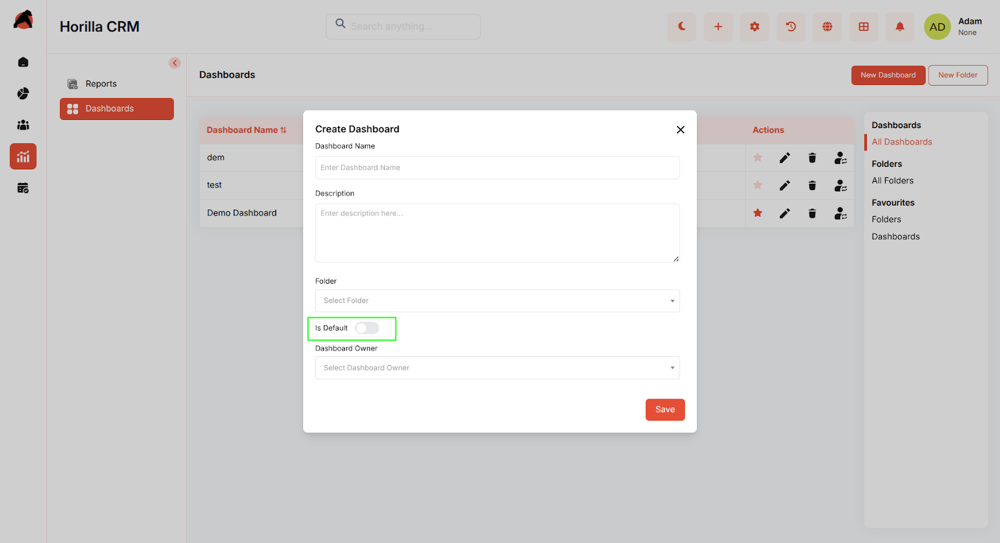
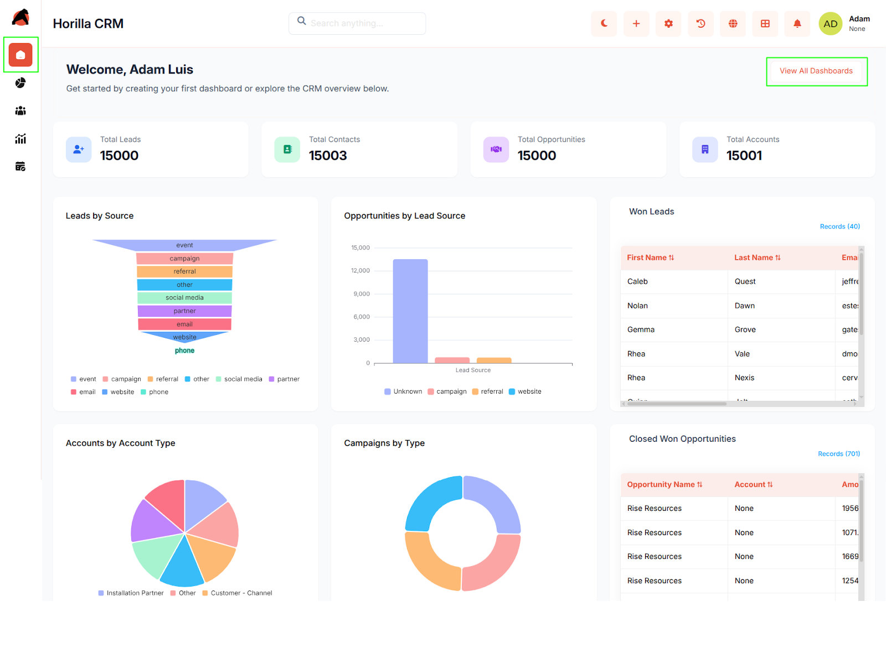

# **Horilla CRM Dashboard & Home – Functional Guide**

## **Introduction**

The **Horilla CRM Dashboard & Home Page Module** provides a powerful, user-friendly interface for visualizing and analyzing key business metrics and CRM performance indicators. Designed for CRM administrators, business analysts, and end-users, this module integrates seamlessly with other Horilla CRM components to deliver real-time insights. Users can create customizable dashboards, organize them hierarchically, and configure personalized home pages to streamline access to critical data. With intuitive navigation, flexible component management, and robust export options, the module empowers users to monitor and optimize business performance efficiently.

## **Key Features and Functionalities**

### **1.1 Dashboard Management**

**Purpose**: Enable users to create, organize, and manage multiple analytical dashboards for tailored business insights.

* **Create Multiple Dashboards**: Users can create unlimited dashboards to track various business needs (e.g., sales performance, customer support metrics).  
* **Dashboard Naming & Description**: Assign descriptive names (e.g., "Q1 Sales Overview") and detailed descriptions for easy identification.  
* **Default Dashboard Selection**: Set any dashboard as the default home page for quick access upon login.  
* **Dashboard Owner Assignment**: Assign dashboards to specific users or teams for ownership and access control (e.g., view-only or edit permissions).  
* **Navigation to Dashboard Detail**: Clicking a dashboard name navigates to its detailed view, displaying all configured components.

### **1.2 Folder Organization System**

**Purpose**: Provide a hierarchical structure for organizing dashboards and improving navigation.

* **Create Multiple Folders**: Organize dashboards into logical folders (e.g., "Sales Dashboards," "Marketing Analytics").  
* **Folder Naming & Description**: Assign clear names and descriptions to folders for easy reference.  
* **Nested Folder Support**: Folders can contain dashboards and sub-folders, enabling hierarchical organization (e.g., Main Folder \> Sales \> Q1 Reports). 
* **Folder Detail View**: Clicking a folder name displays its contents, including dashboards and sub-folders.  
* **Dashboard-Folder Assignment**: Move dashboards between folders or assign them to a folder during creation.

### **1.3 Favorites Management**

**Purpose**: Allow quick access to frequently used dashboards and folders .

* **Favorite Any Dashboard**: Mark any dashboard/folders as a favorite, regardless of its folder location.  
* **Quick Favorite Access**: Favorited ones appear in a dedicated "Favorites" section in the sidebar.  
* **Visual Favorite Indicators**: Star icons highlight favorite dashboards/folders in listings for easy identification.

  

### **1.4 Dashboard Detail View & Interaction**

**Purpose**: Provide a comprehensive, interactive view of dashboards and their components.

* **Interactive Dashboard Display**: View all configured components in an organized, responsive layout.  
  1. **Add Components Button**: Easily add new widgets via a dedicated button.  
  2. **Reorder Functionality**: Reorganize dashboard layout using drag-and-drop controls.  
  3. **Component-Specific Actions**:  
     * **Export Options**: Export  chart components as PNG or PDF for reporting.  
     * **Export** **Table** Components as CSV,Excel,PDF  
     * **Update Components**: Modify existing component configurations (e.g., update filters or metrics).  
     * **Delete Components**: Remove unwanted widgets from the dashboard.  
     * **Copy to Other Dashboards**: Duplicate components to other dashboards for reuse.

### **1.5 Dashboard Components & Widgets**

**Purpose**: Provide flexible data visualization through diverse component types to display CRM data effectively.

* **Available Component Types**:  
  * **Charts**: Visualize data with bar, line, pie, or other chart types (e.g., a line chart showing monthly lead growth).  
  * **Table Data**: Display CRM data in tabular format (e.g., a table listing top customers by revenue).  
  * **KPI Widgets**: Highlight **key performance indicators**, such as total sales or customer satisfaction scores.  
* **Component Configuration**:  
  * **Component Name**: Assign descriptive names (e.g., "Lead Conversion Rate").  
  * **Module Selection**: Choose data source modules (e.g., Sales, Leads, Customer Support).  
  * **Metric Field Selection**: Select specific metrics to display (e.g., "Total Revenue" or "Number of Active Leads").  
  * **Condition-Based Filtering**: Apply filters with multiple conditions (e.g., "Show sales data for Q1 2025 where revenue \> $10,000").

### 

### 

### **1.6 Component Preview & Management**

**Purpose**: Enable users to preview and manage dashboard components efficiently.

* **Real-time Preview**: Preview component appearance before adding it to a dashboard.  

* **Component Reordering**: Drag-and-drop to reorder all dashboard components for customized layouts.  
* **Separate KPI Reordering**: Independently reorder KPI widgets for prioritized display.  

### **1.7 Navigation & Folder Hierarchy**

**Purpose**: Ensure intuitive navigation through the dashboard organizational structure.

* **Breadcrumb Navigation**: Displays the current path (e.g., All Folders \> Sales \> Q1 Dashboards) for easy orientation.  
* **Sidebar Navigation**: Includes sections for:  
  * All Dashboards  
  * All Folders  
  * Favorites (Folders & Dashboards)  
* **Hierarchical Folder View**: Folders can contain dashboards and sub-folders for flexible organization.  
* **Quick Navigation Actions**: Direct links to create dashboards, manage folders, or access favorites.

### **1.8 Home Page Configuration**

**Purpose**: Deliver personalized home page experiences based on user preferences.

* **Default Dashboard Home Page**: Setting a dashboard as default makes it the user’s home page upon login.  

* **System Default Home Page**: If no dashboard is set, users see the standard system home page.  
    

    
* **Dynamic Home Page Loading**: Home page content updates automatically based on default dashboard selection.  
* **User-Specific Configuration**: Each user can set their own default dashboard for a tailored experience.

## **Benefits**

* **Centralized Business Intelligence**: Unified access to CRM analytics and metrics in one interface.  
* **Flexible Organization**: Hierarchical folder system supports diverse organizational needs.  
* **Personalized Experience**: Custom home pages and favorites enhance user efficiency.  
* **Real-time Data Visualization**: Dynamic components deliver up-to-date insights.  
* **Scalable Dashboard Management**: Supports unlimited dashboards and folders for growing businesses.  
* **Enhanced Productivity**: Favorites and quick navigation reduce time spent locating key dashboards.  
* **Comprehensive Analytics**: Multiple component types address varied analytical needs.  
* **User-Friendly Interface**: Intuitive navigation and management lower the learning curve.  
* **Data Export Capabilities**: PNG and PDF exports facilitate reporting and external analysis.  
* **Collaborative Dashboard Sharing**: Ownership and folder assignments enable team collaboration.
