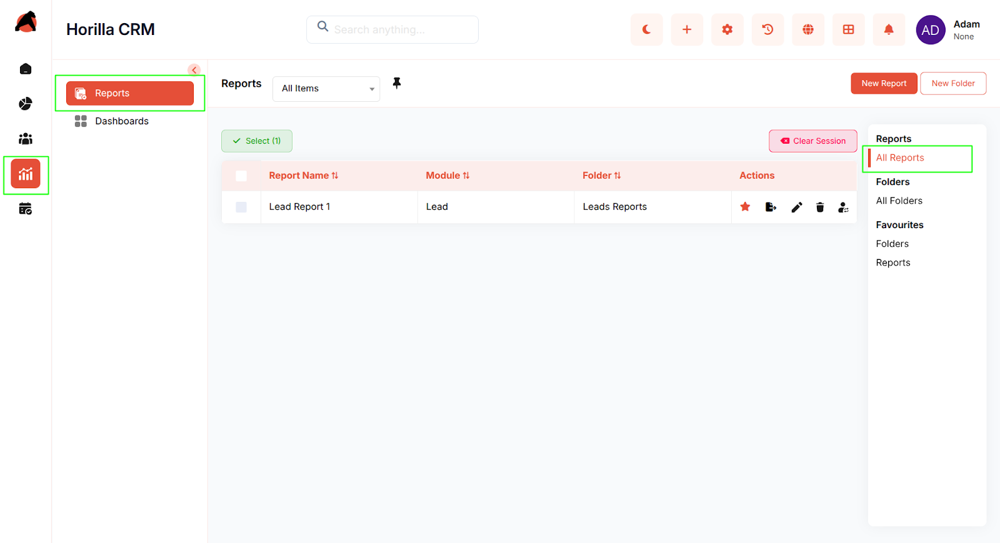
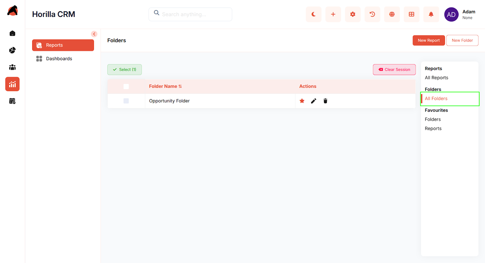

# **Analytics**

## **Introduction**

The Horilla CRM Analytics Section provides a comprehensive platform for data analysis and business intelligence within your organization. This section integrates two powerful modules: **Reports** and **Dashboards**. The Reports module enables users to create, organize, and analyze detailed CRM data through customizable tables, pivot tables, and charts. The Dashboards module allows administrators and users to build personalized analytical dashboards with visual components, KPIs, and real-time metrics. Together, the Analytics Section empowers organizations to gain actionable insights, monitor performance, and make data-driven decisions efficiently.

## **Key Features and Functionalities**

### **2.1 Analytics Section Overview**

**Purpose:** Provide a unified interface for comprehensive business intelligence and data analysis.

**Access:** Analytics section in the sidebar with two sub-sections:

* Reports  
* Dashboards

**Key Features:**

* Centralized access point for all reporting and analytical needs  
* Two complementary modules for detailed analysis and visual insights  
* Flexible organization through folders and favorites  
* Multiple data visualization options (tables, charts, KPIs, pivot tables)  
* Export capabilities for sharing data externally  
* Hierarchical organization structure for scalable management

### **2.2 Reports Module**

**Purpose:** Enable creation and analysis of detailed CRM data reports with customizable views.

**Access:** Analytics → Reports

**Key Features:**

* View all available reports in a centralized list  
* Create new reports with custom configurations  
* Organize reports into folders for easy categorization  
* Mark reports as favorites for quick access  
* Detail table view displaying record-level data with selected columns  
* Pivot table functionality to summarize and group data by up to 3 fields  
* Report charts with multiple visualization types (pie, bar, line, etc.)  
* Filter data with customizable conditions  
* Edit report configurations including columns, grouping, and filters  
* Export reports as CSV, Excel, or PDF  
* Delete outdated reports  
* Move reports between folders  
* Edit report names and configurations

### **2.3 Dashboards Module**

**Purpose:** Deliver personalized, visual analytics through interactive dashboard components.

**Access:** Analytics → Dashboards

**Key Features:**

* Create unlimited dashboards for various business needs  
* Organize dashboards into hierarchical folders with nesting support  
* Set a dashboard as default home page upon login  
* Assign dashboard ownership for access control  
* Configure multiple dashboard components including charts, tables, and KPI widgets  
* Add or remove components from dashboards  
* Reorder dashboard components using drag-and-drop  
* Apply condition-based filtering to dashboard components  
* Export dashboard charts as PNG or PDF  
* Export table components as CSV, Excel, or PDF  
* Copy components to other dashboards for reuse  
* Update or delete components from dashboards  
* Mark dashboards and folders as favorites  
* Real-time data preview before adding components  
* User-specific home page configuration

### **2.4 Reports & Dashboards Integration**

**Purpose:** Enable seamless data flow between reports and dashboard components.

**Key Features:**

* Report data can be visualized through dashboard components  
* Consistent filtering and grouping options across both modules  
* Shared export capabilities (PNG, PDF, CSV, Excel)  
* Reusable components for multiple dashboards  
* Cross-module navigation and data linking

### **2.5 Organization and Navigation**

**Purpose:** Provide efficient organization and quick access to analytical resources.

**Key Features:**

* Folder creation and management for both reports and dashboards  
* Nested folder support for hierarchical organization  
* Favorites section in sidebar for frequently used reports and dashboards  
* Star icons to mark favorite items  
* Breadcrumb navigation for easy orientation  
* Quick filters (All Reports, All Folders, Favorites, etc.)  
* Search functionality across reports and dashboards

## **Conclusion**

The Horilla CRM Analytics Section provides organizations with a powerful, integrated platform for data analysis and business intelligence. By combining detailed reporting capabilities with visual dashboard analytics, the section enables users at all levels to extract meaningful insights, monitor key performance indicators, and make informed business decisions. The flexible organization, multiple visualization options, and robust export functionality ensure that analytical capabilities scale with organizational growth and meet diverse analytical needs.
