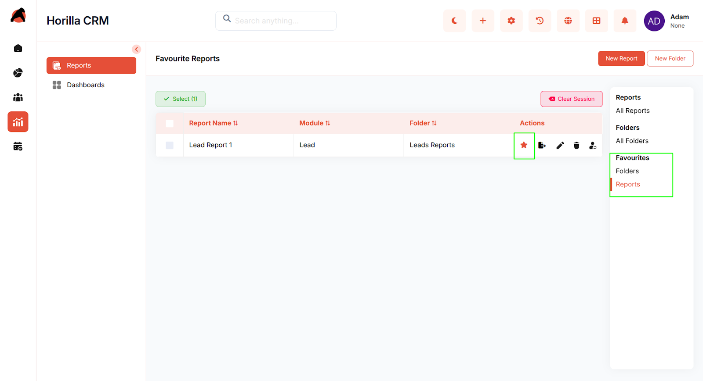
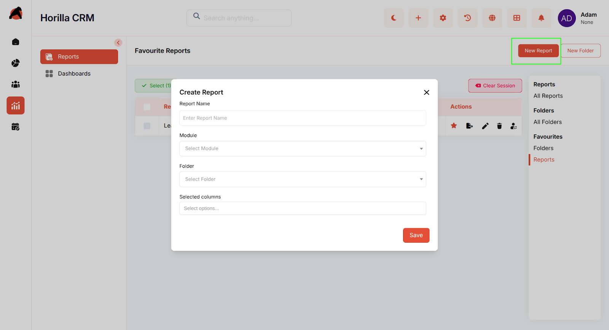
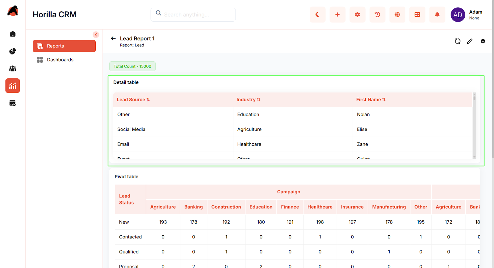
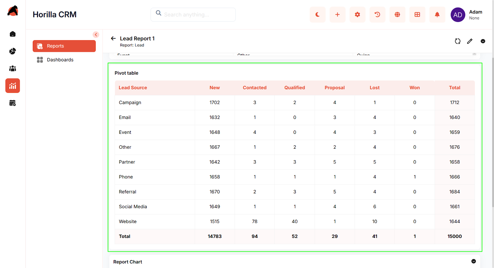
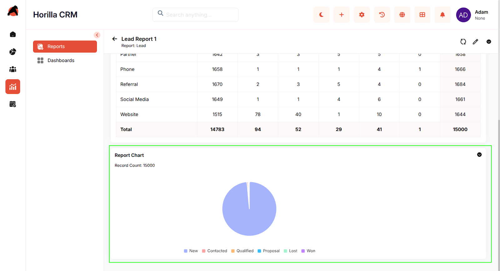
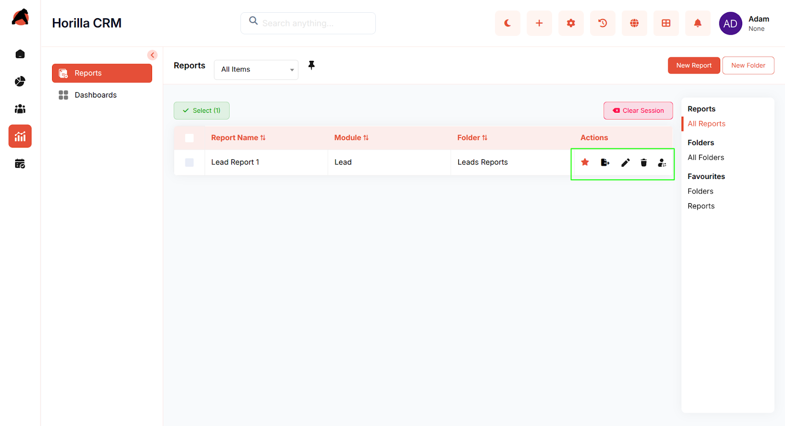

# **Horilla CRM Reports – Functional Guide**

## **Introduction**

The **Horilla CRM Reports Module** provides a structured and intuitive way to generate, organize, and analyze CRM data. Designed for sales teams, managers, and administrators, the module enables users to create detailed reports, group them into folders, and leverage pivot tables and charts for advanced insights. With customizable columns, filters, and grouping options, users can extract meaningful patterns from CRM records and visualize data through interactive reports. The module supports both operational and analytical needs, helping organizations make data-driven decisions.

## **Key Features and Functionalities**

### **1\. Report List View**

**Purpose:** Allows users to view, manage, and organize reports across different CRM modules.

* **View All Reports:** Users can access all available reports in the system.  
* **Mark as Favorite:** Quickly mark reports as favorites for easier access  
* **Delete Reports:** Remove reports that are no longer needed.  

### **2\. Folder Organization System**

**Purpose:** Provides a structured way to organize reports for easy access.

* **Create Multiple Folders:** Group related reports under folders (e.g., Leads Reports, Opportunity Reports).  
* **Folder Naming:** Assign meaningful names for better categorization.  
* **Edit & Delete Folders:** Update folder names or remove folders when no longer needed.  
* **Favorites:** Mark folders as favorites for quick access.

### **3\. Favorites Management**

**Purpose:** Provides quick access to frequently used reports and folders.

* **Favorite Any Report/Folder:** Mark with a star icon for easier navigation.  
* **Favorites Section in Sidebar:** Access favorited reports and folders directly from the sidebar.  
* **Visual Indicators:** Star icons highlight favorite items in the listing.

### **4\. Creating a Report**

**Purpose:** Enable users to build new reports easily.

* Use the **New Report** button to create a report.  
* Fill in fields such as **name, module, folder, and columns**, then save. 

### 

### **5\. Report Detail View**

**Purpose:** Provides detailed insights and interactive data exploration.

* **Detail Table:** Displays record-level details with selected columns. 

* **Pivot Table:** Summarizes data by grouping and aggregating values. Clicking a pivot value filters the data and displays related details in the detail table.  

* **Report Chart:**

  * Enhances visualization and provides quick analytical insights.  
  * **Available Chart Types:** Pie chart, bar chart, line chart, etc. (based on configuration).  
  * **Dynamic Data Display:** Updates automatically with selected filters and groupings.  
  * **Interactive Legend:** Breaks down categories such as New, Contacted, Qualified, Proposal, Lost, Won.  
  * **Record Count Indicator:** Shows the total number of records included in the chart.  
  * **Download Options:** Export charts as **PNG** or **PDF**.

### **6\. Report Edit View**

**Purpose:** Allows users to modify report configuration.

* The edit view contains **three tabs**:

  1. **Columns:** Add or remove columns in the detail table.  
  2. **Grouping:** Add or remove fields for pivot table grouping (maximum of 3 fields).  
  3. **Filter:** Define filter conditions for report data.

* Save or discard changes as needed.

### **7\. Report Actions & Export**

**Purpose:** Provides flexibility for sharing and managing reports outside the CRM.

* **Export Options:** Export tables as **CSV** or **Excel**.  
* **Delete Report:** Remove outdated or unnecessary reports.  
* **Favorite Report:** Mark important reports for quick access via the sidebar.  
* **Move Report:** Transfer reports between folders.  
* **Edit Report Name:** Update report titles for clarity.

## 

## **Benefits**

* **Centralized Reporting:** Single interface to manage and analyze CRM data.

* **Customizable Insights:** Flexible column, filter, and grouping options.

* **Efficient Organization:** Folder-based structure for streamlined report management.

* **Quick Access:** Favorites and sidebar navigation improve efficiency.

* **Visual Analytics:** Charts and pivot tables highlight trends at a glance.

* **Scalable Management:** Supports multiple reports and folders for growing business needs.

* **Export-Friendly:** Seamlessly share data with external stakeholders.

* **User-Friendly UI:** Simplified navigation with actionable icons for managing reports and folders.
