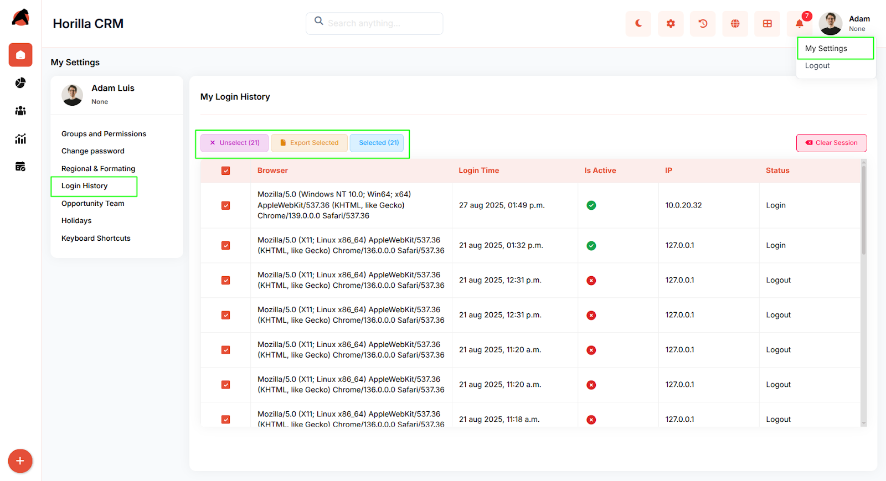

# **Horilla CRM User Login History – Functional Guide**

## **Introduction**

The User Login History Module in Horilla CRM provides users with full visibility into their login activities. By offering a detailed log of session events, devices, browsers, and IP addresses, it helps ensure transparency, security, and accountability. Users can easily review their own access history, track active sessions, and export records for further analysis or compliance reporting.

## **Key Features and Functionalities**

### **1.1 Login History Overview**

**Purpose:** Provide users with a centralized dashboard of their login activities for monitoring and tracking.  
 Accessible via **My Settings → Login History**.

* Displays session details including Browser, Login Time, IP Address, Active Status, and Login/Logout status.

* Green/Red indicators show whether a session is currently active or inactive.

### **1.2 Session Management**

**Purpose:** Allow users to monitor and manage their current and past sessions.

* Active sessions are highlighted for quick visibility.

* Provides transparency by showing all login/logout events chronologically

### **1.3 Export Functionality**

**Purpose:** Enable users to generate reports of login activities in different formats.

* Export selected records to **CSV, Excel, or PDF** for record-keeping or audits.

* Multi-select checkboxes allow bulk export of multiple sessions at once.

* Ensures that compliance and reporting requirements can be met easily.

**Conclusion**

The User Login History Module in Horilla CRM empowers users to track and manage their own access patterns. With detailed session logs, active session monitoring, and export functionality, it enhances transparency and accountability while supporting compliance and security requirements. By giving users visibility and control over their login history, the module fosters greater trust and system security across the organization.