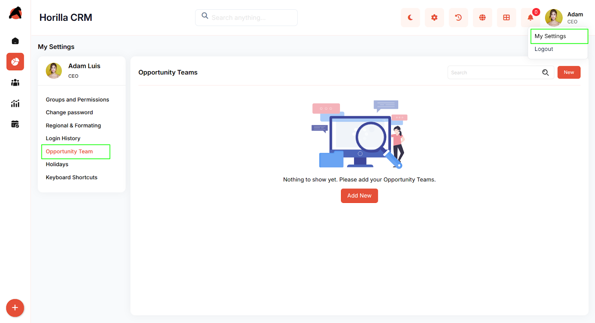
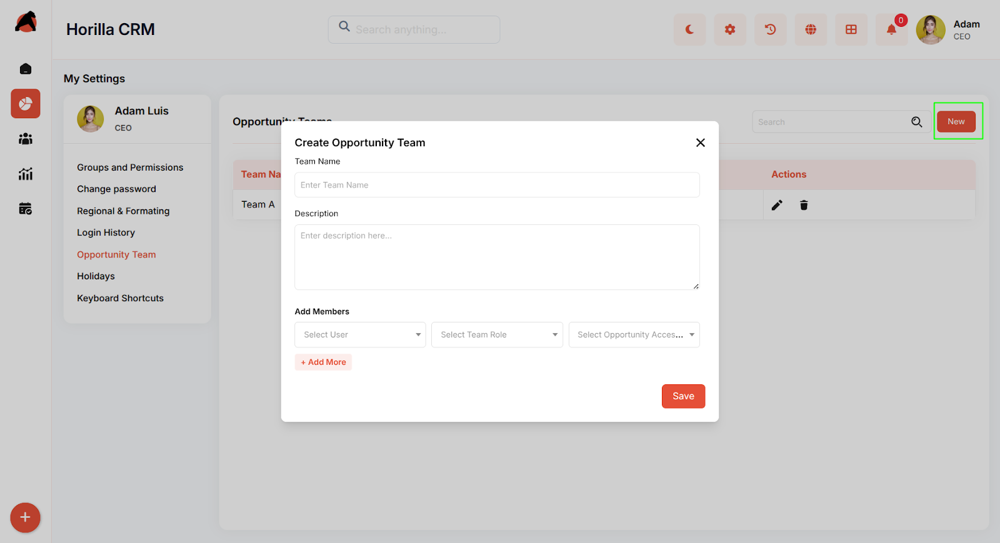
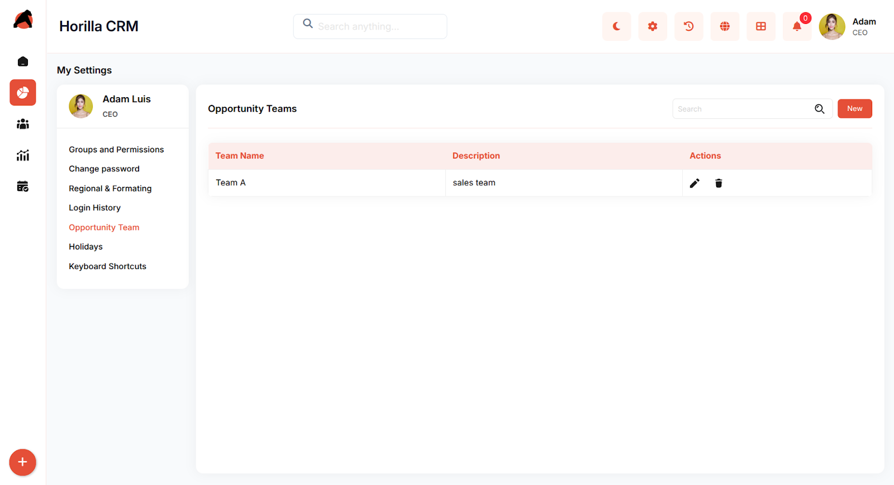
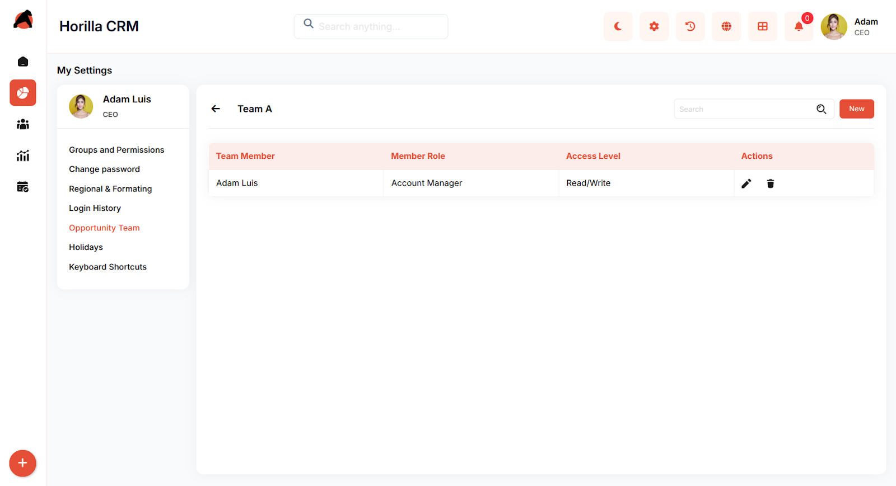

# **Horilla CRM Opportunity Teams – Complete Functional Guide**

## **Introduction**

The Opportunity Teams module in Horilla CRM enables organizations to create collaborative sales teams for managing opportunities effectively. Each user with appropriate permissions can create and manage their own teams independently, providing flexibility and autonomy in team organization. By organizing team members with defined roles and access levels, users can ensure proper responsibility distribution, accountability, and streamlined communication throughout the sales process.

Opportunity Teams support role-based access control, allowing different team members to have varying levels of permissions (Read/Write access) based on their responsibilities. Each permitted user can build their own team structure, add members, and define access levels according to their specific needs. This ensures that the right people have the right level of access to opportunity information while maintaining data security and workflow efficiency.

## **Key Features and Functionalities**

### **Accessing Opportunity Teams**

Navigate to: **Settings → My Settings → Opportunity Team**

Here, each user with appropriate permissions can view, create, and manage their own opportunity teams independently. Users can only see and manage teams they have created, ensuring personal workspace organization and data privacy.

### **1\. Opportunity Teams Overview**

The main Opportunity Teams page displays the current state of team management:

* **Empty State**: When no teams exist, users see a helpful illustration with the message "Nothing to show yet. Please add your Opportunity Teams."  
* **Call-to-Action**: **Add New** button prominently displayed for easy team creation.

### **2\. Create New Opportunity Team**

Click **New** or **Add New** to open the opportunity team creation form.

#### **Team Creation Form Fields:**

**Basic Information:**

* **Team Name**: Enter a unique, descriptive team name  
* **Description**: Provide detailed information about the team's purpose and scope

**Add Team Members:**

* **Select User**: Choose team members from available user list  
* **Select Team Role**: Assign specific roles to team members  
* **Select Opportunity Access**: Define access permissions (Read/Write levels)  
* **\+ Add More**: Option to add multiple team members in a single setup

After configuring team details → click **Save**.

### **3\. Team Management and List View**

Once teams are created, the interface displays:

#### **Team List Table with Columns:**

* **Team Name**: Display of team identifier  
* **Description**: Brief overview of team purpose  
* **Actions**: Management options for each team

#### **Available Actions:**

* **Edit** : Modify team details, members, or permissions  
* **Delete** : Remove teams that are no longer needed

### **4\. Team Detail View**

Clicking on a team name opens the detailed team management page:

#### **Team Information Section:**

* **Team Header**: Displays team name with back navigation  
* **Search Function**: Find specific team members quickly  
* **New Button**: Add additional members to existing teams

#### **Team Member Table:**

* **Team Member**: Names of assigned users  
* **Member Role**: Specific roles (e.g., Account Manager, Sales Representative)  
* **Access Level**: Permission levels (Read/Write, Read Only)  
* **Actions**: Individual member management options

#### **Member Management Actions:**

* **Edit Member**  Modify member roles or access levels  
* **Remove Member** Remove team members when necessary

## **Benefits**

**Enhanced Collaboration**: Organize sales teams effectively around specific opportunities or market segments.

**Role-Based Security**: Ensure appropriate access levels while maintaining data security and compliance.

**Accountability**: Clear role assignments help track responsibility and performance across team members.

**Scalable Structure**: Easily add or remove team members as business needs change.

**Streamlined Communication**: Centralized team management improves coordination and reduces miscommunication.

**Flexible Access Control**: Granular permission settings accommodate various organizational structures and security requirements.

## **Summary**

The Opportunity Teams module in Horilla CRM provides a comprehensive framework for organizing and managing collaborative sales efforts. With flexible team creation, role-based access control, and intuitive member management, organizations can ensure that opportunities are handled by well-coordinated teams with appropriate permissions and clear accountability. This structured approach to team management ultimately leads to improved sales performance and better customer relationship management.
