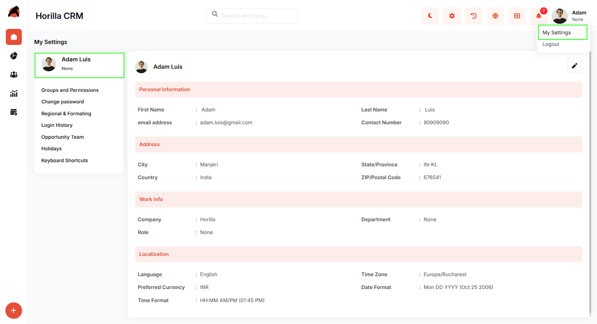
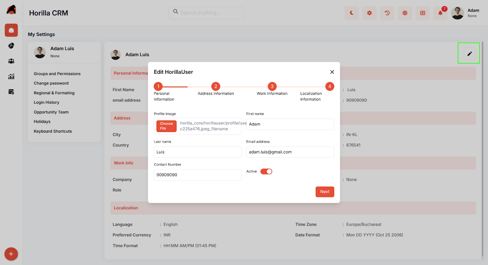

# **Horilla CRM User Profile Settings – Functional Guide**

## **Introduction**

The User Profile Settings Module in Horilla CRM provides users with comprehensive control over their personal information, work details, and system preferences. By offering a centralized interface for managing account details, localization settings, and contact information, it ensures users can maintain accurate profiles while customizing their system experience. Users can easily update their information, configure display preferences, and manage their professional details within the organization.

## **Key Features and Functionalities**

### **1.1 Personal Information Management**

**Purpose:** Enable users to maintain accurate personal identification and contact details for system-wide use. Accessible via **My Settings → User Profile**.

* Displays and manages **First Name, Last Name, Email Address, and Contact Number**.  
* Email validation ensures proper format and uniqueness across the system.  
* Contact information integrates with notification systems and organizational directory.

### **1.2 Address Configuration**

**Purpose:** Allow users to specify their geographical location for regional customization and compliance.

* Captures **City, State/Province, Country, and ZIP/Postal Code** information.  
* State/Province uses standardized ISO codes (e.g., IN-KL for Kerala, India).  
* Address validation ensures proper formatting based on selected country standards.

### **1.3 Work Information Setup**

**Purpose:** Maintain professional details and organizational hierarchy within the CRM system.

* Manages **Company, Department, and Role** assignments for proper access control.  
* Company field links to organizational master data for consistency.  
* Department and Role selections integrate with permission systems and reporting structures.

### **1.4 Localization Preferences**

**Purpose:** Customize user interface display formats and regional settings for optimal user experience.

* Configures **Language, Time Zone, Preferred Currency, Date Format, and Time Format**.  
* Language selection affects the entire interface display in real-time.  
* Time zone settings impact all datetime displays, scheduling, and calendar integrations.  
* Currency preference becomes default for financial reports and transaction displays.  
* Date and time formats provide preview examples for user clarity (e.g., "Mon DD YYYY (Oct 25 2006)" and "HH:MM AM/PM (01:45 PM)").

### **1.5 Profile Editing and Validation**

**Purpose:** Provide secure and user-friendly editing capabilities with comprehensive data validation.

* **Edit button** (pencil icon) enables inline editing of all profile sections.  
* Real-time validation prevents invalid data entry and ensures required fields are completed.  
* Save/Cancel functionality provides standard form controls with change confirmation.

## **Conclusion**

The User Profile Settings Module in Horilla CRM empowers users to maintain comprehensive and accurate personal profiles while customizing their system experience. With detailed information management, localization preferences, and secure editing capabilities, it enhances user satisfaction and system functionality while supporting organizational needs for accurate user data. By providing users with complete control over their profile information and display preferences, the module ensures optimal user experience and maintains data accuracy across the entire CRM system.
