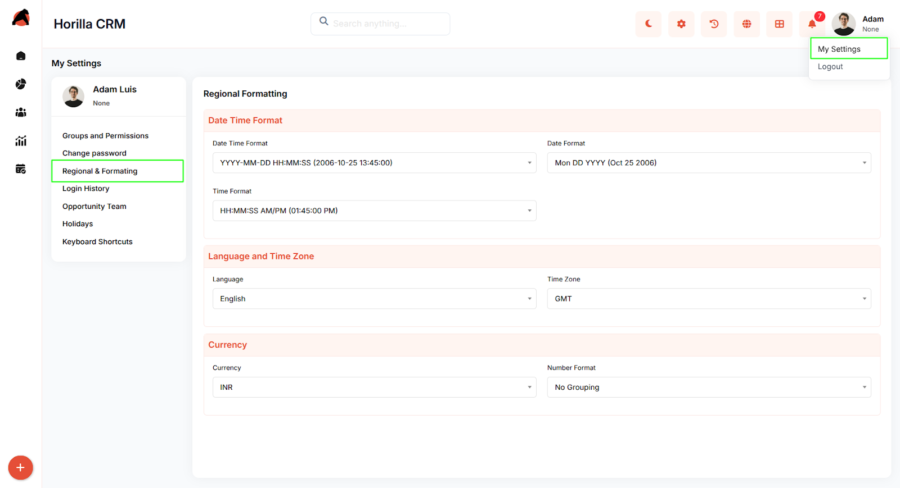

# **Horilla CRM Regional Formatting – Functional Guide**

## **Introduction**

The **Regional Formatting** settings in Horilla CRM allow users to define how dates, times, currencies, and numbers are displayed across the system. These preferences are user-specific, ensuring that each individual sees data in a format consistent with their regional standards.

Once configured, the selected formats are applied globally to the corresponding field types. This guarantees uniform data presentation across all modules and pages within the CRM, while still accommodating individual user preferences.

## **Key Features and Functionalities**

### **1.1 Date Time Format**

**Purpose:** Configure display format for all date and time fields across the CRM system.

* Select from predefined date-time format options (e.g., YYYY-MM-DD HH:MM:SS).  
* Separate date format selection for date-only fields (e.g., Mon DD YYYY).  
* Time format options include 12-hour AM/PM or 24-hour display.  
* Changes apply instantly to all date and time fields in leads, campaigns, contacts, and activities.

### **1.2 Language and Time Zone Configuration**

**Purpose:** Set interface language and time zone for proper localization and time conversion.

* Language dropdown affects CRM interface elements and labels.  
* Time zone selection (GMT, PST, etc.) converts all time-sensitive data automatically.  
* Enables consistent time display for global teams across different time zones.  
* Affects meeting schedules, campaign timing, and activity timestamps.

### **1.3 Currency and Number Formatting**

**Purpose:** Configure monetary and numerical display formats for financial fields.

* Currency selection (INR, USD, EUR, etc.) applies to all revenue and budget fields.  
* Number format options control thousand separators and grouping.  
* "No Grouping" displays numbers without separators (1000000).  
* Grouped format displays with separators (1,000,000).  
* Affects deal values, campaign budgets, and financial reports throughout CRM.

### **1.4 Settings Application Scope**

**Purpose:** Ensure formatting preferences apply consistently across all CRM modules.

* User-specific settings do not affect other users' displays.  
* Changes reflect immediately without requiring page refresh or logout.  
* Settings persist across browser sessions and maintain consistency.  
* Apply to all modules including Leads, Contacts, Campaigns, Opportunities etc..