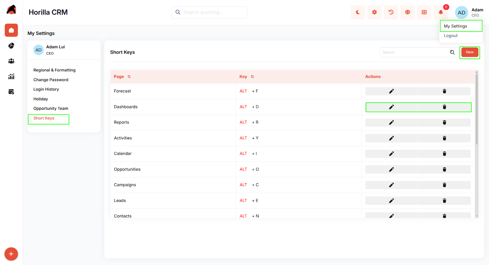
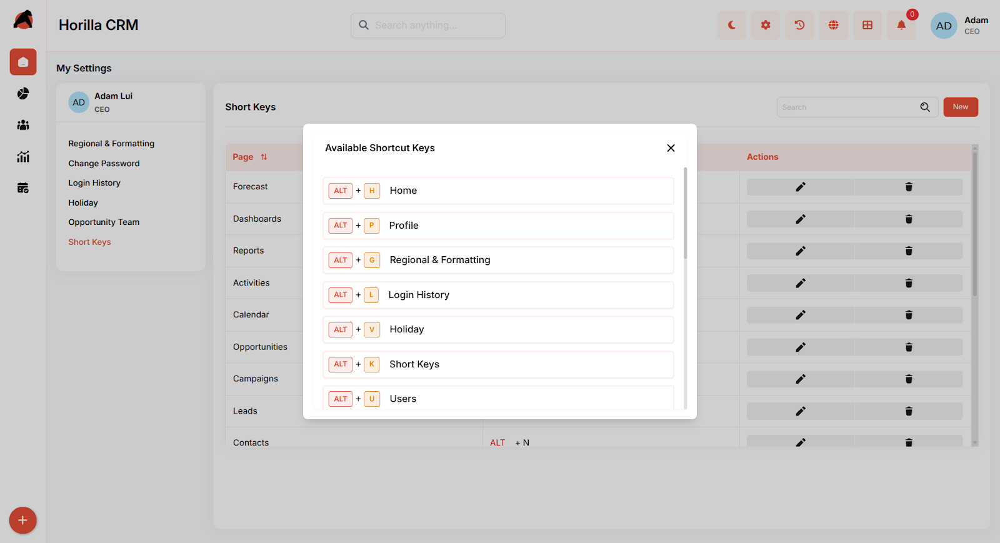

# **Horilla CRM Short Keys – Functional Guide**

## **Introduction**

The **Short Keys Module** in **Horilla CRM** enhances user efficiency by enabling quick navigation across various CRM sections using customizable keyboard shortcuts. This module empowers users to create, modify, and manage their own shortcuts while maintaining flexibility and compatibility across different operating systems.

By supporting both **predefined system shortcuts** and **user-defined shortcuts**, Horilla ensures that every user can tailor their workspace for faster access and improved productivity.

## **Key Features and Functionalities**

1.1 **Predefined Short Keys**

* **Purpose:** Supplies a default set of shortcuts to all users upon account creation, ensuring a quick start to optimized workflow.  
* **Access:** Easily accessible under My Settings → Short Keys.  
* **Details:** Includes a range of shortcuts such as ALT \+ F (Forecast), ALT \+ D (Dashboards), ALT \+ R (Reports), and more, presented in a customizable table.  
* **Behavior:** These default keys are automatically assigned and adjusted based on the user’s operating system for immediate usability.

1.2 **Customization Options**

* **Purpose:** Empowers users to personalize their shortcut setup to match their specific workflow needs.  
* **Functionality:** Users can add new shortcuts using the "New" button, modify existing ones with the edit/pencil icon, or delete them using the trash icon. Each action is performed directly within the Short Keys interface.  
* **Process:** Select a desired page or command, assign a unique key combination, and save the changes to update the shortcut list.

1.3 **Operating System Adaptation**

* **Purpose:** Ensures that shortcuts are intuitive and functional across different operating systems.  
* **Behavior:** The command key (e.g., ALT on Windows, Option on macOS, or equivalent on Ubuntu) adapts automatically based on the user agent detected, providing a consistent experience regardless of the device.  
* **Benefit:** Enhances accessibility and usability by aligning shortcuts with the user’s platform-specific keyboard layout.

1.4 **Dynamic Shortcut Display**

* **Purpose:** Assists users in exploring and learning available shortcuts without needing to memorize them.  
* **Functionality:** By holding a command key (e.g., ALT) for 2-3 seconds, a pop-up window appears, listing all currently available shortcuts tailored to the user’s operating system and existing configurations.  
* **Benefit:** This interactive feature promotes ease of use, reduces the learning curve, and encourages users to fully leverage the shortcut system.

## **Conclusion**

The **Shortcut Keys Module** in Horilla CRM transforms user productivity by providing a flexible, intuitive, and powerful keyboard navigation system. With predefined shortcuts for instant usability, full customization capabilities, intelligent cross-platform support, and an innovative quick-access overlay, users can work faster and more efficiently. Whether you're a new user getting started or a power user optimizing your workflow, the Shortcut Keys feature adapts to your needs while maintaining simplicity and control.

