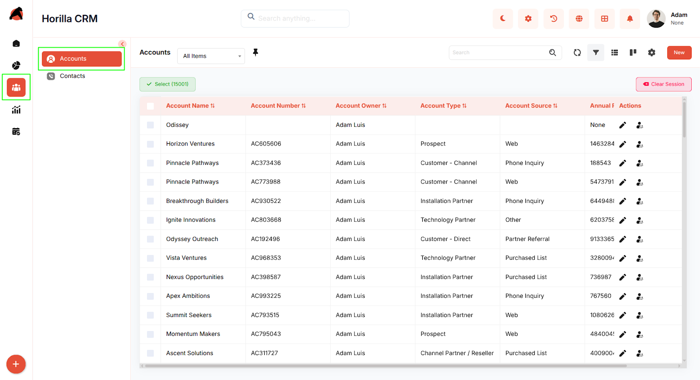
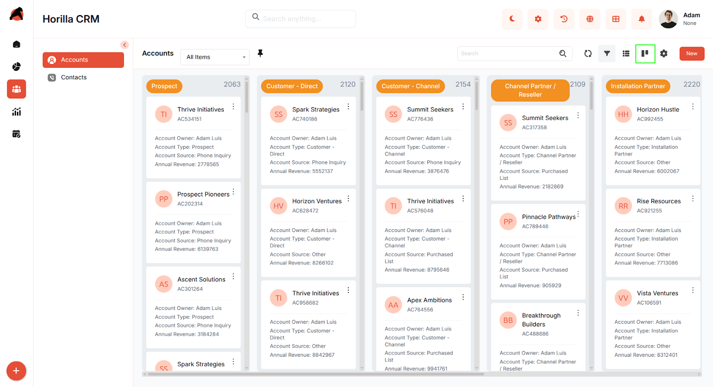
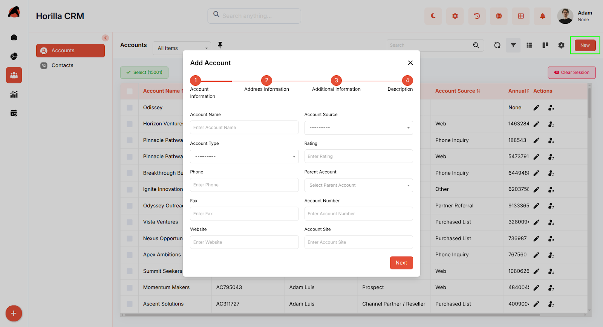
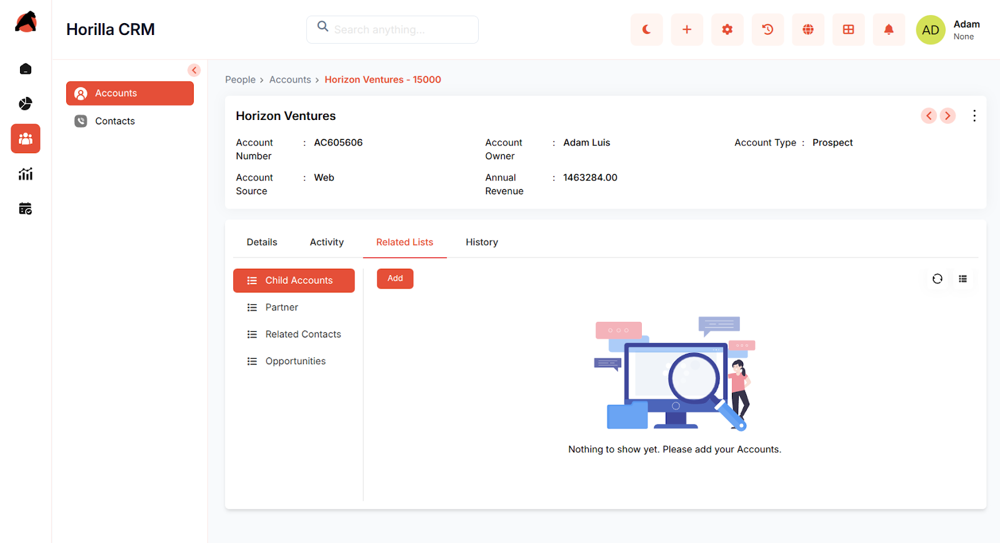

# **Horilla CRM Accounts – Functional Guide**

## **Introduction**

The Horilla CRM Accounts Module is a critical feature engineered to simplify and enhance the administration of corporate entities within the CRM ecosystem. It offers a robust, streamlined, and accessible interface that empowers businesses to manage account details, oversee relationships across various stages, and optimize team performance. This module supports the organization of account data, tracks engagements, and ensures timely interactions to strengthen business connections, while seamlessly integrating with other tools for an efficient operational flow.

## **Key Features and Functionalities**

### **2.1 Accounts Overview**

* **Purpose:** Showcase all accounts in a consolidated list format for straightforward management and visibility.  
* Users can access the list by selecting the "Accounts" option under the "Sales" menu in the sidebar.  
* Provides search and filtering tools to quickly pinpoint specific accounts using criteria such as company name or industry.  
* The layout includes adjustable columns and tailored filters to boost usability and productivity.  
* Supports bulk handling of accounts in the list view by selecting multiple entries with checkboxes, offering actions like Edit, Export, and Mass Delete.

### **2.2 Accounts Kanban Display**

* **Purpose:** Deliver a visual layout of accounts grouped by their current relationship status.  
* Users can customize the grouping by adjusting Kanban configurations to align with their preferences.  
* Enables drag-and-drop functionality to effortlessly update account statuses.  
* Aids in visually tracking the evolution of each account with clarity and ease.

### **2.3 Creating a New Account**

* **Purpose:** Facilitate the addition of new accounts to kickstart relationship management.  
* Press the "New" button on the accounts page to initiate a step-by-step form.  
* Fill in core details (account owner, company name, industry, annual revenue, address) in the "Basic Information" step.  
* Proceed with "Next" to include additional data (contact person, phone, website).  
* Navigate between sections as needed using "Next" and "Previous" options.  
* Complete the process by clicking "Save" to register the account details.

### **2.4 Account Detailed Information**

**Purpose:** Provide a comprehensive overview and control options for individual accounts.

* **Accessing the Profile**

  * Click on an account’s name from the list or Kanban view to open its detailed profile.  
  * The profile is organized into multiple tabs for easy navigation.

* **Details Tab**

  * Each field can be edited individually without affecting other details.

  * Supports inline editing for faster updates.

* **Activity Tab**

  * Provides a centralized place to log and track activities related to the account.  
  * Users can add activities such as tasks, meetings, calls, and emails.

* **Related Lists**

  * Displays associated records for a complete 360° view of the account.  
  * Includes:

    * **Child Accounts** – sub-accounts linked to the parent account  
    * **Related Contacts** – people connected with the account  
    * **Opportunities** – deals or potential business linked with the account.  
    * **Partners** – related partner accounts tied to the relationship.

  * Allows quick navigation to related records and supports adding new related items directly from the related list section.

* **History Tab**

  * Tracks and displays changes made to the account over time.

