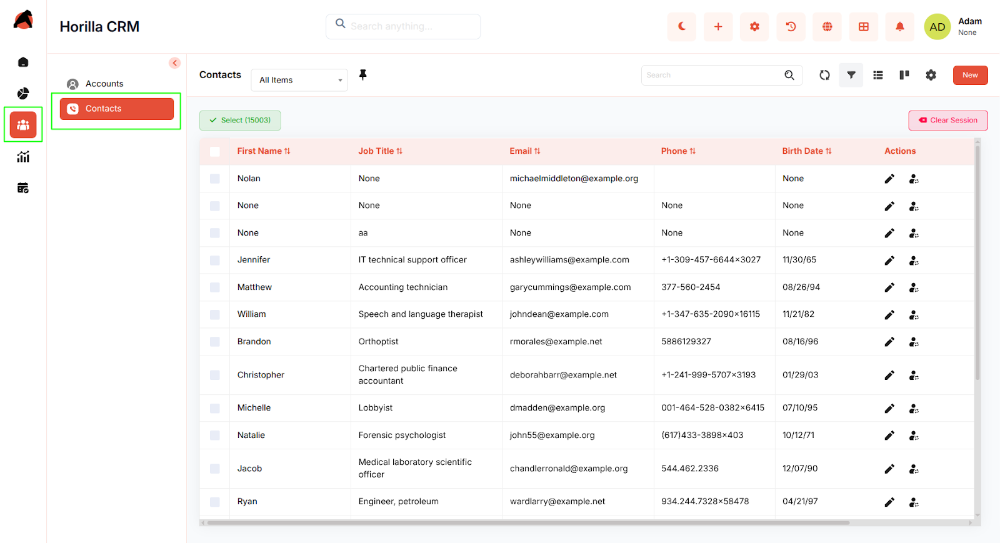
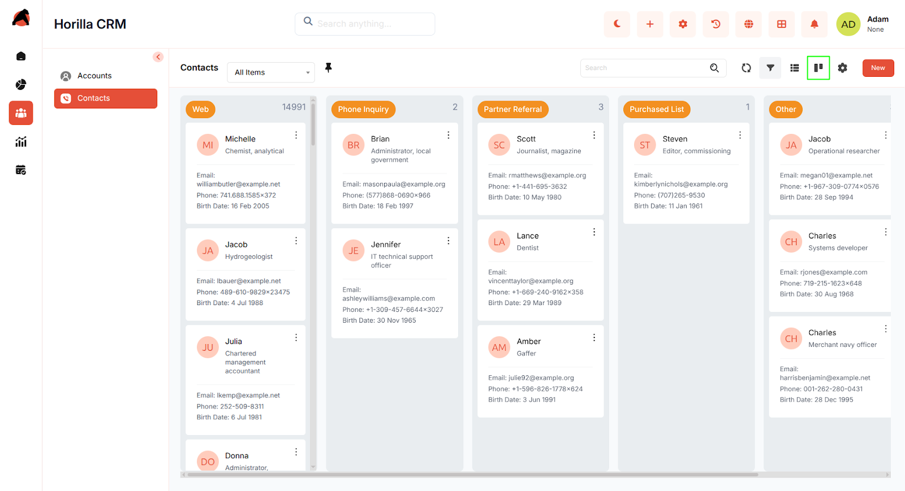
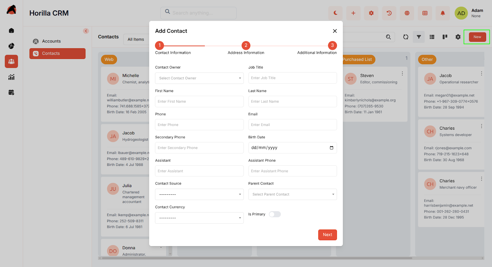
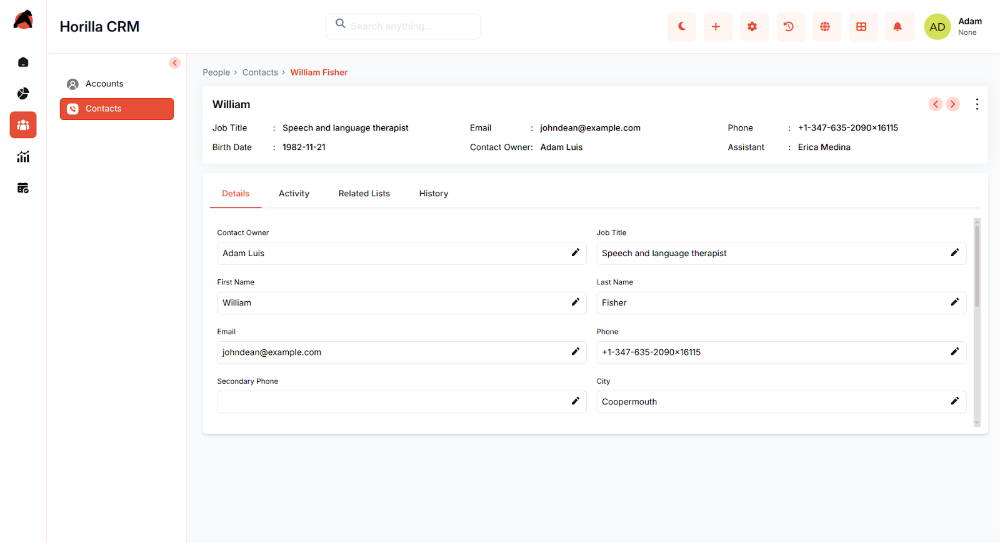

# **Horilla CRM Contacts – Functional Guide**

## **Introduction**

The **Horilla CRM Contacts Module** serves as a central repository for managing individual contact information. It enables businesses to capture, organize, and maintain complete records of customers, prospects, and related individuals. With structured forms and detailed views, the module ensures all relevant information such as personal details, addresses, and additional notes are easily accessible. By integrating with other CRM modules such as **Leads** and **Opportunities**, the Contacts Module enhances customer relationship management, supports communication tracking, and helps build stronger client interactions.

## **Key Features and Functionalities**

### **2.1 Contacts Overview**

* **Purpose:** Display all contacts in a centralized list view for quick access and management.  
* Navigate to the **“People”** section in the sidebar and select **“Contacts.”**  
* Includes search, sorting, and filtering to find contacts by name, job title, or email.  
* Bulk management is supported via checkboxes, with actions such as Update, Export, and Delete.  
    

### **2.2 Contacts Kanban Display**

* **Purpose:** Visualize and group contacts based on their source.  
* Categorization can be adjusted using **Kanban settings**.  
* Contacts are automatically grouped by **Contact Source** (e.g., Web, Referral, Social Media, Event, etc.).  
* Switch to **Kanban View** using the view toggle on the Contacts page.  
* Cards display essential details such as **Name, Job Title, Email, and Phone**.  
* Drag-and-drop functionality allows repositioning or reassigning contacts to different sources.  
* Helps in identifying which sources contribute the most valuable contacts.

### **2.3 Creating a New Contacts**

* **Purpose:** Enable the addition of new contacts with structured step-by-step forms.  
* Click **“New”** on the Contacts page to open a multi-step creation wizard.  
* **Step 1 – Contact Information:** Enter owner, job title, first/last name, phone numbers, email, assistant details, parent contact, source, and currency.  
* **Step 2 – Address Information:** Enter city, state, country, and postal code (Zip).  
* **Step 3 – Additional Information:** Choose language and add descriptive notes if required.  
* Navigate using **Next** / **Previous.**  
* Click **Save** to create the contact record.

### **2.4 Contacts Detailed Information**

* **Purpose:** Provide a complete and editable view of contact details.  
* Open a contact by clicking their name in the Contacts list.  
* Displays personal details (job title, phone, email, birth date, assistant, etc.) and address information.  
* Tabs available for **Details, Activity, Related Lists, and History.**  
* Fields can be updated directly from the detailed view using inline edit icons.  
* Allows full visibility into interactions and relationship history with the individual

