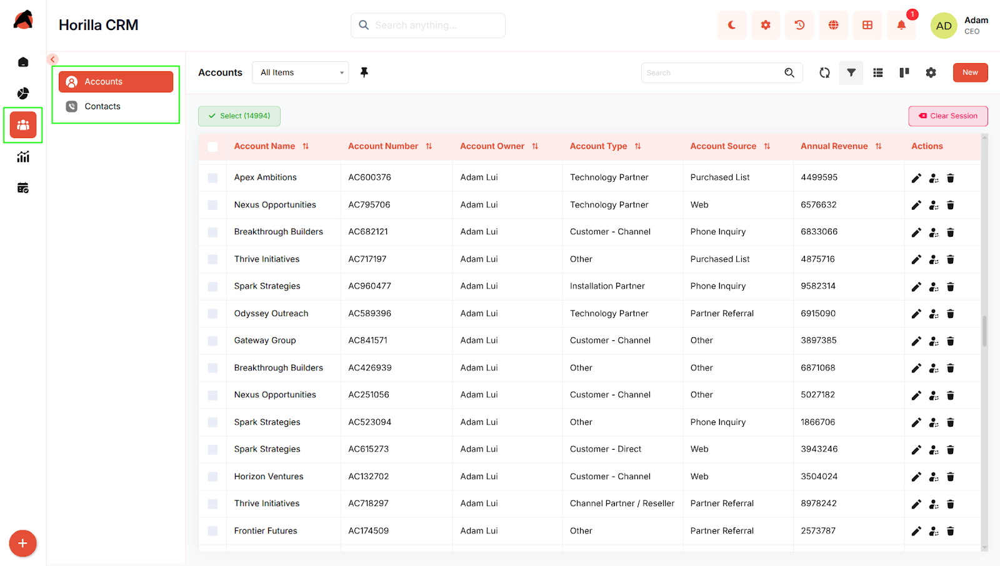
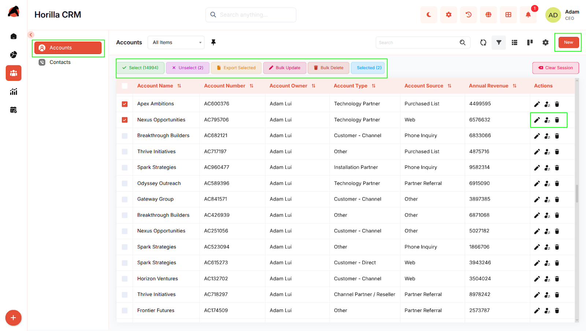
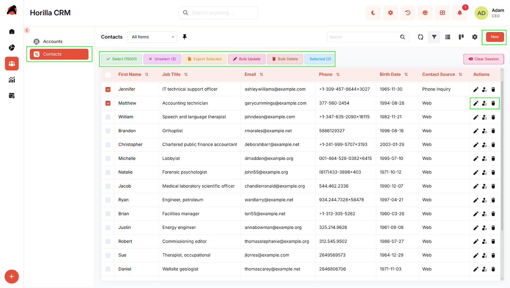

# **People**

## **Introduction**

The Horilla CRM People Section serves as a comprehensive hub for managing all individual and organizational contact information within your system. This section integrates two distinct but complementary modules: **Accounts** and **Contacts**. The Accounts module handles corporate entities and their business relationships, while the Contacts module manages individual contact records. Together, they provide a unified platform to maintain complete relationship data, track interactions, and foster stronger business connections. By seamlessly connecting account information with individual contacts, the People Section enables businesses to gain a 360-degree view of their customer base and streamline communication across their organization.

## **Key Features and Functionalities**

### **2.1 People Section Overview**

**Purpose:** Provide a centralized access point to manage all account and contact data within the organization.

**Access:** People section in the sidebar with two sub-sections:

* Accounts  
* Contacts

**Key Features:**

* Single navigation point for all people and organizational relationship management  
* Organized into Accounts (corporate entities) and Contacts (individual contacts)  
* Search, filtering, and bulk operations available across both sub-sections  
* List and Kanban view options for flexible data visualization  
* Seamless integration between accounts and contacts for comprehensive relationship tracking

### **2.2 Accounts Module**

**Purpose:** Manage corporate entities, business relationships, and account lifecycle.

**Access:** People → Accounts

**Key Features:**

* View all accounts in a consolidated list with search and filtering capabilities  
* Kanban view to visualize accounts grouped by relationship status  
* Create new accounts with multi-step forms (Basic Information, Additional Details)  
* Edit account details with inline editing  
* Track activities (tasks, meetings, calls, emails) related to each account  
* View related records: Child Accounts, Related Contacts, Opportunities, and Partners  
* Monitor account history and changes over time  
* Bulk operations: Edit, Export, Delete multiple accounts

### **2.3 Contacts Module**

**Purpose:** Manage individual contact records and maintain personal relationship information.

**Access:** People → Contacts

**Key Features:**

* View all contacts in a centralized list with search, sorting, and filtering  
* Kanban view to visualize contacts grouped by contact source (Web, Referral, Social Media, Event, etc.)  
* Create new contacts with multi-step forms (Contact Information, Address Information, Additional Information)  
* Edit contact details with inline editing  
* Track activities and interactions related to each contact  
* Access detailed information including personal details, addresses, and relationship history  
* View related interactions and communications  
* Bulk operations: Update, Export, Delete multiple contacts  
* Monitor contact history and changes over time

### **2.4 Integration and Navigation**

**Purpose:** Enable seamless workflow between accounts and contacts for complete relationship management.

**Key Features:**

* Related Contacts section in Account details for viewing people connected to an account  
* Parent Account reference in Contact details to identify associated accounts  
* Drag-and-drop functionality in both Kanban views for quick status or source updates  
* Cross-module linking for viewing related opportunities, activities, and communications  
* Unified search across both Accounts and Contacts for quick information retrieval

## **Conclusion**

The Horilla CRM People Section provides a comprehensive and integrated platform for managing all relationship data across your organization. By combining account-level business entity management with individual contact management, the section enables teams to maintain accurate, complete, and actionable information about their customer base. The intuitive interface, flexible viewing options, and seamless integration between accounts and contacts empower businesses to strengthen relationships, streamline communications, and drive more effective customer interactions.

