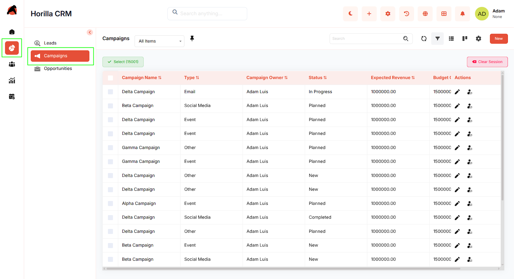
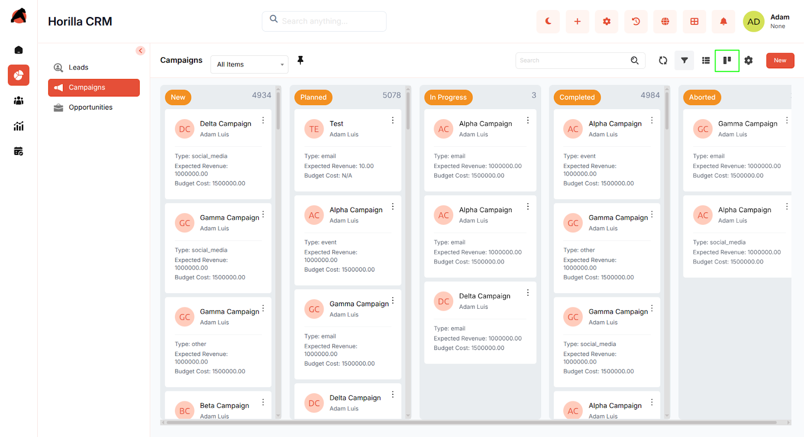
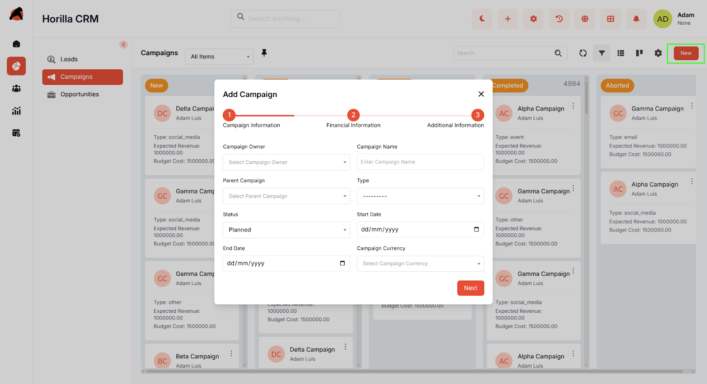
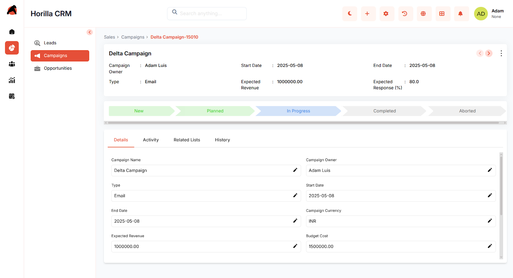

# **Horilla CRM Campaigns – Functional Guide**

## **Introduction**

The **Horilla CRM Campaigns Module** is designed to simplify the creation, execution, and tracking of marketing initiatives. It provides organizations with a unified platform to plan campaign activities, define target audiences, manage budgets, and evaluate results. By giving marketing teams visibility into performance metrics such as response rates and conversions, the module enables smarter decision-making and continuous optimization. Through integration with other CRM modules like **Leads** and **Contacts**, Campaigns bridge the gap between marketing and sales, ensuring alignment and improving overall business impact.

## **Key Features and Functionalities**

### **1.1 Campaigns Overview**

* **Purpose:** Present all campaigns in a centralized list for quick access and management.  
* Access via the **“Sales”** section in the sidebar and choose **“Campaigns.”**  
* Includes search, filtering, and sorting to easily locate campaigns by name, type, or status.  
* Provides customizable filters for personalized views.  
* Bulk actions (Update, Export, Delete) available by selecting multiple campaigns through checkboxes.  

### **1.2 Campaigns Kanban Display**

* **Purpose:** Offer a visual workflow to monitor campaigns by their progress or status.  
* Categorization can be adjusted using **Kanban settings**.  
* Drag-and-drop cards to update campaign stages instantly.  
* Helps teams understand campaign progress at a glance and prioritize tasks efficiently.

### **1.3 Creating a New Campaigns**

* **Purpose:** Enable marketing teams to set up and launch new campaigns quickly.  
* Click **“New”** on the Campaigns page to open a multi-step creation form.  
* **Step 1 – Basic Info:** Enter owner, campaign name, status, start/end date, and campaign type.  
* **Step 2 – Financials:** Add budget cost, actual cost, expected revenue, and estimated response.  
* **Step 3 – Additional Info:** Fill in description, audience size.  
* Navigate using **Next** / **Previous** until complete.  
* Click **Save** to finalize and register the campaign.

### **1.4 Campaign Detailed Information**

* **Purpose:** Provide full visibility into an individual campaign’s information and progress.  
* Open by clicking a campaign name in the **list** or **Kanban view**.  
* Displays related activities, performance stats, and history for context.  
* Update campaign status directly or mark it completed by selecting the final stage in the progress bar.

