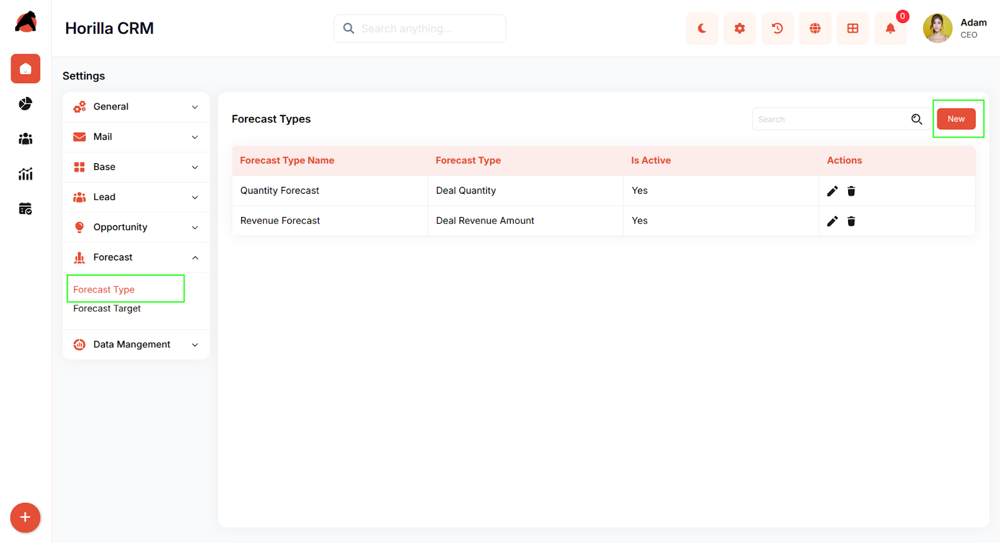
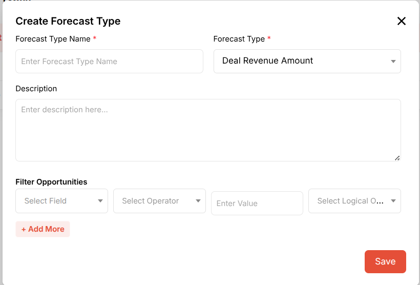
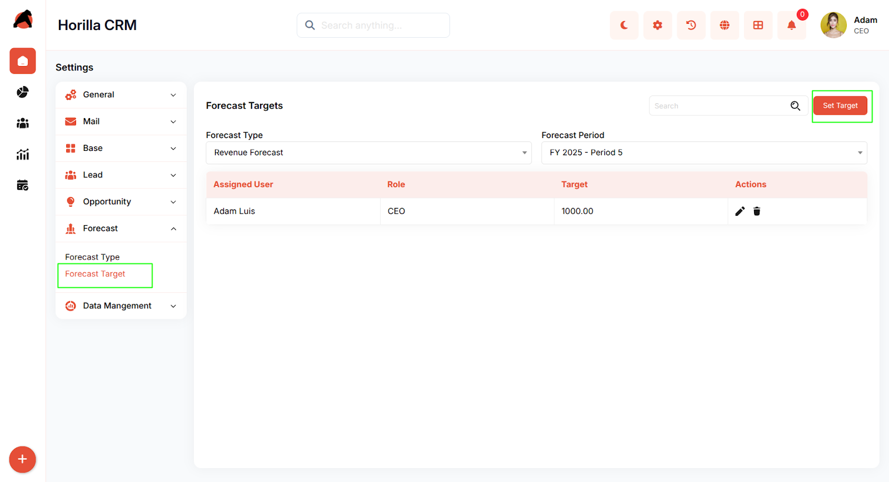
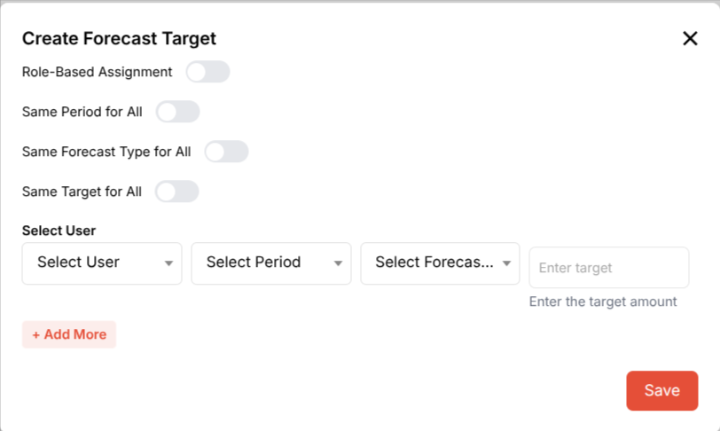
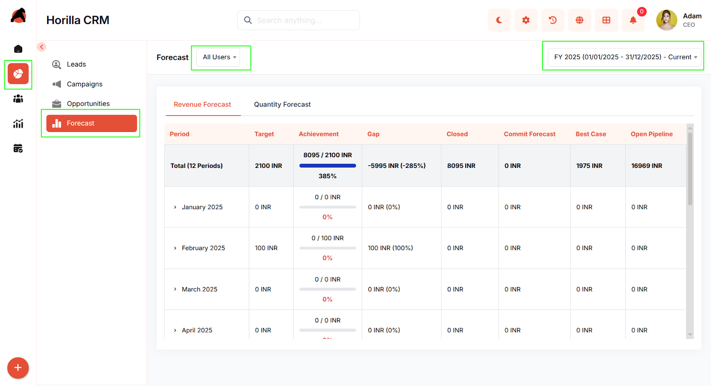
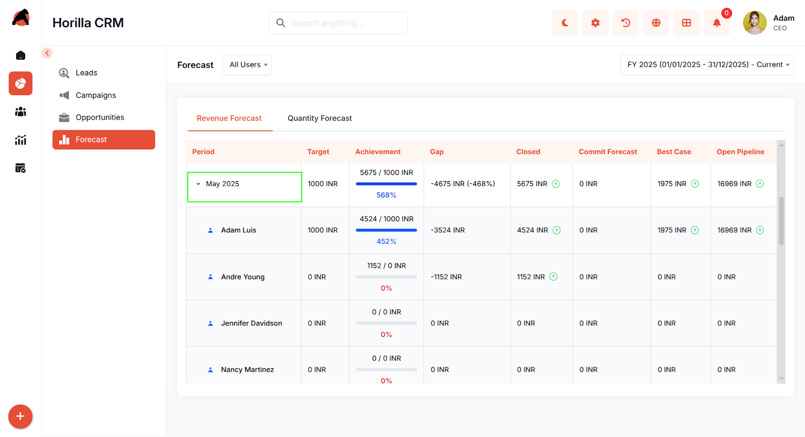

# **Horilla CRM Forecast – Functional Guide**

## **Introduction**

The Horilla CRM Forecast Module is a sophisticated feature designed to streamline sales forecasting and target management within the CRM ecosystem. It provides a comprehensive, intuitive interface that empowers businesses to set revenue and quantity targets, track performance against goals, and gain visibility into sales pipeline metrics. This module supports the creation of customizable forecast types, enables period-based target setting, and delivers real-time achievement tracking to help organizations make data-driven decisions and optimize sales performance.

## **Key Features and Functionalities**

1. ### **Forecast Types Management**

**Purpose:** Define and manage different categories of forecasts to align with business objectives.

1. #### **Accessing Forecast Types**

* Navigate to **Settings \> Forecast \> Forecast Type** from the sidebar menu.  
* The Forecast Types page displays all configured forecast categories in a table format.

2. #### **Viewing Forecast Types**

* The table shows three key columns:  
  * **Forecast Type Name** – The unique identifier for each forecast category  
  * **Forecast Type** – The underlying metric being tracked (Deal Quantity or Deal Revenue Amount)  
  * **Is Active** – Current status indicator (Yes/No)  
* **Actions** column provides quick access to edit (pencil icon) or delete (trash icon) options.

  3. #### **Creating a New Forecast Type**

* Click the **"New"** button in the top-right corner to open the creation modal.  
* Complete the form with the following fields:  
  * **Forecast Type Name**\* (required) – Enter a descriptive name for the forecast  
  * **Forecast Type**\* (required) – Select from dropdown:  
    * Deal Revenue Amount  
    * Deal Quantity  
  * **Description** (optional) – Add contextual information in the text area  
  * **Filter Opportunities** – Configure advanced filtering with:  
    * Select Field dropdown  
    * Select Operator dropdown  
    * Enter Value text field  
    * Select Logical Operator dropdown  
  * Click **"+ Add More"** to create multiple filter conditions  
* Click **"Save"** to create the forecast type.

4. #### **Managing Existing Forecast Types**

* Use the search bar to quickly locate specific forecast types.  
* Edit existing forecasts by clicking the pencil icon in the Actions column.  
* Remove unwanted forecasts using the delete icon (confirmation required).

2. ### **Forecast Targets Configuration**

**Purpose:** Set and manage performance targets for team members across specific periods and forecast types.

1. #### **Accessing Forecast Targets**

* Navigate to **Settings \> Forecast \> Forecast Target** from the sidebar menu.  
* The page displays configured targets with filtering options for Forecast Type and Forecast Period.

  2. #### **Viewing Forecast Targets**

* Dropdown filters at the top allow selection of:  
  * **Forecast Type** – Filter by specific forecast category (e.g., Revenue Forecast)  
  * **Forecast Period** – Select time period (e.g., FY 2025 \- Period 5\)  
* The table displays:  
  * **Assigned User** – Team member responsible for the target  
  * **Role** – Position of the assigned user  
  * **Target** – Numerical goal value  
  * **Actions** – Edit and delete options

  3. #### **Creating a New Forecast Target**

  Click the **"Set Target"** button to open the target creation modal.

     **Configuration Options:**

* **Role-Based Assignment** toggle – Enable to assign targets by role instead of individual users  
* **Same Period for All** toggle – Apply the same period to all target rows  
* **Same Forecast Type for All** toggle – Use identical forecast type across all entries  
* **Same Target for All** toggle – Set uniform target values for multiple users

  **Target Details:**

* **Select User** section with table including:  
  * Select User dropdown  
  * Select Period dropdown  
  * Select Forecast Type dropdown (truncated in display)  
  * Enter target text field (placeholder: "Enter target")  
  * Help text: "Enter the target amount"  
* Click **"+ Add More"** to create additional target rows for multiple users or periods.  
* Click **"Save"** to finalize and store the targets.

  4. #### **Managing Existing Targets**

* Use the search functionality to locate specific targets.  
* Edit targets using the pencil icon in the Actions column.  
* Delete targets with the trash icon (requires confirmation).

3. ###  **Forecast Dashboard and Performance Tracking**

**Purpose:** Provide real-time visibility into forecast achievement, pipeline health, and period-over-period performance.

1. #### **Accessing the Forecast Dashboard**

* Click on **Forecast** from the main left sidebar (indicated by the chart icon).  
* The forecast view opens with comprehensive performance metrics and filtering options.

2. **Top Navigation Bar:**  
* **Forecast** tab – Active view for forecast metrics  
* **All Users** dropdown – Filter by specific users  
* **Current FY selected in**  dropdown – Select different fiscal year  
  3. **Forecast Type Tabs:**  
  * Toggle between  **Forecast** types  
  * Each tab displays corresponding metrics and achievement data  
    1. **Overview Row (Total \- 12 Periods):**  
* **Target** – Total target amount   
* **Achievement** – Visual progress bar showing:  
  * Closed amount / Target amount  
  * Percentage achieved   
* **Gap** – Difference from target  
* **Closed** – Total closed revenue   
* **Commit Forecast** – Committed but not closed   
* **Best Case** – Optimistic pipeline value  
* **Open Pipeline** – Total open opportunities   
  2. **Period-by-Period Breakdown:** Expandable rows for each month (e.g., January 2025, February 2025, March 2025, April 2025\) showing:  
* **Period** column with expand/collapse chevron  
* **Target** – Period-specific goal  
* **Achievement** – Progress bar with ratio and percentage  
* **Gap** – Variance from target with percentage  
* **Closed**, **Commit Forecast**, **Best Case**, **Open Pipeline** – Individual metrics per period  
  3. **Expanded Period Display (e.g., May 2025):**  
* Shows overall period performance in the first row  
* Lists individual team members with their contributions:  
  * **User icon and name** Individual **Target** values  
  * Personal **Achievement** metrics with progress bars  
  * **Gap** calculations  
  * **Closed**, **Commit Forecast**, **Best Case**, **Open Pipeline** values

## **Conclusion**

The Horilla CRM Forecast Module provides a powerful framework for sales performance management through configurable forecast types, granular target setting, and comprehensive achievement tracking. By leveraging the visual dashboard, period-based analysis, and detailed user-level metrics, organizations can maintain clear visibility into sales performance, identify trends, and make informed decisions to drive revenue growth and operational excellence.