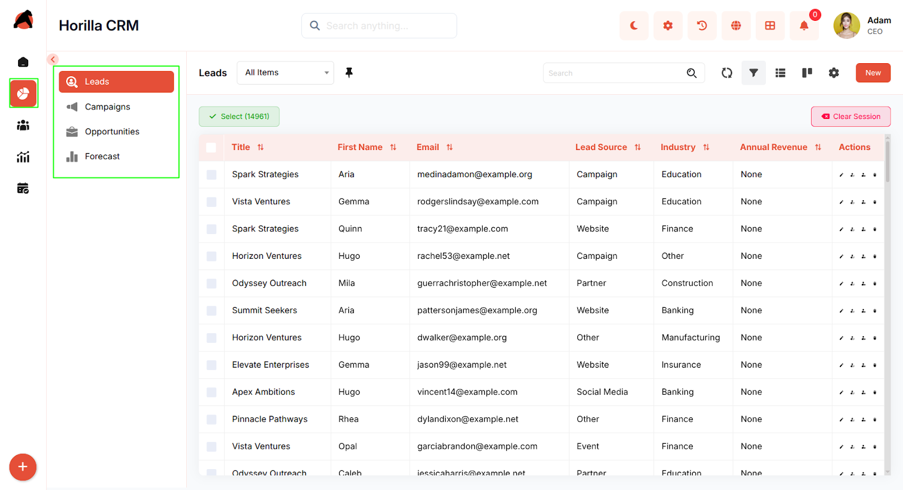
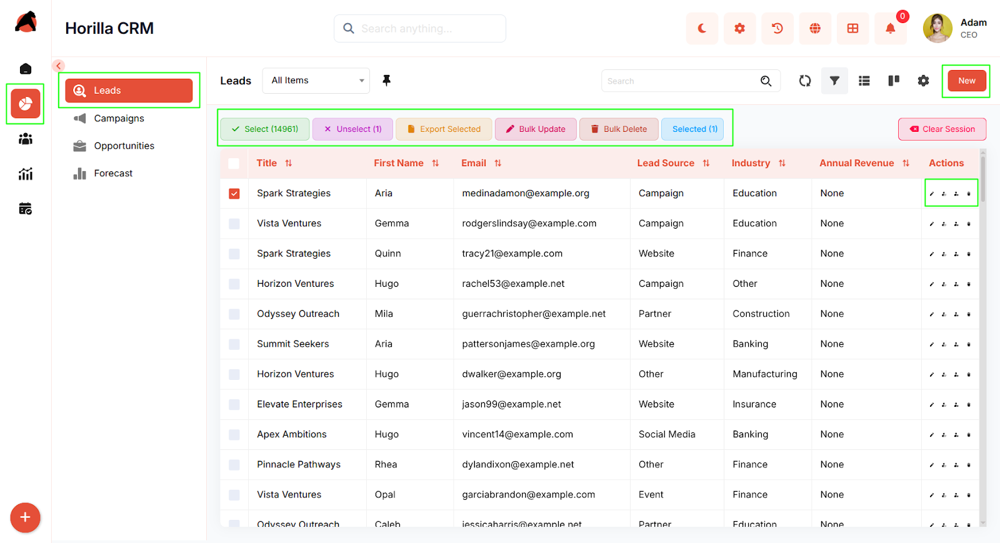
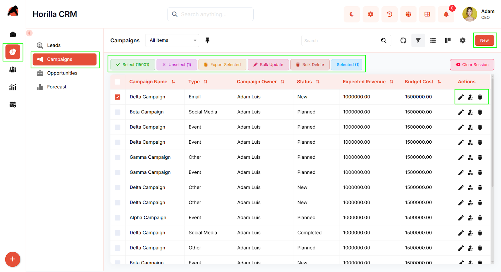
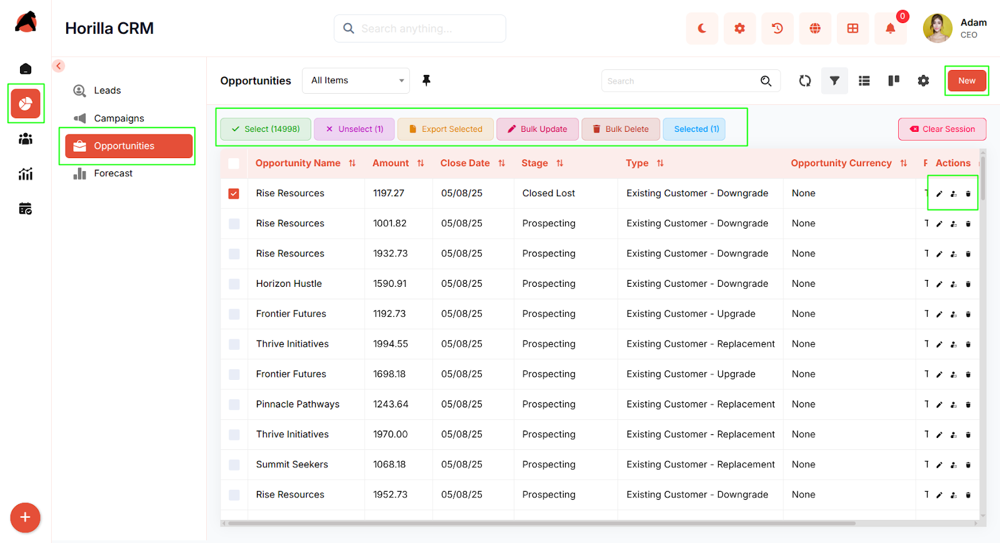
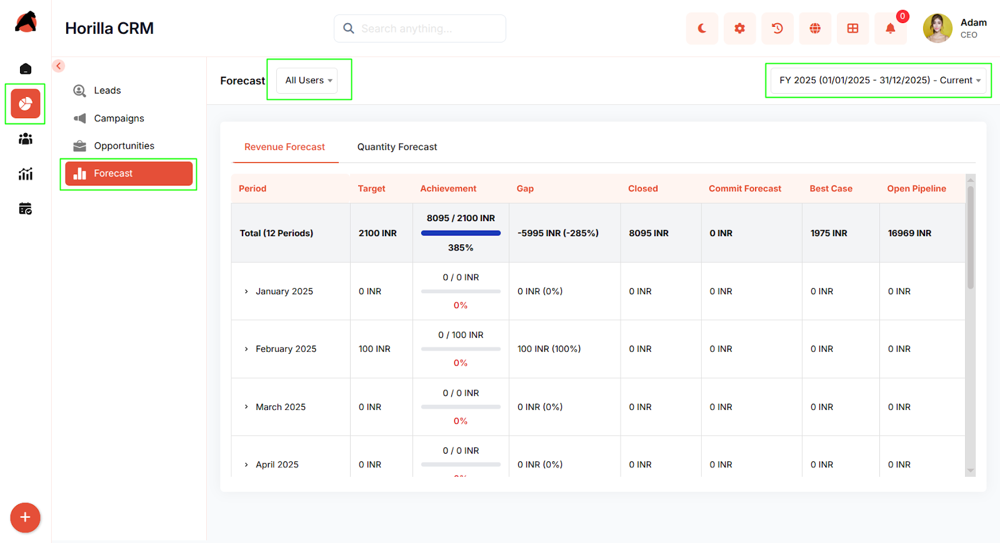

# **Sales**

## **Introduction**

The **Horilla CRM Sales Section** is a comprehensive suite designed to manage the complete sales lifecycle — from lead generation to deal closure and performance forecasting. This section integrates four powerful modules: **Leads**, **Campaigns**, **Opportunities**, and **Forecasts**. Together, they provide businesses with an integrated platform to capture potential customers, execute marketing activities, manage ongoing deals, and monitor sales targets. By connecting marketing and sales processes seamlessly, the Sales Section enhances productivity, drives collaboration, and enables data-driven decision-making for improved business outcomes.

## **1.Sales Section Overview**

**Purpose:** Provide a centralized workspace for managing all sales-related data and activities within the organization.

**Access:** Navigate to the **Sales** section in the sidebar, which includes four sub-sections:

* Leads

* Campaigns

* Opportunities

* Forecasts

**Key Features:**

* Unified access to all sales modules

* Integrated workflows between marketing, sales, and forecasting

* Search, filtering, and bulk operations across modules

* List and Kanban view options for flexible visualization

* Seamless transition of records across modules (e.g., Lead → Opportunity)

* Real-time progress and performance tracking

## **1.1 Leads Module**

**Purpose:** Manage and convert potential customers into qualified sales opportunities.

**Access:** Sales → Leads

**Key Features:**

* **List View:** Centralized lead list with filters, sorting, and bulk actions (Update, Export, Delete)

* **Kanban View:** Visual representation of leads categorized by stage, supporting drag-and-drop updates

* **Lead Creation:** Multi-step form capturing basic, company, and location details

* **Detailed View:** Complete record of lead information with related activities and history

* **Conversion:** Seamless conversion of leads into Accounts, Contacts, and Opportunities directly from the detail view

## **1.2 Campaigns Module**

**Purpose:** Plan, execute, and monitor marketing campaigns to generate leads and measure campaign performance.

**Access:** Sales → Campaigns

**Key Features:**

* **Overview:** Consolidated campaign list with search, filtering, and bulk management

* **Kanban View:** Visual board to track campaigns by status or progress stage

* **Campaign Creation:** Step-based form for entering details such as campaign type, duration, and financials (budget, expected revenue, actual cost)

* **Detailed View:** Displays performance stats, related activities, and campaign history

* **Integration:** Direct linkage between campaigns and generated leads or contacts for tracking conversion impact

---

## **1.3 Opportunities Module**

**Purpose:** Manage deals, track sales progress, and close opportunities efficiently.

**Access:** Sales → Opportunities

**Key Features:**

* **List View:** Comprehensive opportunity list with filters and bulk actions

* **Kanban View:** Visual sales pipeline grouped by stage with drag-and-drop updates

* **Opportunity Creation:** Multi-step form to enter basic info (owner, amount, expected close date) and additional sales details

* **Detailed View:** Complete record with related lists, activities, and interaction history

* **Stage Management:** Easily update or close opportunities using progress bar stages

* **Integration:** Direct linkage with accounts, contacts, and forecast data for comprehensive deal tracking

---

## **1.4 Forecast Module**

**Purpose:** Set sales targets, track progress, and evaluate performance across periods and teams.

**Access:** Sales → Forecast

**Key Features:**

* **Forecast Types:** Define forecast categories such as Revenue or Quantity

* **Target Configuration:** Assign targets to users or roles for specific periods with flexible options

* **Dashboard:** Visual insights showing targets, achievements, gaps, and pipeline health

* **User-Level Tracking:** Drill down by team member, role, or forecast period for performance analysis

* **Integration:** Syncs with Opportunities for real-time revenue and pipeline calculations

## **Conclusion**

The **Horilla CRM Sales Section** delivers a complete sales management framework that unifies marketing, lead tracking, deal management, and forecasting in one cohesive system. By combining visual workflows, detailed tracking, and intelligent automation, it empowers organizations to optimize their sales processes, strengthen collaboration, and drive consistent revenue growth. Through seamless integration between all modules, the Sales Section ensures teams stay aligned and focused on achieving business success.
