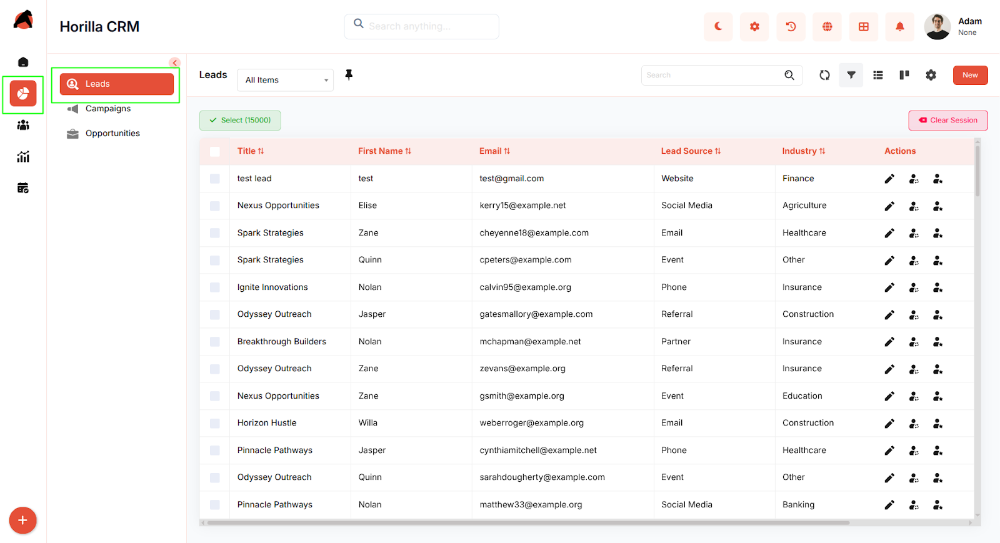
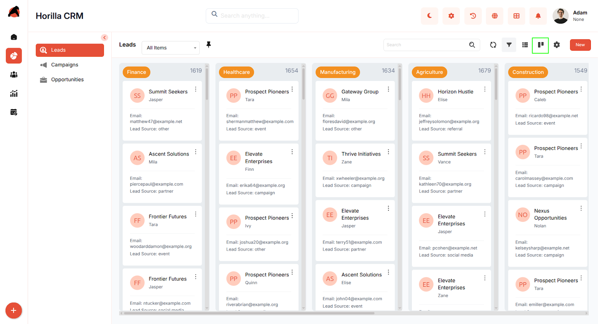
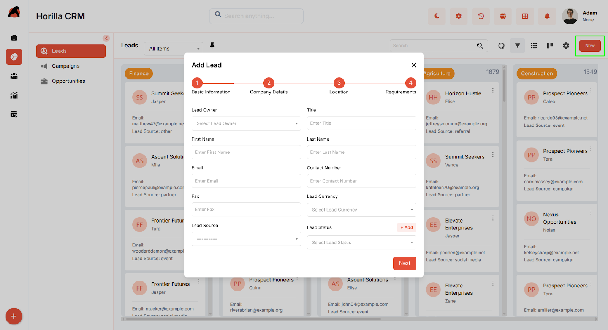
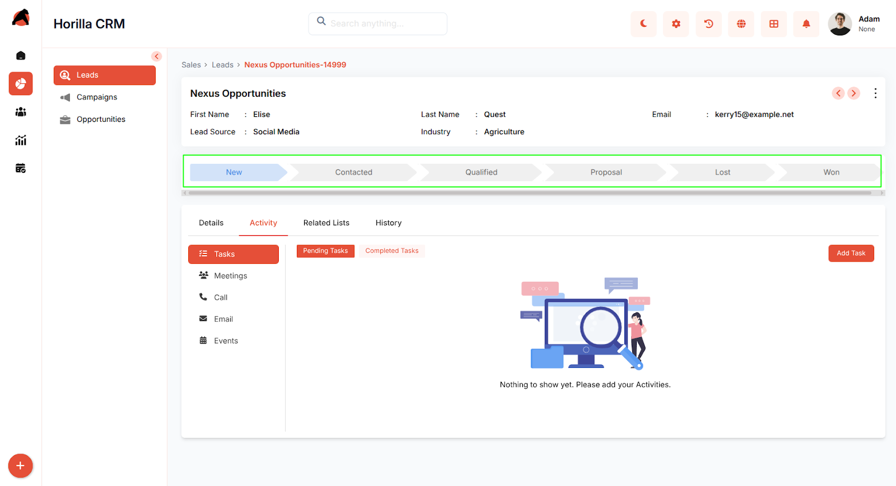
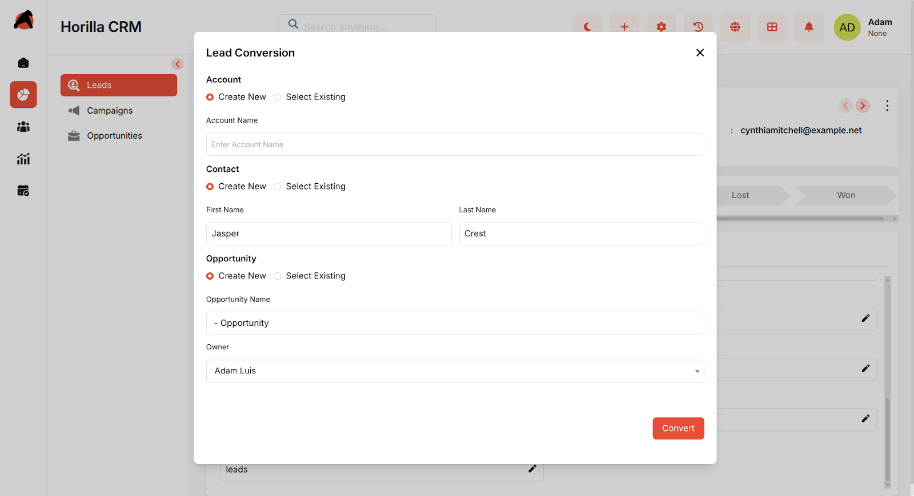

# **Horilla CRM Leads – Functional Guide**

## **Introduction**

The Horilla CRM Leads Module is a crucial component designed to automate and streamline the management and conversion of potential customer leads. It offers a secure, efficient, and user-friendly system that helps businesses track lead details, monitor their progress through various stages, and enhance sales team productivity. The module facilitates lead organization, interaction tracking, and timely follow-ups to convert prospects into opportunities, while also supporting integration with other business tools for a seamless workflow.

## **Key Features and Functionalities**

### **2.1 Leads Overview**

* **Purpose:** Display all leads in a centralized list view for easy access and management.  
* Users can navigate to the "Sales" section in the sidebar and select "Leads" to view the list.  
* Includes search and filter options to quickly locate specific leads based on criteria like name or lead source.  
* The interface features sortable columns and customizable filters to enhance usability and efficiency.  
* Enable bulk management of leads from the list view by selecting one or more opportunities using the checkboxes, with available actions including Update, Export and Bulk Delete.

{.full-width}

### **2.2 Leads Kanban Display**

* **Purpose:** Provide a visual representation of leads categorized by their current stage.  
* Users can decide the categorization by changing Kanban settings to suit their preferences.  
* Supports drag-and-drop functionality to update lead statuses seamlessly.  
* Helps in tracking the progress of each lead efficiently and visually.

### **2.3 Creating a New Lead**

* **Purpose:** Enable the creation of new leads to initiate the tracking process.  
* Click the "New" button on the leads page to open a multi-step form.  
* Enter basic details (lead owner, name, email, lead source, industry) in the "Basic Information" step.  
* Use "Next" to input company details (title, contact number, lead currency).  
* Navigate to "Location" and "Requirements" sections as needed with "Next" and "Previous" options.  
* Click "Save" to submit and store the lead information.

### **2.4 Lead Detailed Information**

* **Purpose:** Offer comprehensive details and management options for each lead.  
* Clicking a lead’s title from the list or Kanban view opens the detailed view.  
* Includes related lists, activities, and history for a complete overview.  
* Users can convert a lead into an account, contact, and opportunity by clicking the final stage in the progress bar.

### **2.5 Lead Conversion Process**

* **Purpose:** Facilitate the transformation of a lead into actionable business entities.  
* Access the lead detail view and navigate to the final stage in the progress bar.  
* Select options to create a new account, contact, or opportunity during conversion.  
* The form includes fields for account name, contact details (first name, last name), and opportunity name.  
* Click "Convert" to finalize the process, linking the lead to the new entities.

