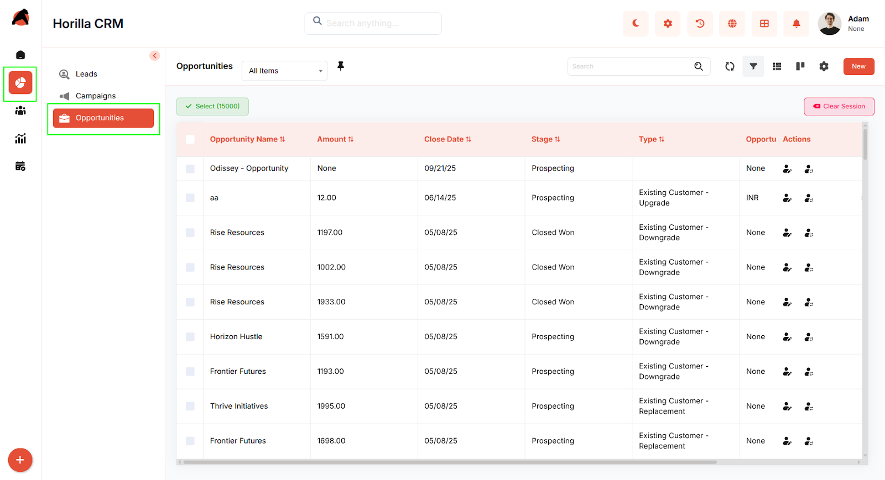
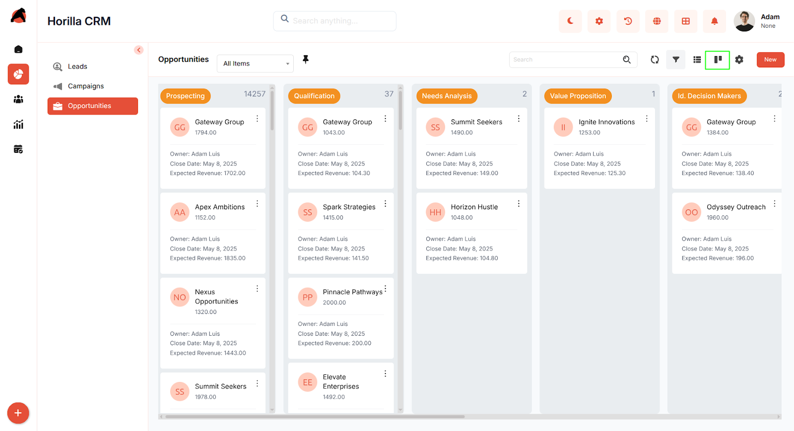
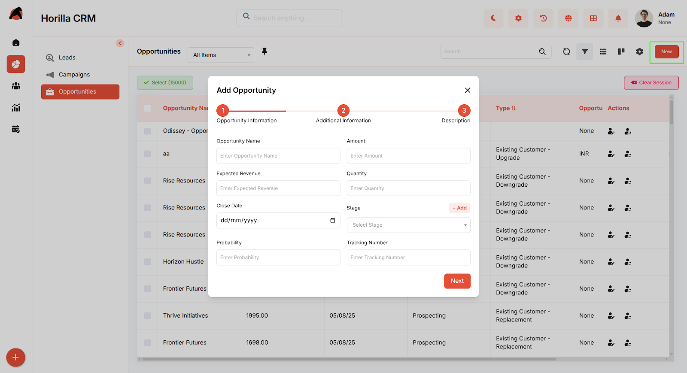
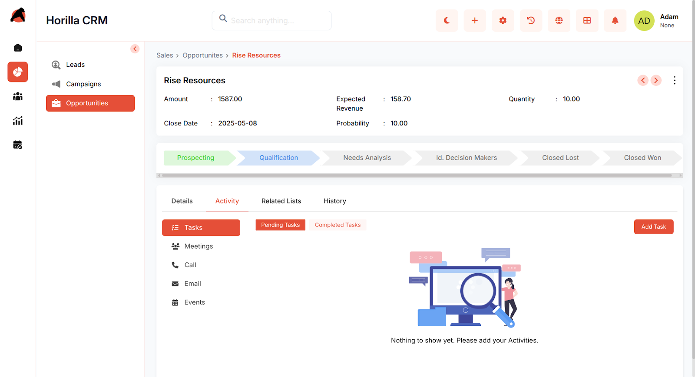

# **Horilla CRM Opportunities – Functional Guide**

## **Introduction**

The Horilla CRM Opportunities Module serves as a vital tool crafted to automate and simplify the oversight and transformation of sales opportunities. It delivers a protected, streamlined, and intuitive platform that allows companies to monitor opportunity specifics, follow their journey across different sales phases, and elevate the efficiency of their sales teams. The module supports the structuring of opportunities, tracks interactions, and ensures prompt follow-ups to turn prospects into finalized deals, while also enabling integration with other business systems for a cohesive workflow.

## **Key Features and Functionalities**

### **1.1 Opportunities Overview**

* **Purpose:** Present all opportunities in a unified list view for convenient access and control.  
* Users can access the list by navigating to the "Sales" section in the sidebar and choosing "Opportunities."  
* Offers search and filter capabilities to swiftly identify specific opportunities based on factors like name or stage.  
* The interface includes sortable columns and adjustable filters to improve user experience and effectiveness.  
* Facilitates bulk management of opportunities in the list view by selecting multiple opportunities via checkboxes, offering options such as Update, Export, and Bulk Delete.
* 

### **1.2 Opportunities Kanban Display**

* **Purpose:** Offer a graphical depiction of opportunities organized by their current sales phase.  
* Users have the flexibility to adjust categorization through customizable Kanban settings to match their needs.  
* Features drag-and-drop functionality for smooth updates to opportunity statuses.  
* Assists in effectively and visually monitoring the advancement of each opportunity.  
    

### **1.3 Creating a New Opportunity**

* **Purpose:** Allow the initiation of new opportunities to begin the sales tracking process.  
* Select the "New" button on the opportunities page to launch a multi-step form.  
* Input initial details (opportunity owner, name, account, amount, expected close date) in the "Basic Information" step.  
* Proceed with "Next" to add further details (stage, probability, lead source).  
* Move to "Description" sections as required using "Next" and "Previous" options.  
* Finalize by clicking "Save" to submit and save the opportunity data.

### **1.4 Opportunity Detailed Information**

* **Purpose:** Provide an in-depth view and management capabilities for individual opportunities.  
* Accessing the detailed view is possible by clicking an opportunity’s title from either the list or Kanban view.  
* Encompasses related lists, activities, and history for a thorough understanding.  
* Allows users to modify the opportunity stage or finalize it by selecting the last stage in the progress bar.  

