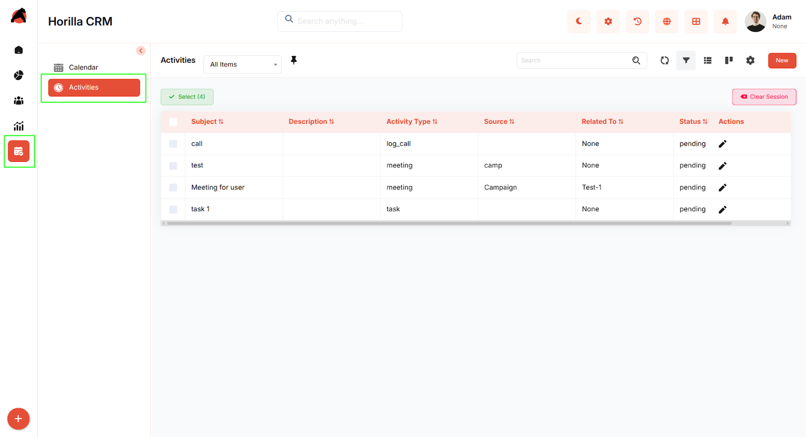
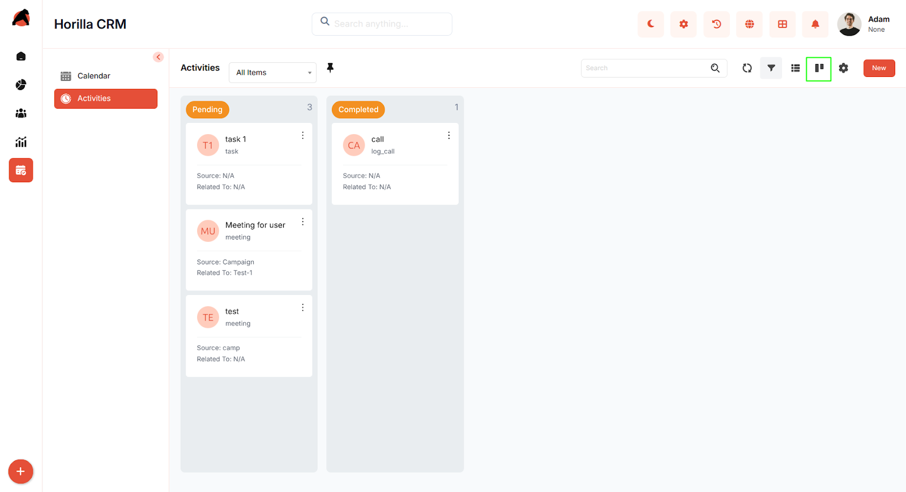
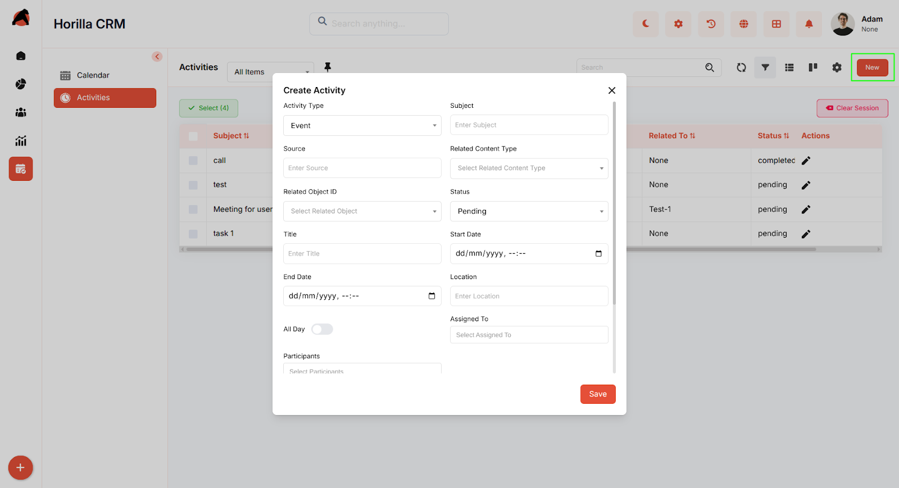
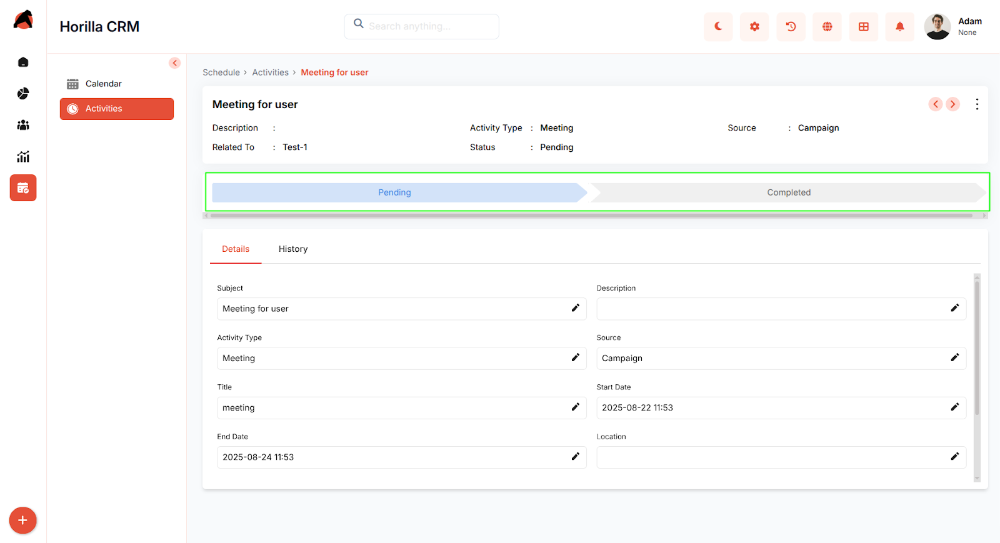

# **Horilla CRM Activities – Functional Guide**

## **Introduction**

The Horilla CRM Activities Module is designed to streamline the tracking, scheduling, and management of all account-related and contact-related interactions. It provides users with a structured interface to create, view, and manage activities such as calls, meetings, tasks, and events. This ensures that follow-ups are completed on time, progress is monitored, and team productivity is optimized. Activities can be linked to various records in CRM (Accounts, Contacts, Opportunities, etc.) to provide a 360° view of engagements.

## **Key Features and Functionalities**

### **2.1 Activities Overview**

**Purpose:** Display all activities in a consolidated list format for quick tracking and updates.

* Accessible from the sidebar menu under the **Activities** option.  
* Provides search and filter options for locating specific activities by subject, type, or related record.  
* List view includes essential fields such as **Subject, Description, Activity Type, Source, Related To, and Status**.  
* Bulk selection supported for editing, deleting, or exporting activities.  

### **2.2 Activities Kanban Display**

**Purpose:** Offer a visual representation of activities based on their status.

* Activities are grouped into columns such as **Pending** and **Completed**.

* Users can drag and drop activities across columns to update status.

* Each activity card shows details like **Subject, Type, Source, and Related Record** for quick insights.

* Helps users monitor progress in a more interactive and clear format.  
  

### **2.3 Creating a New Activity**

**Purpose:** Enable users to add new activities for effective engagement management.

* Click the **New** button in the Activities page to open the creation form.

* Core fields include:

  * **Activity Type** (Task, Event, Call, Meeting, etc.)

  * **Subject, Description, Title**

  * **Source**

  * **Related Record** (Account, Contact, Opportunity, etc.)

  * **Status** (Pending / Completed)

  * **Start Date, End Date, Location, Assigned To**

* Save to register the activity, which then becomes visible in both **List** and **Kanban** views.

### **2.4 Activity Detailed Information**

**Purpose:** Provide a complete view of an activity, along with tracking and editing options.

* **Details Tab**

  * Displays all activity fields (Subject, Type, Status, Dates, Source, etc.).

  * Fields can be edited individually using inline editing.

* **History Tab**

  * Maintains a log of changes made to the activity.

  * Tracks updates like subject changes, status transitions (Pending → Completed), and re-assignments.

* **Status Tracking**

  * A progress bar (e.g., Pending → Completed) visually shows the current stage of the activity.

  * Users can update the activity status directly from the detailed view.

