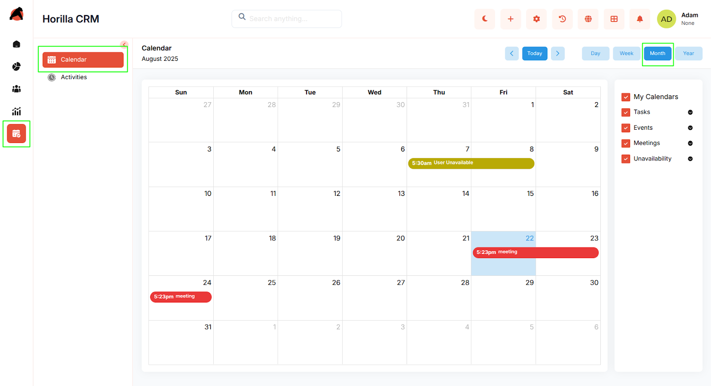
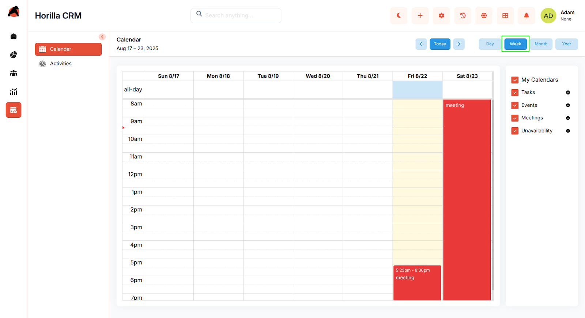
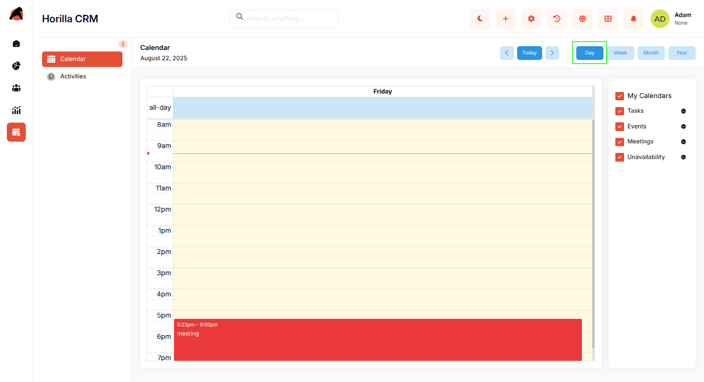
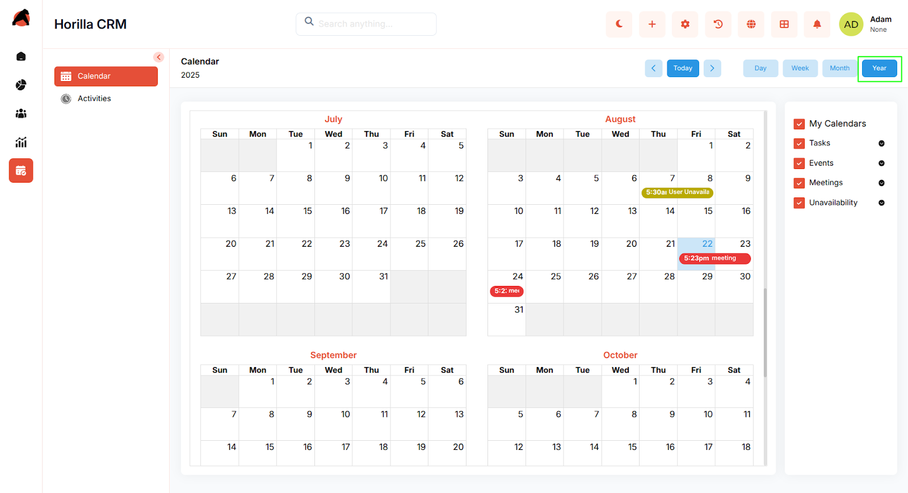
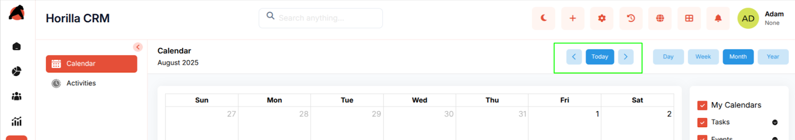
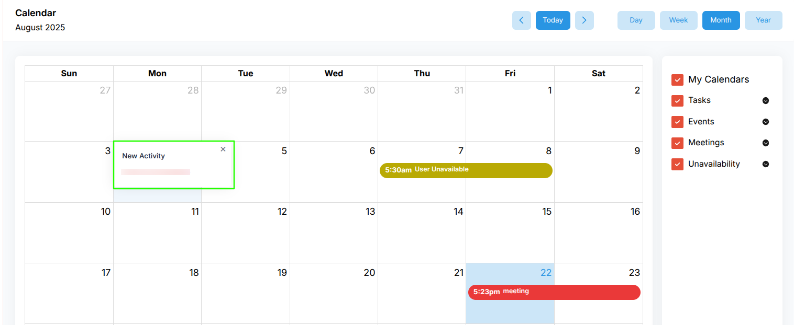
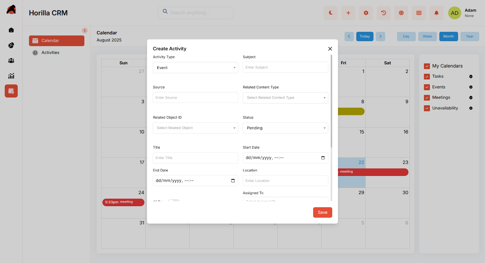
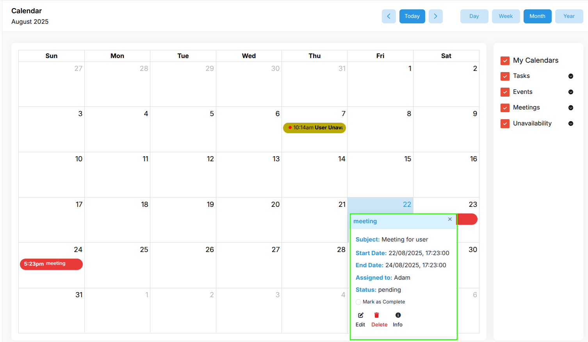
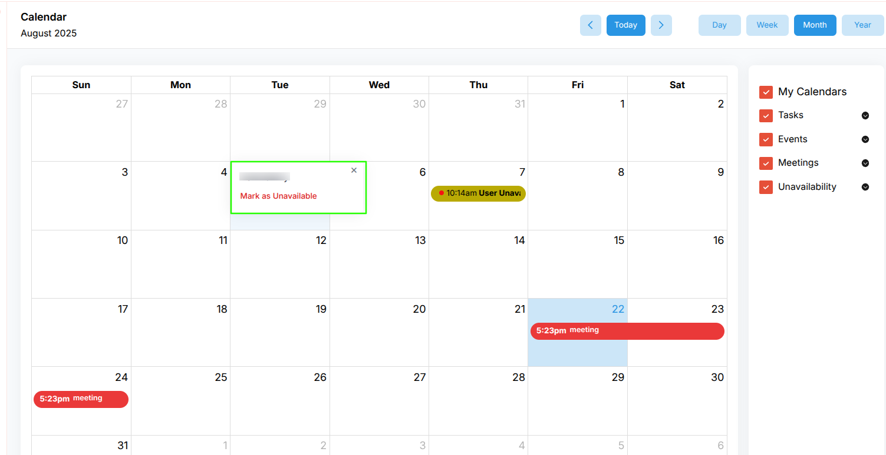
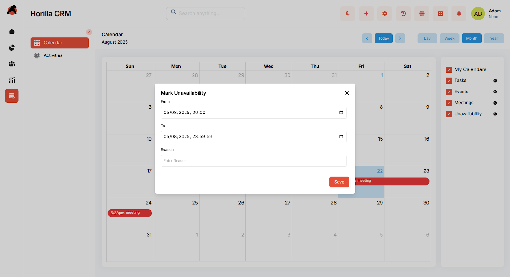

# **Horilla CRM Calendar – Functional Guide**

## **Introduction**

The **Horilla CRM Calendar Module** provides users with a unified interface to manage all CRM-related activities in a time-based format. It helps schedule, track, and organize tasks, meetings, events, and availability directly within the CRM. With multiple calendar views, quick actions, and integration with other modules, the Calendar ensures that users never miss critical engagements while maintaining full control of their schedules.

## **Key Features and Functionalities**

### **1.1 Calendar Views**

**Purpose:** Provide flexible time-based perspectives for managing activities.

* **Month View** – Displays all activities in a monthly grid.  

* **Week View** – Shows detailed scheduling across the week.  

    
* **Day View** – Focused view of a single day’s activities.  

* **Year View** – Provides a broader overview of activity distribution across the year.  
  

* Navigation options: Today, Previous, Next.  

### **1.2 Activities and Activity Preference** 

**Purpose:** Display CRM activities in an interactive, color-coded calendar interface.

* Supports multiple activity types: **Task, Event, Meeting, Unavailability**.

* Activities appear on their scheduled start and end times.

* **Colors are user-configurable** (each user can define preferences for activity types).

* Users can filter which activity types are visible (e.g., only show Tasks & Meetings).  
    
* Users can choose which activity types to display.  
* Customizable **color coding per user** for activity types.

### **1.3 Creating a New Activity**

**Purpose:** Enable users to schedule and manage CRM-related activities.

* Add activities directly from the calendar.

* Once saved, activities are instantly visible in the selected calendar view.  

### **1.4 Activity Detail View**

**Purpose:** Provide quick and complete access to activity information.

* **Short Detail Popup (on calendar click):**

  * Shows Subject, Description, Assigned User, Dates, and Status.

  * Quick actions: **Edit, Delete, Mark Complete, Info (full view)**.

* **Full Detail View (via Info):**

  * Displays all fields with inline editing.

  * History tab to track updates (status changes, reassignments, etc.).

  * Progress tracking for status updates (e.g., Pending → Completed).  

### **1.5 Unavailability Management**

**Purpose:** Allow users to block specific times to avoid scheduling conflicts.

* Users can mark themselves unavailable for specific dates or time slots.

* Appears on the calendar as a dedicated activity type.

* Optional notes to explain the unavailability reason.

##  **Benefits**

* Centralized scheduling of all CRM activities.

* Visual clarity with flexible views and color coding.

* Improved productivity with direct actions from the calendar interface.

* Prevents scheduling conflicts with unavailability tracking.

* Strengthens CRM’s 360° engagement tracking by linking activities with records.
