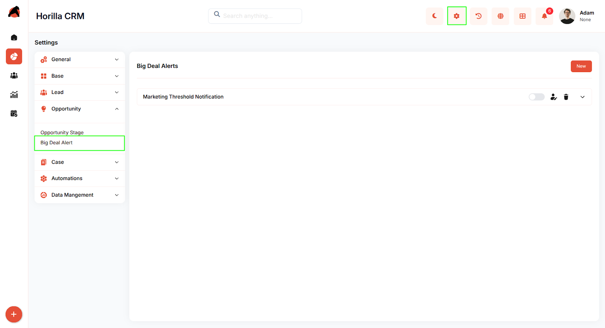
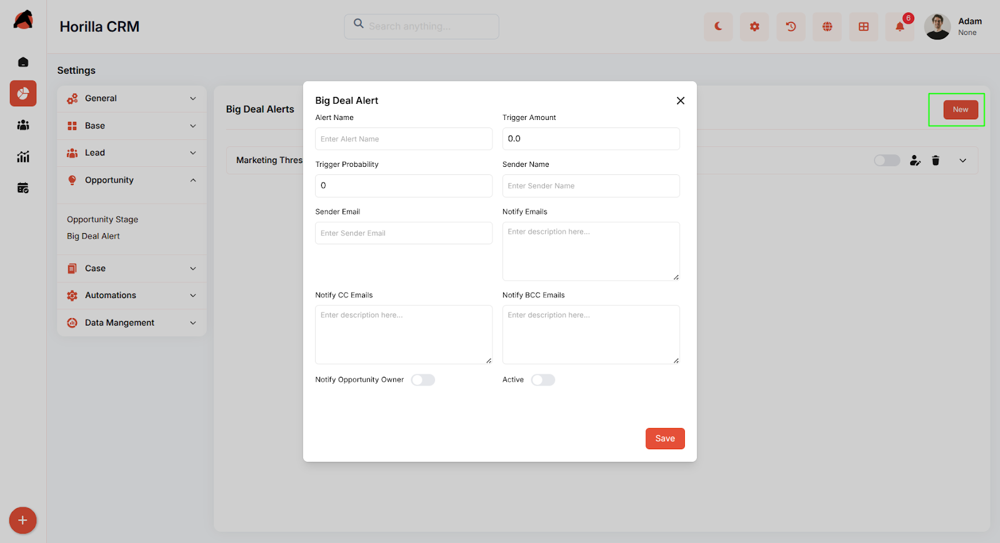
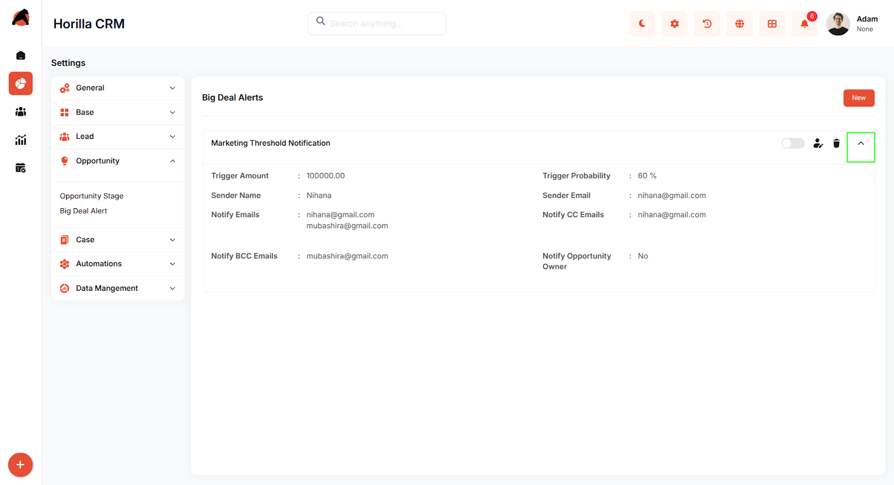

# **Horilla CRM Big Deal Alert – Functional Guide**

##  **Introduction**

The Big Deal Alert Module in Horilla CRM is designed to help organizations proactively monitor and manage high-value opportunities. It enables users to configure alert thresholds, receive timely notifications, and take swift action to maximize revenue potential. By providing centralized visibility and detailed insights into critical deals, the module ensures that stakeholders stay informed, improving decision-making and overall sales performance.

##  **Key Features and Functionalities**

### **1.1 Big Deal Alerts Overview** 

**Purpose: Present all Big Deal Alerts in a centralized dashboard for simplified monitoring and management.**

* Accessible via **Settings → Opportunity → Big Deal Alert.**.

* Displays key alert details such as Alert Name, Trigger Amount, Sender Name, Notify Emails, and Status (Active/Inactive).

* Supports quick search and filtering for easy alert identification.

* Provides options to activate/deactivate, edit, or delete alerts directly from the list.

* The expandable view allows reviewing alert details without leaving the dashboard.

### **1.2 Configuring Big Deal Alerts**

**Purpose:** Enable users to create and manage alerts for high-value opportunities efficiently.

* Define alert criteria including trigger amounts, probability thresholds, and notification recipients.

* Specify sender information and configure recipients (To, CC, BCC) as needed.

* Toggle notifications for opportunity owners to ensure relevant stakeholders are informed.

* Alerts can be activated or deactivated at any time without deletion.

### **1.3 Alert Detailed View**

**Purpose:** Provide comprehensive visibility into individual alert settings and history.

* View detailed information including trigger criteria, notification recipients, and status.

* Quick actions allow editing or removing alerts while preserving data integrity.

* Expandable interface ensures that all relevant information is available without navigating away from the dashboard.  
    

### **1.4 Notifications and Activation**

**Purpose:** Ensure timely and automated communication for high-value deals.

* Active alerts continuously monitor opportunities and send notifications in real-time.

* Notifications are delivered automatically via email to configured recipients.

* Alerts can be easily toggled on or off to align with business needs.  
    

### **1.5 Edit and Delete Functionality**

**Purpose:** Maintain accurate and up-to-date Big Deal Alerts for effective monitoring.

* Edit functionality allows modification of all alert parameters.

* Delete functionality removes alerts permanently with confirmation prompts to prevent accidental removal.

* Changes are reflected immediately across the dashboard and notification system

## **Conclusion**

The Big Deal Alert Module provides a robust platform to track high-value opportunities and take timely action. By combining real-time notifications, detailed visibility, and centralized management, it ensures that critical deals are never overlooked. This module enhances decision-making, accelerates deal closure, and integrates seamlessly with Opportunity and Automation modules to improve overall workflow efficiency and revenue performance.

