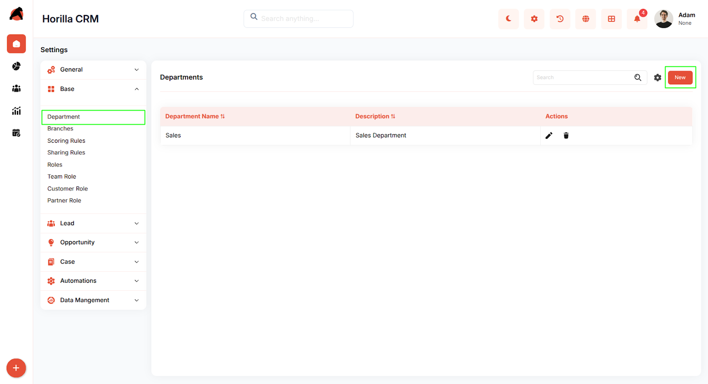
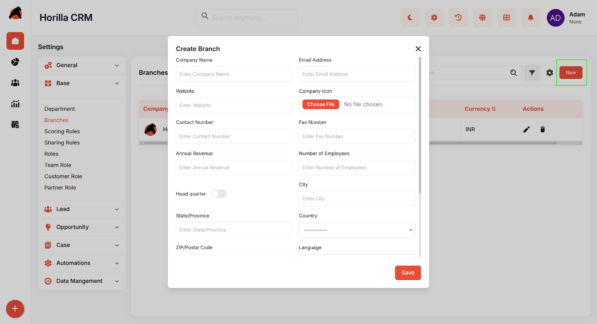
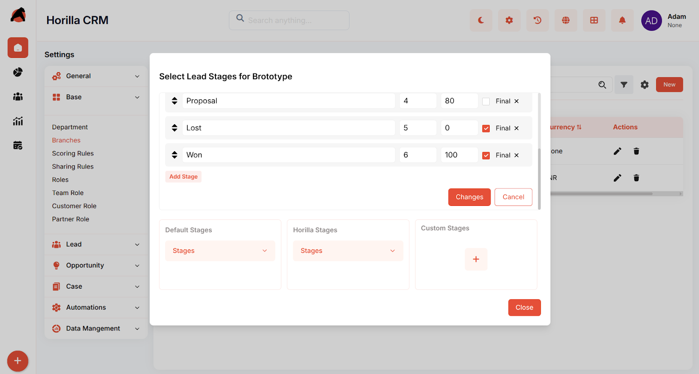
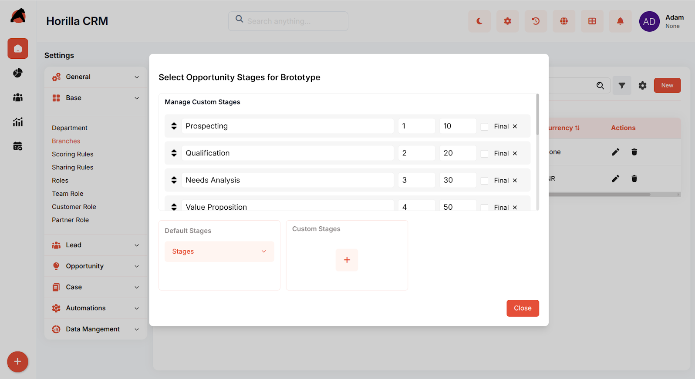
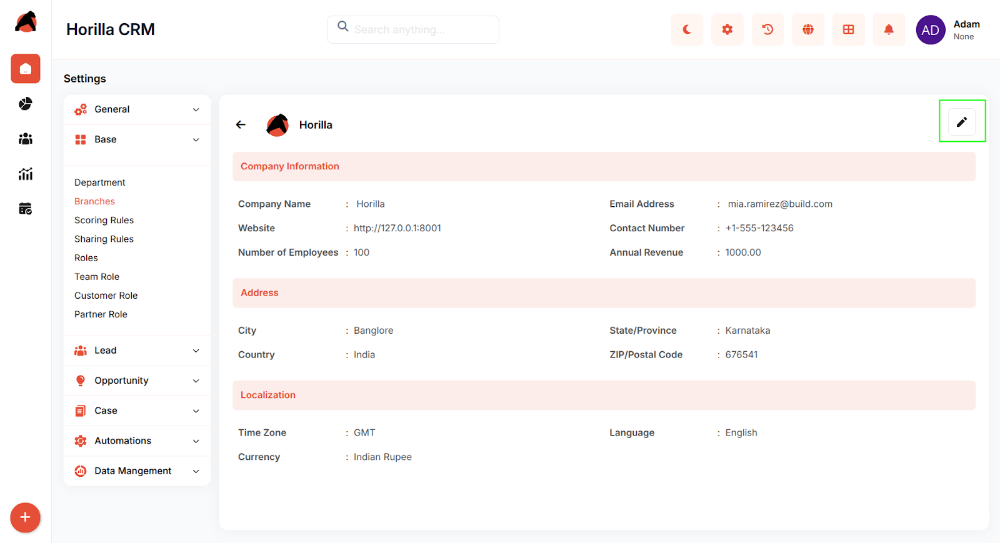

# **Horilla CRM Branch & Department Management – Complete Functional Guide**

## **Introduction**

The Branch & Department Management module in Horilla CRM allows organizations to manage multiple business units and their internal structures under a single system.

Each branch (company) can store its own company details, localization settings, and operational configurations while still being integrated into the wider CRM. Departments within branches provide a clear hierarchy and alignment between teams, enabling streamlined reporting and access management.

Branch (company) creation also triggers streamlined lead and opportunity stage configuration, ensuring that each branch (company) has its own tailored sales processes right from the start. This feature supports organizations with multi-location operations, enabling flexible customization for sales pipelines, departmental organization, and reporting.

## **Key Features and Functionalities**

### **1\. Accessing Department** 

Navigate to: **Settings → Base → Departments**

### **1.1 Department Management**

**Purpose:** Define organizational departments to categorize users and structure business operations.

*  Departments provide a clear hierarchy and alignment between teams, enabling streamlined reporting and access management.  
* Departments represent organizational units such as Sales, Marketing, or Support. They provide structure for grouping users, aligning responsibilities, and managing departmental reporting.

### **2\. Accessing Branches (Companies)**

Navigate to: **Settings → Base → Branches**

Here, administrators can view, create, and manage branches (companies).

### **2.1  Branches (Companies) List View**

* Displays all created branches (companies) in a structured table.  
* **Columns**: Company Name, Email Address, Number of Employees, Headquarter, Currency, Actions.  
* **Actions Available**:  
  * Edit branch (company) details.  
  * Delete branch (company).  
* Search and filter options allow quick access to branches (companies).

### **2.2. Create New Branch (Company)**

Click **New** to open the branch (company) creation form.

**Branch (Company) Form Fields:**

#### **Company Information**

* **Company Name**: Enter the official name of the branch/company  
* **Email Address**: Primary email contact for the branch (company)  
* **Website**: Company website URL  
* **Company Icon**: Upload company logo/icon using "Choose File" button

#### **Contact Details**

* **Contact Number**: Primary phone number for the branch (company)  
* **Fax Number**: Fax contact number

#### **Business Metrics**

* **Annual Revenue**: Enter the annual revenue figure  
* **Number of Employees**: Total employee count for this branch (company)

#### **Location Settings**

* **Head Quarter Toggle**: Mark if the branch (company) is a head office  
* **City**: Enter city name  
* **State/Province**: Enter state or province  
* **Country**: Select from dropdown  
* **ZIP/Postal Code**: Enter postal/ZIP code

#### **Localization & Format Settings**

* **Time Zone**: Select appropriate time zone   
* **Language**: Select language  
* **Currency**: Select currency   
* **Time Format**: Choose time display format (e.g., "HH:MM:SS AM/PM (01:45:00 PM)")  
* **Date Format**: Choose date display format (e.g., "YYYY-MM-DD (2006-10-25)")

#### **Multi-Currency Feature**

* **Activate Multiple Currencies**: Toggle switch to enable multi-currency support for the branch (company)

After entering all required details → click **Save**.

### **2.3. Automated Stage Setup After Saving a Branch (Company)**

A unique capability of Branch (Company) Management is the **automated opening of sales process templates**:

* **Step 1: Lead Stage Template**

  * Immediately after saving a branch (company), the **Lead Stage configuration window** opens.  
  * Admins can select, reorder, and configure lead stages.  
  * Options include stage name, order number, probability percentage, and marking a stage as **Final**.  
  * Supports both default stages and custom stages.

* **Step 2: Opportunity Stage Template**

  * Once the lead stages are saved, the system automatically prompts the **Opportunity Stage configuration window**.  
  * Admins can manage sales pipeline stages for opportunities with similar customization: order, probability, and final stage marking.  
  * Default and custom stages are both supported.

This ensures every branch (company) has a **standardized sales process** aligned with organizational needs right at creation.

### **2.4. Branch (Company) Detail View**

Clicking on a branch (company) opens a **detailed view page** with structured sections:

* **Company Information**  
  * Name, Email, Website, Contact Number, Annual Revenue, Number of Employees.  
* **Address**  
  * City, State/Province, Country, ZIP/Postal Code.  
* **Localization**  
  * Time Zone, Language, Currency, Time Format, Date Format.  
* **Multi-Currency Status**  
  * Shows if multiple currencies are activated.  
* Edit option available to update branch (company) details.

## **Benefits**

* **Multi-Branch (Company) Management**: Organize multiple business units under one CRM.  
* **Automated Sales Stage Setup**: Ensures each branch (company) has pre-configured lead and opportunity pipelines immediately after creation.  
* **Customizable Sales Processes**: Support for default and custom stages provides flexibility.  
* **Comprehensive Company Profiling**: Store detailed company information, contact details, and business metrics.  
* **Advanced Localization**: Support for timezone, language, currency, and date/time format preferences.  
* **Multi-Currency Support**: Enable multiple currency handling per branch (company).  
* **Centralized Data Management**: Store all branch (company) details in organized sections.  
* **Scalable Operations**: Ideal for organizations expanding across regions with different localization needs.
