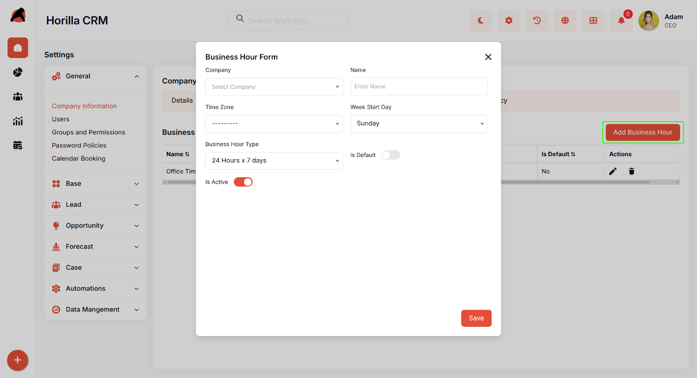
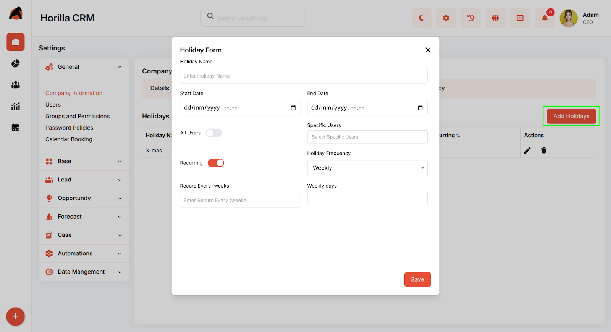
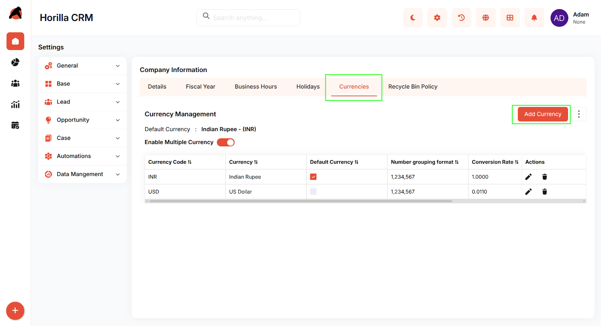
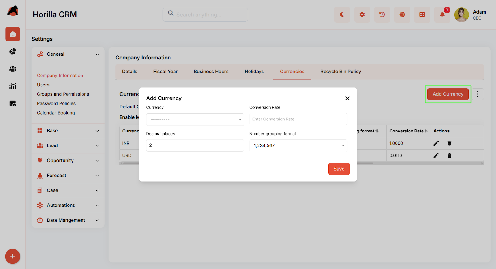
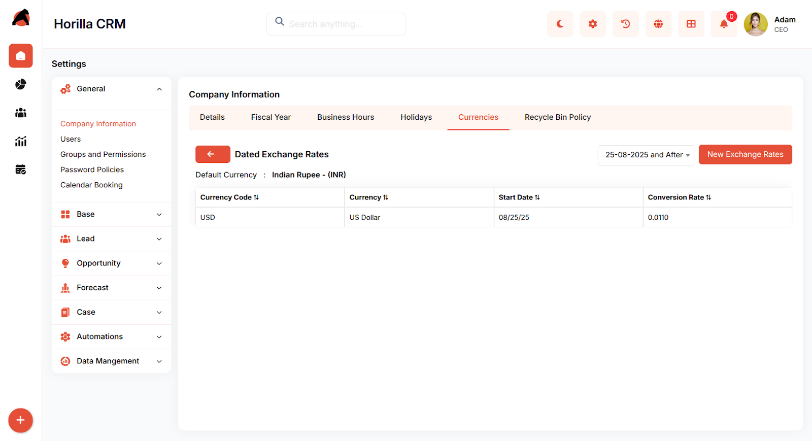

# **Horilla CRM Company Information Settings – Functional Guide**

## **Introduction**

The **Company Information** module in Horilla CRM Settings provides a centralized interface for managing essential organizational data and system configurations. Found under the **General** settings section, this module enables administrators to configure company details, fiscal year settings, business hours, holidays, currency management, and data retention policies.

This module acts as the **foundation for system-wide configurations**, impacting reporting, scheduling, financial calculations, and operational workflows across the CRM.

## **Key Features and Functionalities**

### **Accessing Company Information**

Navigate to: **Settings  → General → Company Information**  
 Here, administrators can view and manage organizational details and configurations.

## **1\. Company Details Tab**

**Purpose:** Manage core organizational profile information.

* **Company Profile:** Configure logo, name, phone, fax, email, website, and address (country, state/province, city, postal code).

* **Operational Details:** Define timezone, language, currency, number of employees, and annual revenue.

**Edit Functionality:**

* Use the **pencil icon** (top-right corner) to edit company details.

## **2\. Fiscal Year Tab**

**Purpose:** Configure financial year settings for reporting and forecasting.

* **Fiscal Year Type:**

  * *Standard Fiscal Year* (default).

  * *Custom Fiscal Year* – configurable via **Manage Fiscal Year** button.

* **Start Date Month:** Default \= January (can be changed).

* **Display Fiscal Year Based On:** Choose **Starting Year** or **Ending Year**.

* **Preview Calendar Button:** View fiscal year layout.  
  

* **Manage Fiscal Year Button:** Switch between **Standard** and **Custom** fiscal year.

### **Custom Fiscal Year Options**

When selecting **Custom Fiscal Year**, administrators can configure the fiscal calendar using **Year-Based** or **Quarter-Based** patterns.

#### **Year-Based Patterns**

* **3-3-3-4** → Q1 (3 periods), Q2 (3), Q3 (3), Q4 (4)  
* **3-3-4-3** → Q1 (3), Q2 (3), Q3 (4), Q4 (3)  
* **3-4-3-3** → Q1 (3), Q2 (4), Q3 (3), Q4 (3)  
* **4-3-3-3** → Q1 (4), Q2 (3), Q3 (3), Q4 (3)

  #### **Quarter-Based Patterns**

* **4-4-5** → Each quarter has 3 periods: 4 weeks, 4 weeks, 5 weeks  
* **4-5-4** → Each quarter has 3 periods: 4 weeks, 5 weeks, 4 weeks  
* **5-4-4** → Each quarter

  #### **Fill Fields** 

* **Start Date Month** → Select the starting month of the fiscal year.  
* **Start Date Day** → Define the exact starting day.  
* **Week Start Day** → Choose the first day of the week (e.g., Sunday, Monday).  
* **Display Fiscal Year Based On** → Choose **Starting Year** or **Ending Year**.  
* **Number of Weeks By** → Define how weeks are calculated (monthly/quarterly).  
* **Period Display Option** → Select display format for periods in reports.  
   has 3 periods: 5 weeks, 4 weeks, 4 weeks  
  

## **3\. Business Hours Tab**

**Purpose:** Define organizational working hours and schedules.

* **Business Hours Management Table:**  
   Columns → Name, Time Zone, Business Hour Type, Week Start Day, Is Default, Actions

* Supports multiple schedules (e.g., 24x7, standard office hours).

* Configurable timezone and week start day.

* One schedule can be marked as **Default**.

**Actions Available:**

* Edit business hours

* Delete business hours

* Create new business hours

**Create Business Hours:**

* Name: Enter a descriptive schedule name.

* Time Zone: Select relevant timezone.

* Week Start Day: Choose day (e.g., Sunday, Monday).

* Business Hour Type: e.g., 24x7, office hours.

* Is Default  
* Is Active

## **4\. Holidays Tab**

**Purpose:** Manage the company holiday calendar.  

* **Holiday Management Table:**  
   Columns → Holiday Name, Start Date, End Date, Recurring, Actions

* Supports single-day or multi-day holidays.

* Allows recurring annual holidays (e.g., New Year, Independence Day).

**Actions Available:**

* Edit holiday

* Delete holiday

* Create holiday

**Create Holiday:**

* Holiday Name: Enter holiday name.

* Start Date / End Date: Define duration.

* All Users: Apply to all users.

* Specific Users: Assign to selected users only.

* Recurring: Enable annual repetition.

* Holiday Frequency & Yearly Repeat Type: Configure repeat pattern.

## **5\. Currencies Tab**

**Purpose:** Manage multi-currency settings and exchange rates.

* **Default Currency:** Company’s primary currency.

* **Enable Multiple Currencies:** Toggle ON to support multiple currencies.

* **Currency Management Table:**  
   Columns → Currency Code, Name, Default Currency, Conversion Rate, Decimal Places, Number Grouping Format

**Add New Currency:**

* Currency: Select from dropdown.

* Conversion Rate: Define against default currency.

* Decimal Places: Specify precision.

* Number Grouping Format: e.g., 1,234,567.

**Actions Available:**

* Edit currency (pencil icon)

* Delete currency (trash icon)

**Additional Currency Features:**

* **Change Default Currency:** Update via form or checkbox. System recalculates rates automatically.

* **Update Conversion Rates:** Change conversion rate across currencies.

* **Dated Exchange Rates:** Add exchange rates valid for specific dates.  

## **6\. Recycle Bin Policy Tab**

**Purpose:** Configure record retention and recovery policy.

* **Default Expire Days:** Specify how long deleted records remain recoverable (default \= 30 days).

* **Save Button:** Apply updated retention settings.

## **Benefits**

* **Centralized Configuration:** One place for all organization-level settings.

* **Multi-Currency Support:** Handle global operations with flexible exchange rates.

* **Flexible Scheduling:** Define multiple business hours and holiday calendars.

* **Financial Integration:** Fiscal year settings integrated with analytics and forecasting.  
* **Data Governance:** Control over retention periods for compliance.  
* **User-Friendly Design:** Tab-based layout with clear action buttons.  
* **System-Wide Impact:** Configurations apply across all CRM modules.  
* **Scalable Management:** Supports growth with multiple currencies, schedules, and policies.
