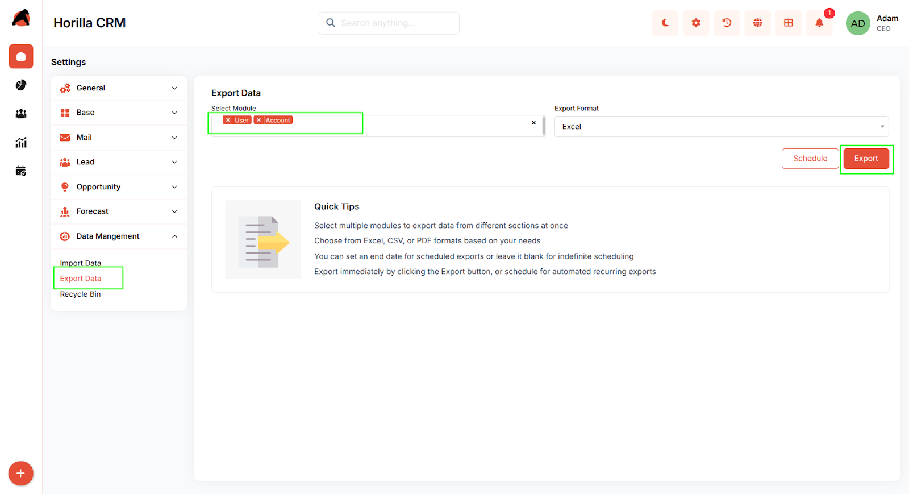
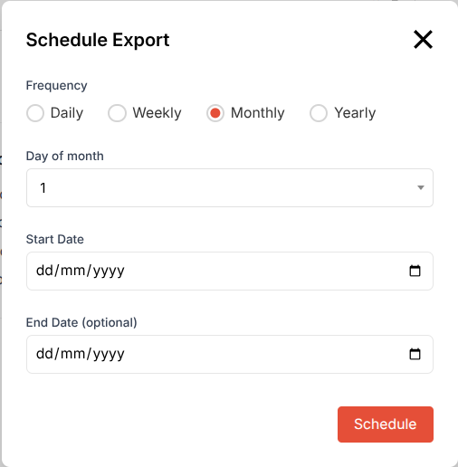
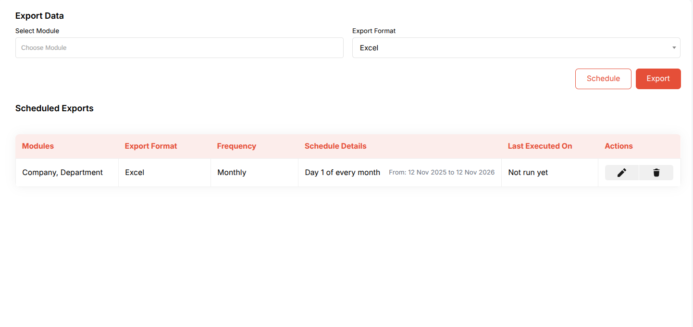

# **Horilla CRM Export Data  Functional Guide**

## **Introduction**

The Horilla CRM Export Data feature, found under the Data Management section, allows users to efficiently extract and download data from various CRM modules. This functionality supports both immediate exports and automated scheduled exports, enabling businesses to generate reports, perform data analysis, or integrate information with external tools. 

Exports are available in formats such as Excel, CSV, or PDF, providing flexibility for different use cases. The module integrates seamlessly with core CRM sections like Base, Mail, Leads, Opportunities, and Forecast, ensuring comprehensive data portability while maintaining data integrity and security.

## **Key Features and Functionalities**

### **2.1 Export Data Overview**

* **Purpose:** Provide a user-friendly interface for selecting modules, formats, and scheduling options to export CRM data.  
* Navigate to the “**Settings**” and select “**Data Management”** \> “**Export Data.**”  
* Supports selection of single or multiple modules  
* If a single module is selected  the export downloads directly in the chosen format .  
* If multiple modules are selected (e.g., Company and Department), the system bundles the files into a ZIP archive for convenient multi-file handling.  
  

### **2.2 Scheduled Exports**

* **Purpose:** Automate recurring data exports to streamline reporting and compliance processes.  
    
* View scheduled exports in the table format, where each row provides at-a-glance details and execution status.  
  

## **Conclusion**

The Horilla CRM Export Data feature offers a flexible and efficient way to extract data from various modules, supporting immediate or scheduled exports in Excel, CSV, or PDF formats. Single-module exports download as standalone files, while multi-module exports are bundled into ZIP archives. With its integration and tracking capabilities, it enhances data management and decision-making.

