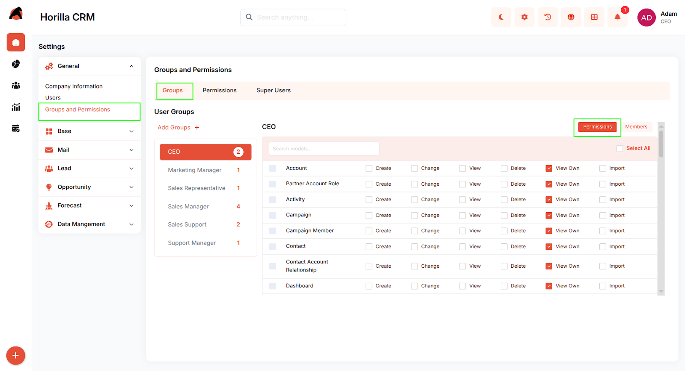
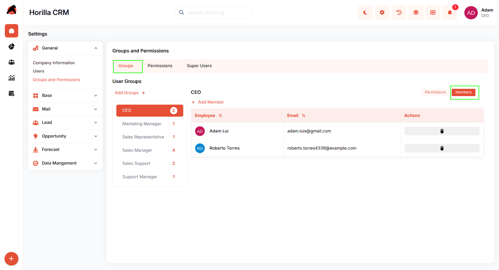
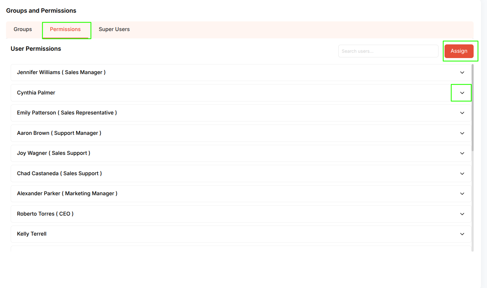
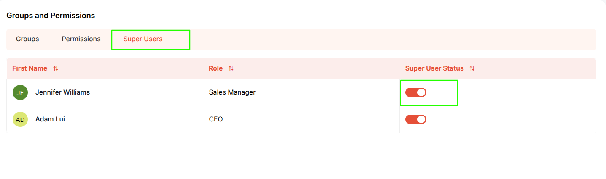

# **Horilla CRM Groups and Permissions – Functional Guide**

## **Introduction**

The Horilla CRM Groups and Permissions Module enables administrators to manage organizational roles, assign permissions to users and groups, and maintain system access control. This module supports both role-based group permissions and individual user permission assignments, with dedicated Super User management to ensure organizational security and continuity.

## **Key Features and Functionalities**

### **2.1 Groups Overview**

**Purpose:** Manage all organizational groups and assign permissions to roles.

**Access:** Settings → Groups and Permissions → Groups tab

**Key Features:**

* View all groups with member count  
* Assign permissions to groups using checkboxes (Create, Edit, Delete, View, View Own, Import)  
* Use "Select All" to assign all permissions at once  
* Click "Add Groups \+" to create new groups  
    
    
   
    
  

### **2.2 Group Members Management**

**Purpose:** Manage users within a group.

**Access:** Groups tab → Members button

**Key Features:**

* View all members in the selected group  
* "+ Add Member" button to add users to the group  
* Delete icon to remove members from the group

### **2.3 Permissions Overview**

**Purpose:** Assign permissions to individual users.

**Access:** Settings → Groups and Permissions → Permissions tab

**Key Features:**

* View all users with their roles  
* Search bar to find users quickly  
* Click on user to expand and configure individual permissions  
* Same permission options as groups (Create, Edit, Delete, View, View Own, Import)

### **2.4 Bulk Permission Assignment**

**Purpose:** Assign permissions to multiple users simultaneously.

**Access:** Permissions tab → Assign button

**Key Features:**

* Select multiple users using the dropdown  
* Configure permissions for selected users  
* Click "Save" to apply permissions to all selected users at once

### **2.5 Super Users Management**

**Purpose:** Manage and control administrator accounts.

**Access:** Settings → Groups and Permissions → Super Users tab

**Key Features:**

* View all Super Users with their roles  
* Toggle switch to enable/disable Super User status  
* Constraint: At least one Super User must exist  
* Last Super User's toggle is disabled to prevent removal

## **Conclusion**

The Horilla CRM Groups and Permissions Module provides a comprehensive framework for managing access control through groups and individual user permissions, ensuring secure and efficient system governance while maintaining organizational continuity.

