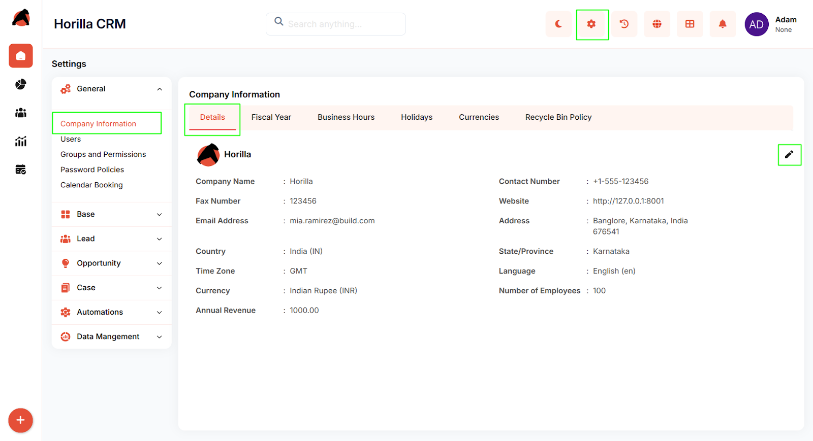
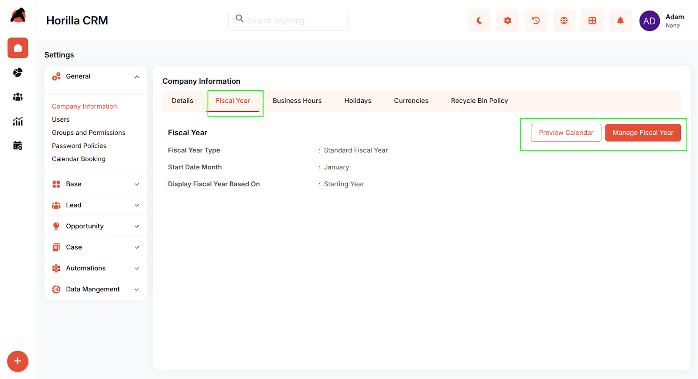
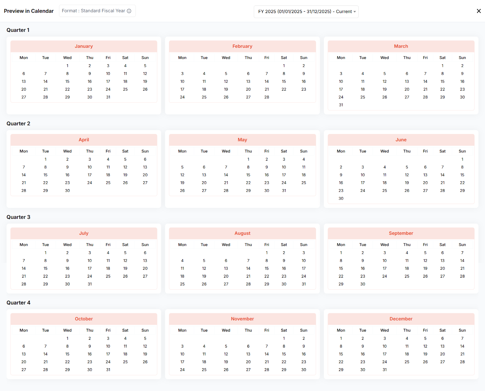
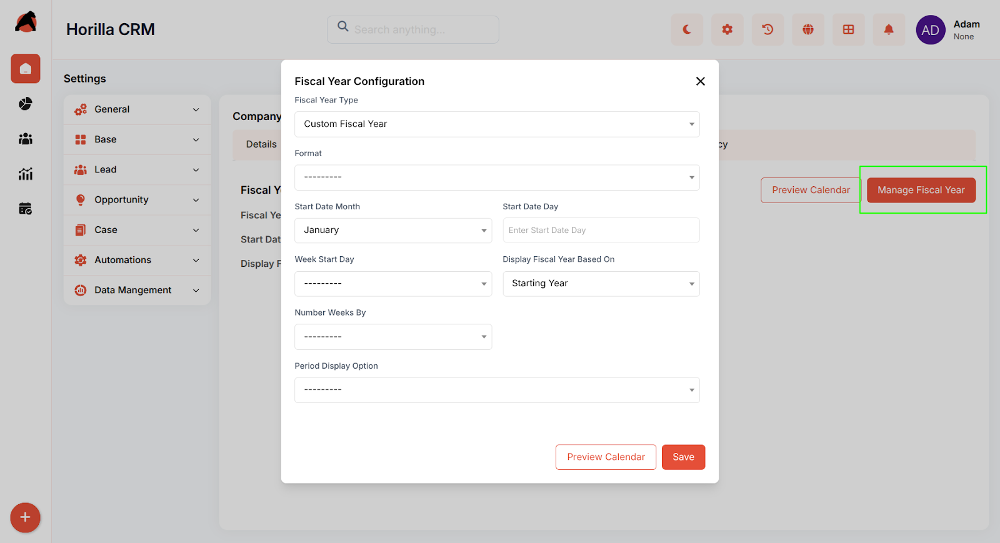
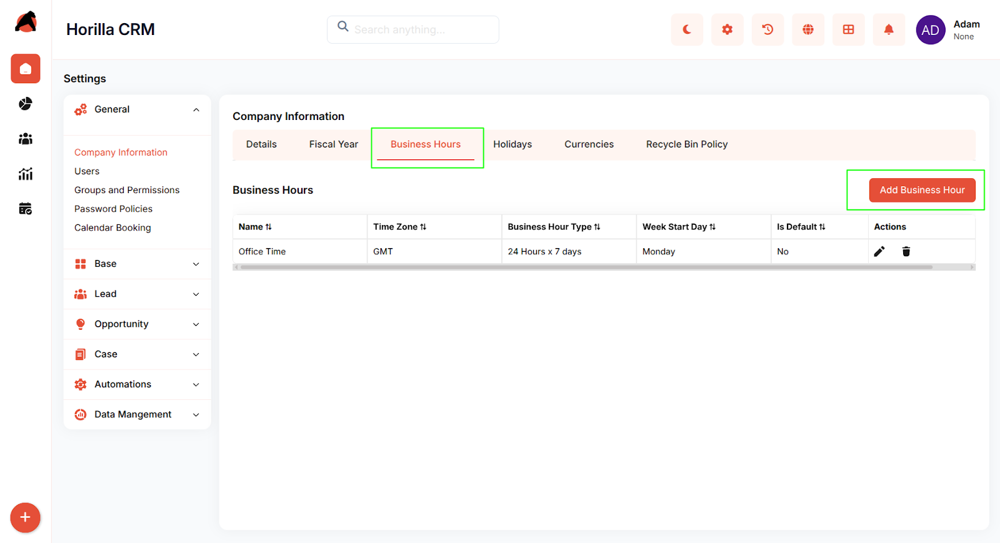
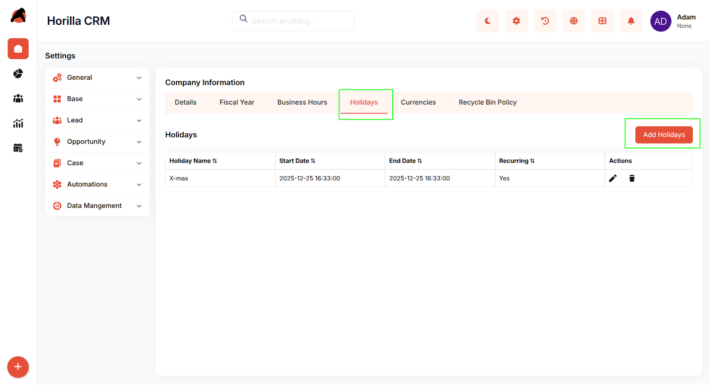

# **Horilla CRM Import Data – Functional Guide**

## **Introduction**

The Horilla CRM Import Data Module simplifies the process of transferring external data into the CRM system. It allows users to bring data from spreadsheets or other sources into CRM modules such as Leads, Accounts, Contacts, and Opportunities. With a structured import wizard and intelligent field mapping, this feature ensures accurate, duplicate-free data migration.

### **Key Features and Functionalities**

#### **1.1 Import Wizard Overview**

**Purpose:** Guide users through a step-by-step process to import data efficiently.

Users can access the Import Wizard by navigating to:  
 **Settings → Data Management → Import Data**

The Import Data interface includes two main tabs:

* **Import Data** – to start a new import process

* **Import History** – to review past imports and logs

#### **1.2 Upload Files**

**Purpose:** Start the import by selecting the module and uploading the source file.

* Choose the **Module** (Lead, Account, Contact, Opportunity, etc.)

* Enter a clear **Import Name** (e.g., *“Q4 2025 Lead Import”*)

* Upload your data file

  * **Supported formats:** CSV, XLS, XLSX  
* Click **Next** to proceed to field mapping after file validation.

#### **1.3 Map Fields**

**Purpose:** Match file columns with CRM fields to ensure correct data placement.

* The mapping screen shows:

  * **Model Field** (CRM field name)

  * **File Header** (matching column from your uploaded file)

  * **Default Value** (fallback for unmapped fields)

  * **Sample Data** (preview from your file)

  * **Status** (mapping progress)

* Fields marked with \* are **required** (e.g., First Name, Last Name, Email).

* The system **auto-maps** fields with matching names.

* Fields marked as **Not Mapped** require manual mapping or a default value.

* Verify **Sample Data** to ensure accurate mapping.

* Click **Next** to continue after all required fields are mapped.

#### **1.4 Action Configuration**

**Purpose:** Define how the system should handle new and existing records.

* **Import Options:**

  * **Create New Records** – adds all rows as new data

  * **Update Existing** – updates records that already exist

  * **Create New and Update Existing** – combines both actions intelligently

* **Record Match By:**  
   When updating or combining, choose matching fields such as:

  * Email

  * Company Name

  * Phone Number

  * Unique Identifier

* Click **Next** to proceed to the confirmation step.

#### **1.5 Import Summary**

**Purpose:** Review all import settings before execution.

The summary displays:

* Selected Module

* Uploaded File Name

* Chosen Import Action

* Number of Mapped and Unmapped Fields

**Checklist Before Importing:**

* Correct module and file selected

* Import action verified

* All required fields mapped

* Default values set (if needed)

Click **Import** to start the process.  
 Processing time depends on the file size and record count.

#### **1.6 Import Completion**

**Purpose:** Provide results and insights after the import process.

Once complete, the system shows:

* **Success Message:** *“Import Completed Successfully\!”*

* **Import Statistics:**

  * Records Created (Green)

  * Records Updated (Blue)

  * Errors (Red)

* **Processing Summary:** Total rows processed and success rate (e.g., *3 rows | 100% success*).

Users can:

* Click **Import More Data** to begin another import

* Visit the related module to review imported records

* Check **Import History** for logs and detailed information

#### **1.7 Import History**

**Purpose:** Track all import activities for review and auditing.

![][image7]

* Access **Import History** under the Import Wizard.

* Displays a list of completed imports with details such as:

  * Import Name

  * Module

  * Created/Updated/Failed record counts

  * Date and time of import

### **Conclusion**

The Horilla CRM Import Data Module provides a guided, four-step process for importing data with confidence. Its structured wizard, smart mapping, and clear feedback make it easy for users to migrate information accurately and maintain data quality.

**Supported File Types:** CSV, XLS, XLSX
