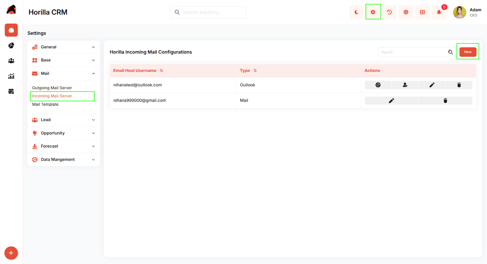
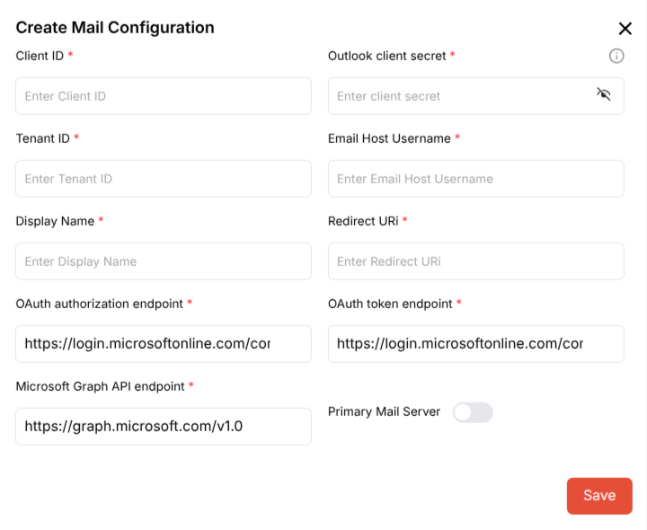
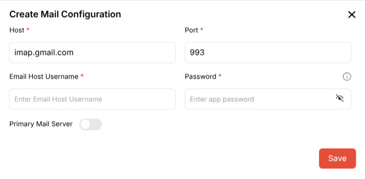

# **Horilla CRM Incoming Mail Configuration – Functional Guide**

## **1\. Introduction**

The Horilla CRM Incoming Mail Configuration module is a critical component designed to establish and manage email server connections for receiving inbound communications. It provides a secure, flexible, and user-friendly system that enables businesses to configure multiple email accounts, supporting both Microsoft Outlook/Office 365 OAuth authentication and other mail servers using IMAP protocols. The module facilitates seamless email integration, ensuring reliable communication management from leads, contacts, and customers while supporting multiple mail configurations for different business needs.

## **2\. Key Features and Functionalities**

### **2.1 Incoming Mail Configurations Overview**

**Purpose:** Display all configured incoming mail servers in a centralized table view for easy access and management.

* Users can navigate to the "Settings" section in the header and select "Mail" \> "Incoming Mail Server" to view the configuration list.  
* The interface displays key information including:  
  * Email Host Username (receiver email address)  
  * Type (Outlook or Mail)  
  * Actions (various management icons)  
* Includes a search functionality to quickly locate specific mail configurations.  
* Features sortable columns with the ability to sort by "Email Host Username" and "Type" using the sorting indicators in the column headers.

### **2.2 Creating a New Mail Configuration**

**Purpose:** Enable the addition of new incoming mail server configurations to support email receiving capabilities.

* Click the "New" button to initiate the setup process.  
* A modal dialog "Select Mail Server Type" appears with two configuration options:  
  * **Outlook Mail Server:** For Microsoft Azure/Office 365 OAuth authentication  
  * **Other Mail Servers:** For IMAP, Gmail, Yahoo, or any other mail server  
* Users select the appropriate server type by clicking either "Select Outlook" or "Select Other" button.

### **2.3 Configuring Outlook Mail Server**

**Purpose:** Set up Microsoft Outlook/Office 365 email integration using OAuth authentication for receiving emails.

After selecting "Outlook Mail Server" from the server type selection modal, the "Create Mail Configuration" form opens.

**Authentication Credentials:**

* Client ID   
* Outlook client secret   
* Tenant ID   
* Email Host Username   
* Display Name   
* Redirect URI 

**Endpoints (pre-populated with default values):**

* OAuth authorization endpoint: `https://login.microsoftonline.com/cor`  
* OAuth token endpoint: `https://login.microsoftonline.com/cor`  
* Microsoft Graph API endpoint: `https://graph.microsoft.com/v1.0`

**Additional Options:**

* Primary Mail Server toggle switch 

Click the "Save" button to finalize the configuration.

### **2.4 Configuring Other Mail Servers**

**Purpose:** Set up IMAP-based email servers including Gmail, Yahoo, or custom mail servers for receiving emails.

After selecting "Other Mail Servers" from the server type selection modal, the "Create Mail Configuration" form opens.

**Server Connection Details:**

* Host  
* Port 

**Authentication:**

* Email Host Username  
* Password 

**Additional Options:**

* Primary Mail Server toggle switch (to designate this as the default receiving account)

Click the "Save" button to finalize the configuration.

### **2.5 Managing Existing Configurations**

**Purpose:** Provide comprehensive management and control options for configured mail servers.

Each mail configuration row in the table includes multiple action icons that vary based on the mail server type:

**For Outlook Mail Server Configurations:**

* Refresh token icon  
* Login Outlook icon  
* Edit icon   
* Delete icon

**For Other Mail Server Configurations:**

* Edit icon   
* Delete icon 

## **3\. Best Practices**

1. Configure at least one mail server before attempting to receive emails into the CRM.  
2. Designate one configuration as the Primary Mail Server for default email receiving operations.  
3. For Outlook configurations, ensure proper Azure AD app registration and permissions (specifically Mail.Read and Mail.ReadWrite permissions) are set up beforehand.  
4. For other mail servers using Gmail or similar providers:  
   * Use app-specific passwords rather than regular account passwords for enhanced security  
   * Enable IMAP access in your email provider's settings  
   * For Gmail, use `imap.gmail.com` as the host and port `993`  
5. Verify that firewall and security settings allow incoming connections on the specified IMAP ports.  
6. Maintain secure storage of client secrets and passwords; use the visibility toggle only when necessary.  
7. Regularly refresh OAuth tokens for Outlook configurations to ensure continued functionality.  
8. Review and update mail configurations periodically to ensure continued functionality and security compliance.
