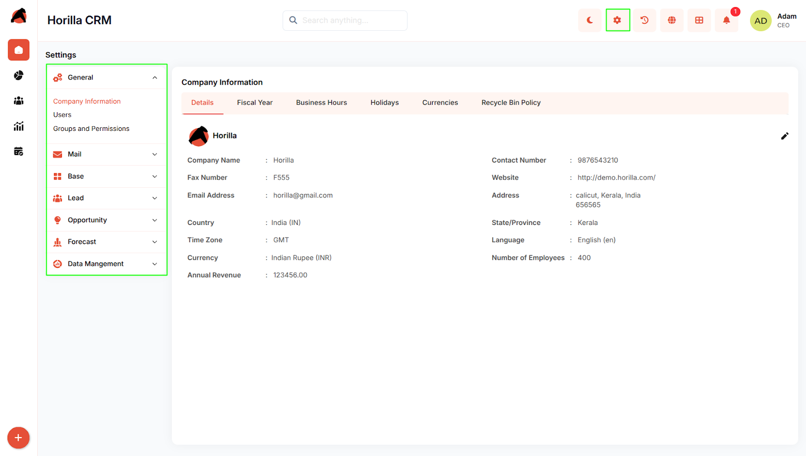

# **Settings**

# **Introduction**

The Horilla CRM Settings Section is the administrative hub for system-wide configuration, user management, and organizational structure. It enables administrators to configure company details, manage users and access control, establish operational hierarchies, and maintain data governance across the entire CRM platform.

## **Key Features and Functionalities**

### **2.1 General Settings**

**Purpose:** Configure core organizational information and system-wide policies.

**Access:** Settings → **General**

**Key Features:**

* Company Information: Organization details, fiscal year, business hours, holidays, currencies, data retention  
* Users: User management, creation, profiles, login history  
* Groups and Permissions: Role-based access control, user permissions, Super User management.

### **2.2 Mail Settings**

**Purpose:** Configure email integration and communication channels.

**Access:** Settings → **Mail**

**Key Features:**

* Incoming Mail Server configuration  
* Outgoing  Mail Server configuration 
* Azure Outlook Integration
* Mail Template management

### **2.3 Base Settings**

**Purpose:** Establish organizational structure and business rules.

**Access:** Settings → **Base**

**Key Features:**

* Department Management: Define organizational departments  
* Branches (Companies): Manage multiple business units with automated stage setup  
* Scoring Rules: Create point-based lead/opportunity qualification  
* Roles: Team Role, Customer Role, Partner Role definitions

### **2.4 Lead Settings**

**Purpose:** Configure lead management pipeline.

**Access:** Settings → **Lead**

**Key Features:**

* Lead Stage: Define pipeline stages with probability and final stage enforcement
* Mail to Lead: Automatically converts incoming emails into new leads.

### **2.5 Opportunity Settings**

**Purpose:** Configure opportunity management and deal monitoring.

**Access:** Settings → **Opportunity**

**Key Features:**

* Opportunity Stage: Define sales pipeline stages with Open/Closed classification 
* Opportunity Team Settings: Configure opportunity team settings to enable collabrotion among sales team members
* Opportunity Split Settings: Enable splitting opportunity revenue or credit among team members.  

### **2.6 Forecast Settings**

**Purpose:** Configure forecasting parameters.

**Access:** Settings → **Forecast**

**Key Features:**

* Forecast Type configuration  
* Forecast Target setup

### **2.7 Data Management**

**Purpose:** Manage data migration and retention.

**Access:** Settings → **Data Management**

**Key Features:**

* Import Data: Bulk migration with field mapping (CSV, XLS, XLSX)  
* Export Data: Export data in multiple formats with scheduled exports
* Recycle Bin: Manage deleted records with restore/permanent delete options

## **Conclusion**

The Horilla CRM Settings Section provides administrators with centralized control over all system configurations, organizational structures, user management, and data governance, ensuring consistent policy enforcement and efficient system administration.

