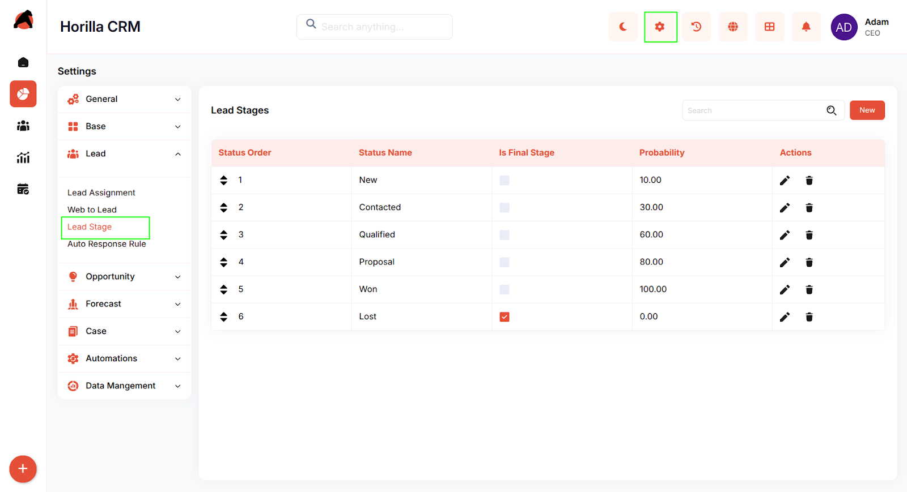
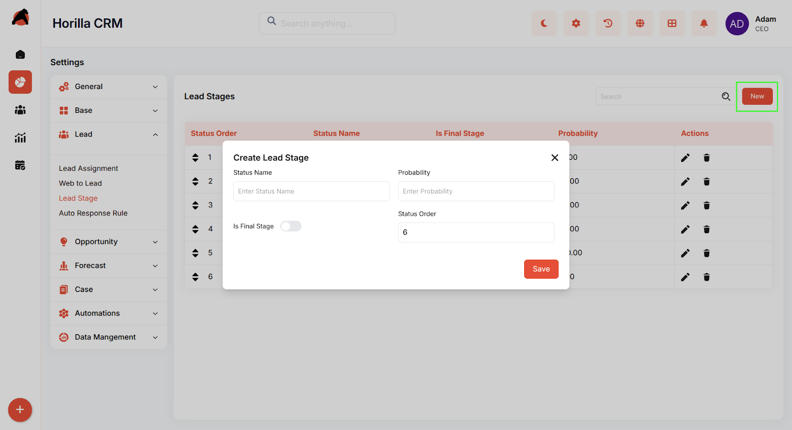
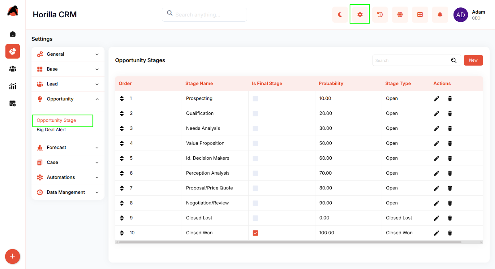
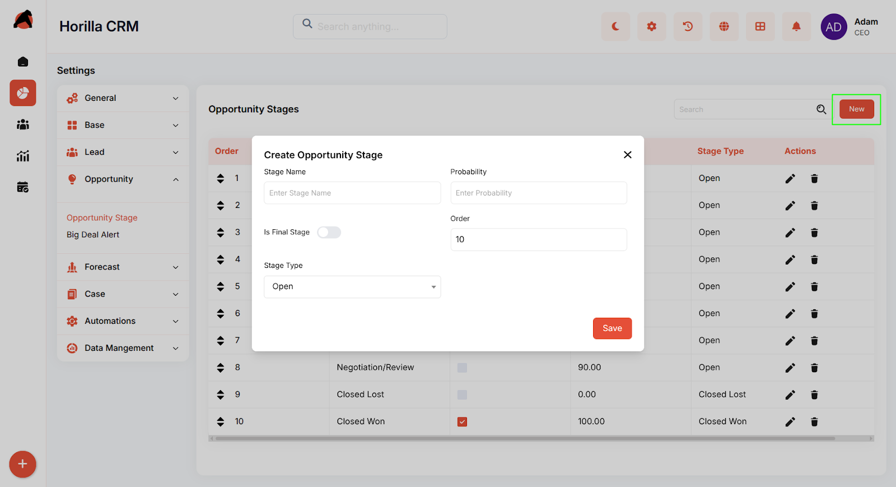

# **Horilla CRM Lead & Opportunity Stages – Functional Guide**

## **Introduction**

The **Lead Stage** and **Opportunity Stage** modules in Horilla CRM allow organizations to design and manage structured sales pipelines. Administrators can create, customize, and reorder stages to match their sales process while ensuring standardized reporting and forecasting across the company.

Both modules support:

* **Drag-and-drop stage ordering**

* **Final stage enforcement** (only one final stage allowed per company, always positioned last)

* **Stage probability management**

## **1\. Accessing Lead and Opportunity Stages**

* **Lead Stages**:  
   Navigate to **Settings → Lead → Lead Stage**

* **Opportunity Stages**:  
   Navigate to **Settings → Opportunity → Opportunity Stage**

Each section provides a list view of existing stages and the ability to add, edit, or delete stages.

## **2\. Lead Stage Management**

### **Lead Stage List View**

The list displays all configured lead stages with the following columns:

* **Status Order** (drag-and-drop reordering)

* **Status Name**

* **Is Final Stage** (checkbox indicator)

* **Probability (%)**

* **Actions** (Edit / Delete)

### **Creating a New Lead Stage**

Click **New** → Fill in the following fields:

* **Status Name** – Enter the lead stage name (e.g., New, Contacted).

* **Probability** – Enter the probability percentage.

* **Is Final Stage** – Toggle if this is the final stage.

* **Status Order** – Automatically assigned; if final, set to last.

**Business Rule**:

* If a stage is marked as **Final**, it is **automatically placed last in the order**.

* **Only one final stage is allowed per company.** Attempting to mark another stage as final will reset the previous one.

## **3\. Opportunity Stage Management**

### **Opportunity Stage List View**

The list displays all configured opportunity stages with the following columns:

* **Order** (drag-and-drop reordering)

* **Stage Name**

* **Is Final Stage**

* **Probability (%)**

* **Stage Type** (e.g., Open, Closed Lost, Closed Won)

* **Actions** (Edit / Delete)

### **Creating a New Opportunity Stage**

Click **New** → Fill in the following fields:

* **Stage Name** – Enter the opportunity stage name (e.g., Prospecting, Negotiation).

* **Probability** – Enter probability percentage.

* **Is Final Stage** – Toggle if this is the final stage.

* **Order** – Auto-managed; final stage is placed last.

* **Stage Type** – Choose from dropdown: Open, Closed Lost, or Closed Won.

**Business Rule**:

* Final stages are always forced to the **last order**.

* Only **one final stage is permitted per company**.

* When a stage is marked as final, the system automatically repositions it and updates any previous final stage.

## **5\. Benefits**

* **Customizable Sales Process** – Tailor lead and opportunity stages to organizational needs.

* **Enforced Pipeline Discipline** – Only one final stage per company ensures clarity in reporting.

* **Improved Forecasting** – Probability assignment helps in accurate revenue forecasting.

* **User-Friendly Reordering** – Drag-and-drop for intuitive stage management.

* **Data Consistency** – Final stage rules prevent duplicate end stages and maintain sales pipeline integrity.
