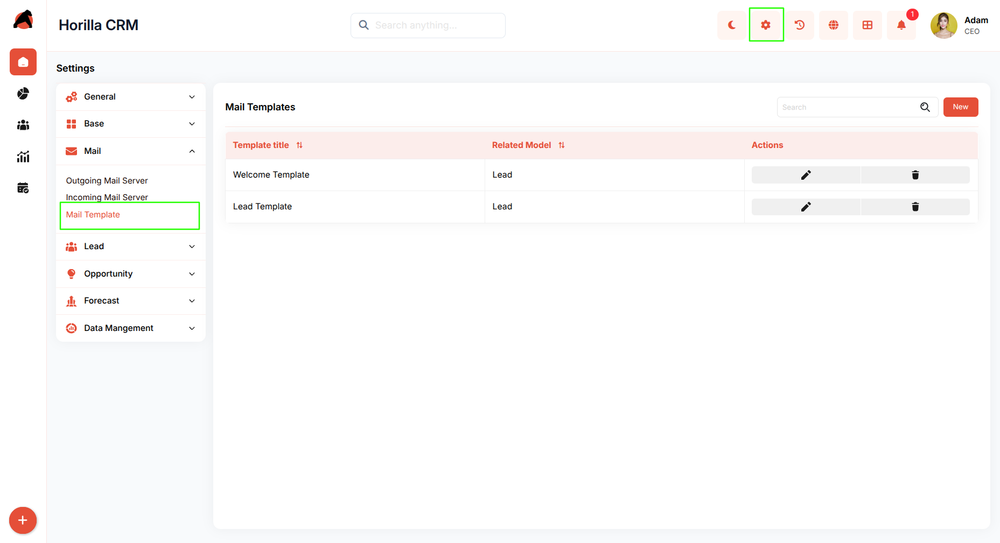
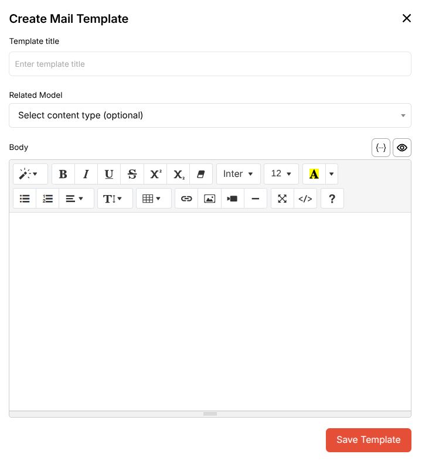

# **Horilla CRM Mail Template – Functional Guide**

## **1\. Introduction**

The Mail Template module enables users to create and manage reusable email templates for various CRM entities. These templates streamline communication by providing pre-formatted email content that can be associated with different models like Leads, Contacts, and Opportunities.

## **2\. Key Features and Functionalities**

### **2.1 Mail Templates Overview**

**Purpose:** Display all configured mail templates in a centralized view for easy management.

* Navigate to Settings \> Mail \> Mail Template  
* The interface displays:  
  * Template title (sortable)  
  * Related Model (sortable)  
  * Actions (Edit and Delete icons)  
* Includes search functionality to quickly locate templates  
* "New" button in the top-right to create templates

### **2.2 Creating a New Mail Template**

**Purpose:** Create reusable email templates for different CRM entities.

Click the "New" button to open the "Create Mail Template" modal.

**Form Fields:**

* **Template title:** Enter a descriptive name for the template  
* **Related Model:** Select the CRM entity type (optional dropdown)  
  * Options: Lead, Contact, Opportunity, etc.  
* **Body:** Rich text editor with formatting tools.

Click "Save Template" to finalize.

### **2.3 Managing Existing Templates**

**Purpose:** Edit or remove mail templates as needed.

Each template row includes:

* **Edit icon:** Modify template content and settings  
* **Delete icon:** Remove the template permanently

## **3\. Best Practices**

* Use descriptive template titles that clearly indicate purpose  
* Associate templates with appropriate Related Models for organized workflow  
* Utilize formatting tools to create professional, readable emails  
* Use variables/placeholders for dynamic content personalization  
* Regularly review and update templates to maintain relevance  
* Delete unused templates to keep the list manageable

