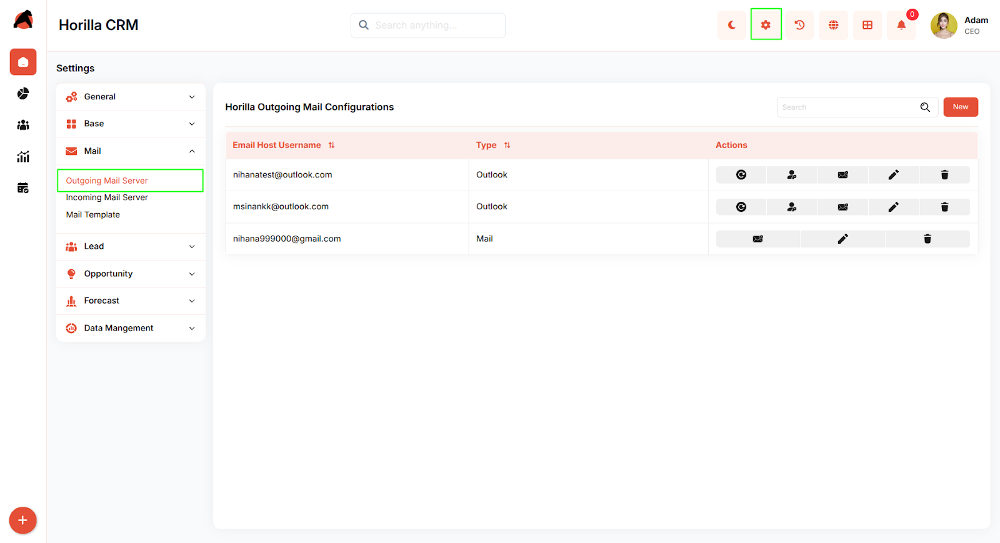
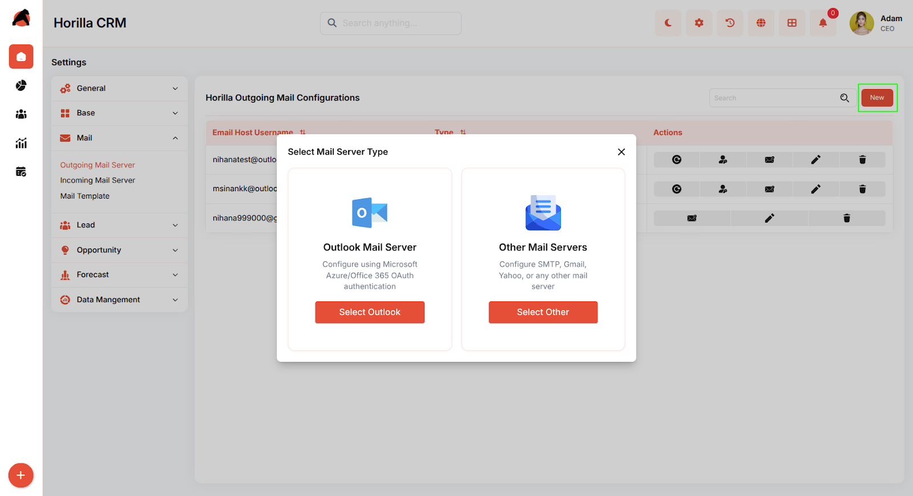
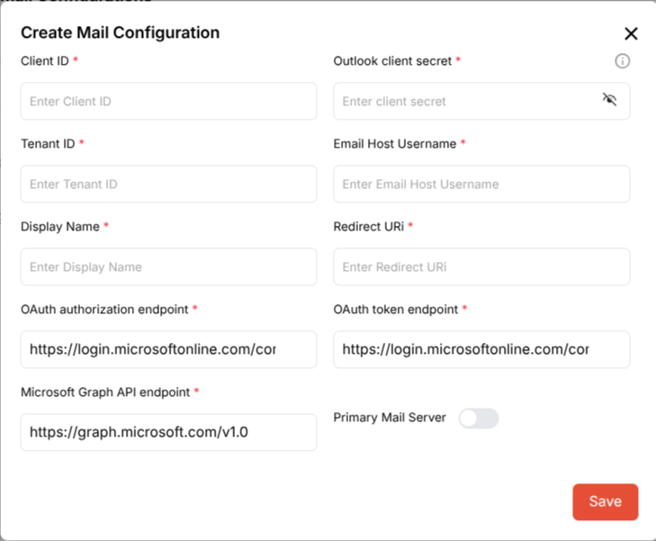
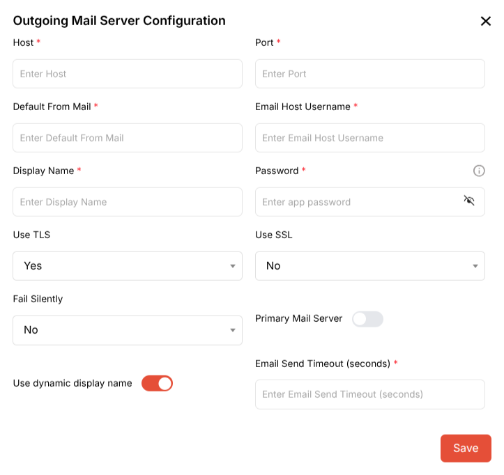

# **Horilla CRM Outgoing Mail Configuration – Functional Guide**

## **1\. Introduction**

The Horilla CRM Outgoing Mail Configuration module is a critical component designed to establish and manage email server connections for sending outbound communications. It provides a secure, flexible, and user-friendly system that enables businesses to configure multiple email accounts, supporting both Microsoft Outlook/Office 365 OAuth authentication and other mail servers using SMTP protocols. The module facilitates seamless email integration, ensuring reliable communication with leads, contacts, and customers while supporting multiple mail configurations for different business needs.

## **2\. Key Features and Functionalities**

### **2.1 Outgoing Mail Configurations Overview**

* **Purpose:** Display all configured outgoing mail servers in a centralized table view for easy access and management.  
* Users can navigate to the "Settings" section in the header and select "Mail" \> "Outgoing Mail Server" to view the configuration list.  
* The interface displays key information including:  
  * Email Host Username (sender email address)  
  * Type (Outlook or Mail)  
  * Actions (various management icons)  
* Includes a search functionality to quickly locate specific mail configurations.  
* Features sortable columns with the ability to sort by "Email Host Username" and "Type" using the sorting indicators in the column headers.

### **2.2 Creating a New Mail Configuration**

* **Purpose:** Enable the addition of new outgoing mail server configurations to support email sending capabilities.  
* Click the "New" button to initiate the setup process.  
* A modal dialog "Select Mail Server Type" appears with two configuration options:  
  * **Outlook Mail Server:** For Microsoft Azure/Office 365 OAuth authentication  
  * **Other Mail Servers:** For SMTP, Gmail, Yahoo, or any other mail server  
* Users select the appropriate server type by clicking either "Select Outlook" or "Select Other" button.

### **2.3 Configuring Outlook Mail Server**

* **Purpose:** Set up Microsoft Outlook/Office 365 email integration using OAuth authentication.  
* After selecting "Outlook Mail Server" from the server type selection modal, the "Create Mail Configuration" form opens.

**Authentication Credentials:**

* Client ID   
* Outlook client secret   
* Tenant ID  
* Email Host Username  
* Display Name  
* Redirect URI

**Endpoints (pre-populated with default values):**

* OAuth authorization endpoint: `https://login.microsoftonline.com/cor`  
* OAuth token endpoint: `https://login.microsoftonline.com/cor`  
* Microsoft Graph API endpoint: `https://graph.microsoft.com/v1.0`

**Additional Options:**

* Primary Mail Server toggle switch  
* Click the "Save" button to finalize the configuration.

### **2.4 Configuring Other Mail Servers**

* **Purpose:** Set up SMTP-based email servers including Gmail, Yahoo, or custom mail servers.  
* After selecting "Other Mail Servers" from the server type selection modal, the "Outgoing Mail Server Configuration" form opens.

**Server Connection Details:**

* Host  
* Port   
* Default From Mail   
* Email Host Username 

**Authentication and Display:**

* Display Name   
* App Password 

**Security Settings:**

* Use TLS dropdown   
* Use SSL dropdown   
* Fail Silently dropdown

**Additional Options:**

* Primary Mail Server toggle switch   
* Use dynamic display name toggle switch   
* Email Send Timeout (seconds) (required \- timeout duration for email sending attempts)  
* Click the "Save" button to finalize the configuration.

### **2.5 Managing Existing Configurations**

* **Purpose:** Provide comprehensive management and control options for configured mail servers.  
* Each mail configuration row in the table includes multiple action icons that vary based on the mail server type:  
  **For Outlook Mail Server Configurations:**  
* Refresh token  
* Login Outlook  
* Send test mail  
* Edit  
* Delete  
  **For Other Mail Server Configurations:**  
* Send test mail  
* Edit  
* Delete

## **3\. Best Practices**

* Configure at least one mail server before attempting to send emails from the CRM.  
* Designate one configuration as the Primary Mail Server for default email operations.  
* For Outlook configurations, ensure proper Azure AD app registration and permissions are set up beforehand.  
* For other mail servers using Gmail or similar providers, use app-specific passwords rather than regular account passwords for enhanced security.  
* Test each configuration after setup using the envelope icon to verify successful email delivery.  
* Maintain secure storage of client secrets and passwords; use the visibility toggle only when necessary.  
* Regularly review and update mail configurations to ensure continued functionality and security compliance.

