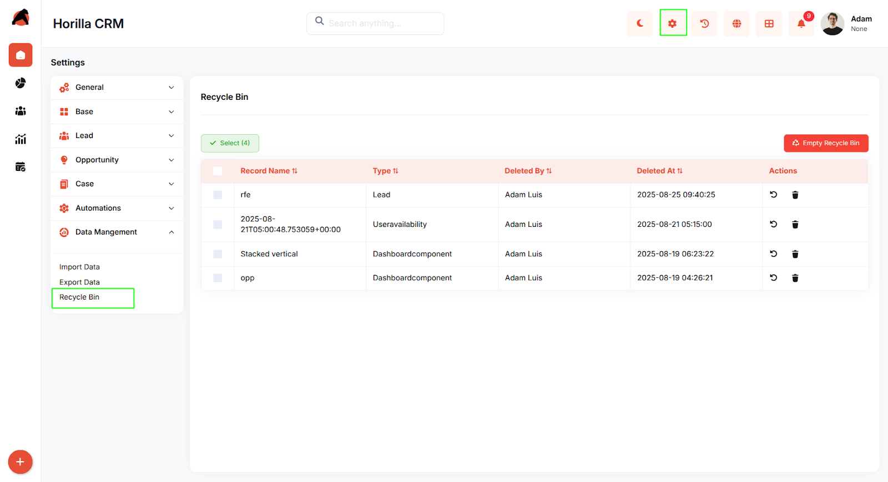
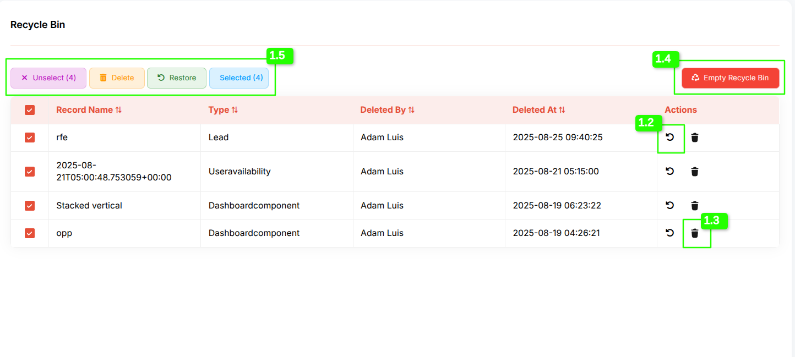
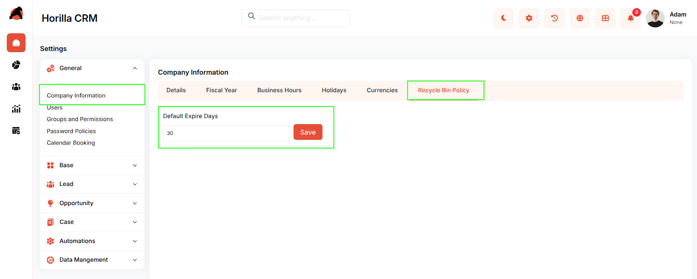

# **Horilla CRM Recycle Bin – Functional Guide**

## **Introduction**

The **Recycle Bin Module** in Horilla CRM ensures that accidentally deleted records are not lost permanently. It provides a secure temporary storage for deleted data, allowing users to restore or permanently delete records when needed. By offering granular control and configurable expiry policies, the Recycle Bin enhances data security, prevents accidental loss, and aligns with organizational data retention policies.

## **Key Features and Functionalities**

### **1.1 Recycle Bin Overview**

**Purpose:** Provide a centralized location to manage deleted records across all CRM modules.

* Accessible via **Settings → Data Management → Recycle Bin**.

* Displays essential record details including:

  * **Record Name**

  * **Type (Module Name)**

  * **Deleted By (User)**

  * **Deleted At (Timestamp)**

* Supports **search, filtering, and sorting** to quickly locate deleted records.

* Provides action buttons for **Restore** (undo deletion) and **Permanent Delete** (remove forever).

* Bulk operations are supported via multi-selection checkboxes.

### **1.2 Restoring Deleted Records**

**Purpose:** Allow users to recover accidentally deleted records.

* Records can be restored individually using the **Restore icon** in the Actions column.

* Bulk restore is available by selecting multiple records and clicking the **Restore button**.

* A confirmation prompt ensures users validate the action before restoration.

* Once restored, the record is immediately reinstated in its original module with full data integrity preserved.  
  

### **1.3 Permanent Deletion of Records**

**Purpose:** Provide secure and controlled removal of unwanted records.

* Records can be permanently deleted from the Recycle Bin individually using the **Delete icon**.

* Bulk deletion is supported via the **Delete button** after selecting multiple records.

* A confirmation dialog appears before deletion to prevent accidental data loss.

* Once permanently deleted, records cannot be recovered.

### **1.4 Empty Recycle Bin**

**Purpose:** Quickly clear all deleted records in one action.

* The **Empty Recycle Bin** option permanently deletes all items currently in the recycle bin.

* A **confirmation dialog** is displayed before execution to prevent accidental data loss.

* Once confirmed, all records are removed permanently and cannot be recovered.

* Useful for administrators who want to clear large amounts of deleted data in a single step.

### **1.5 Bulk Actions and Selection**

**Purpose:** Improve efficiency in managing large volumes of deleted data.

* Options include **Select All**, **Unselect**, and **Selected (count)** indicators.

* Bulk actions available:

  * **Restore selected records**

  * **Permanently delete selected records**

* Selected records are clearly highlighted to ensure user clarity before taking action.

### **1.6 Recycle Bin Policy (Expiry Settings)**

**Purpose:** Automate data retention and compliance management.

* Accessible via **Settings → General → Company Information → Recycle Bin Policy**.

* Administrators can define **Default Expiry Days** for deleted records.

* When the expiry period is reached, records are automatically and permanently removed from the Recycle Bin.

* Ensures compliance with organizational data policies without manual intervention.

## **Conclusion**

The **Recycle Bin Module** in Horilla CRM provides a reliable safeguard against accidental data loss by temporarily storing deleted records and offering restoration options. With bulk management tools, confirmation prompts, an **Empty Recycle Bin** feature, and configurable expiry policies, it balances flexibility with security. This ensures organizations can recover important records when needed while maintaining compliance with retention policies through automated permanent deletion.

