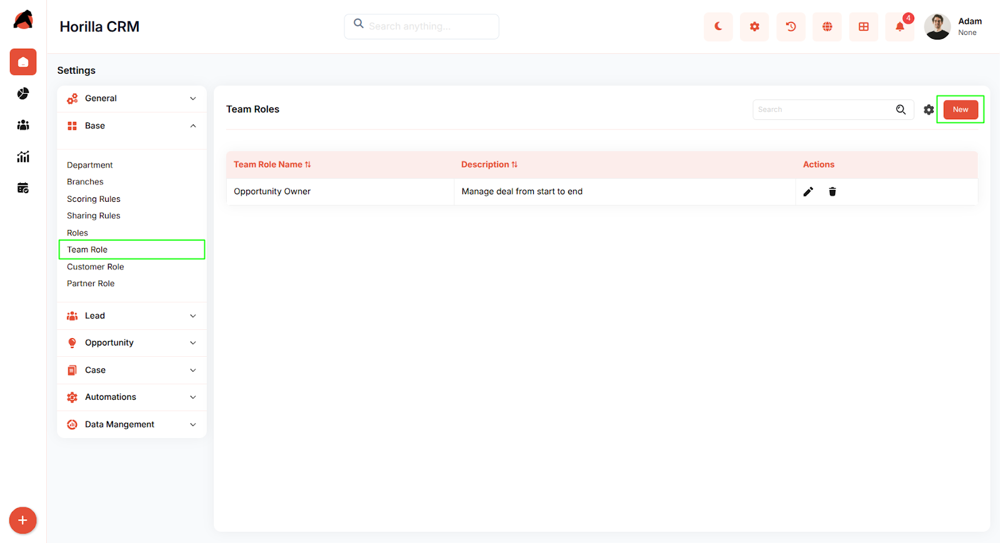
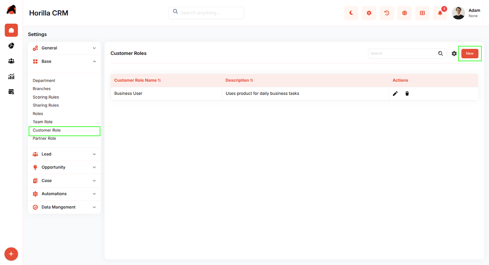
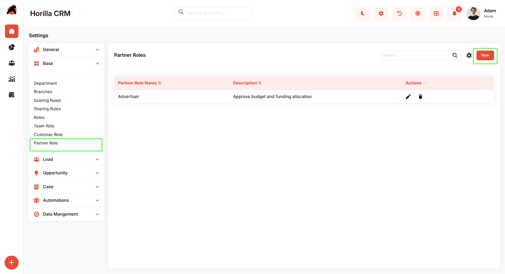

# **Horilla CRM Relationship Roles \- Functional Guide**

## **Introduction**

The **Organizational Structure & Role Management** module provides administrators with tools to configure and define role hierarchies across teams, customers, and partners. These configurations ensure proper data organization, access control, and efficient collaboration throughout the CRM.

## **Key Features and Functionalities**

### **1.1 Team Role Management**

**Purpose:** Establish internal team roles to manage responsibilities and permissions.

*  Team roles control feature access, workflow assignments, and collaboration boundaries across different functional groups.  
* Team roles define the level of access and responsibility for internal users. They control permissions, feature visibility, and workflow ownership within the organization.

### **1.2 Customer Role Management**

**Purpose:** Classify customers based on relationship type.

* Customer roles enable tailored communication, workflows, and services aligned to each customer segment.  
* Customer roles classify the type of relationship a customer holds (e.g., Prospect, Active Customer, Partner). These roles help tailor communication, processes, and service delivery.

### **1.3 Partner Role Management**

**Purpose:** Configure partner relationship categories for external collaboration.

*  Partner roles define collaboration models, partner hierarchies, and access permissions for joint processes.  
* Partner roles define relationship categories for external business partners. They support role-based collaboration, access rights, and partner-specific workflows.

  

## **Benefits**

* Establishes a **clear organizational hierarchy** for efficient management.

* Provides **role-based access control** to protect sensitive information.

* Enhances **collaboration across teams, customers, and partners**.

* Supports **personalized engagement strategies** for different customer categories.

* Improves **reporting accuracy** by aligning data with organizational structure.

* Strengthens **partner collaboration** with controlled role definitions.
