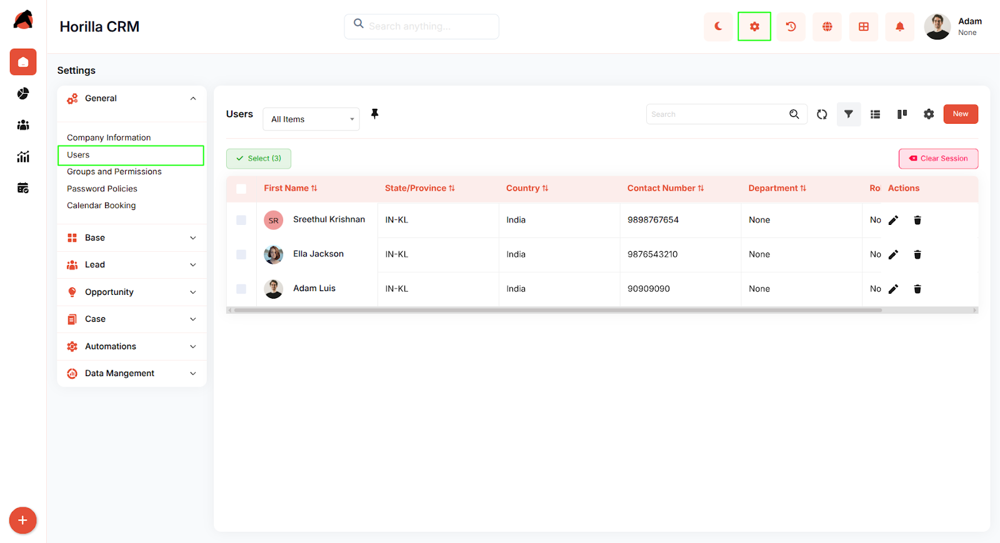
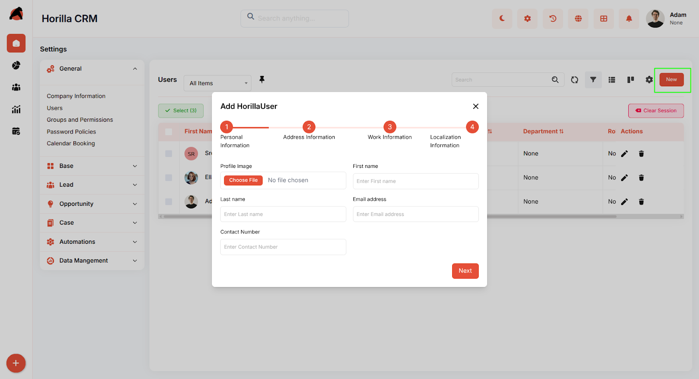
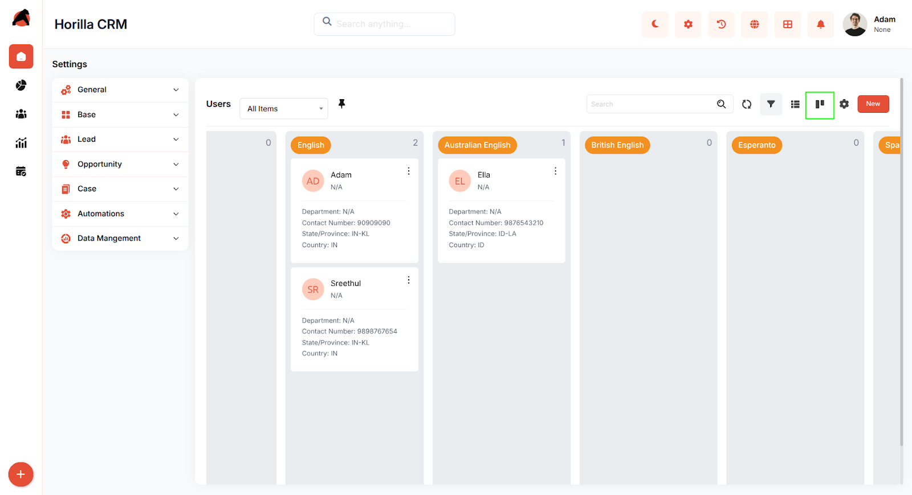
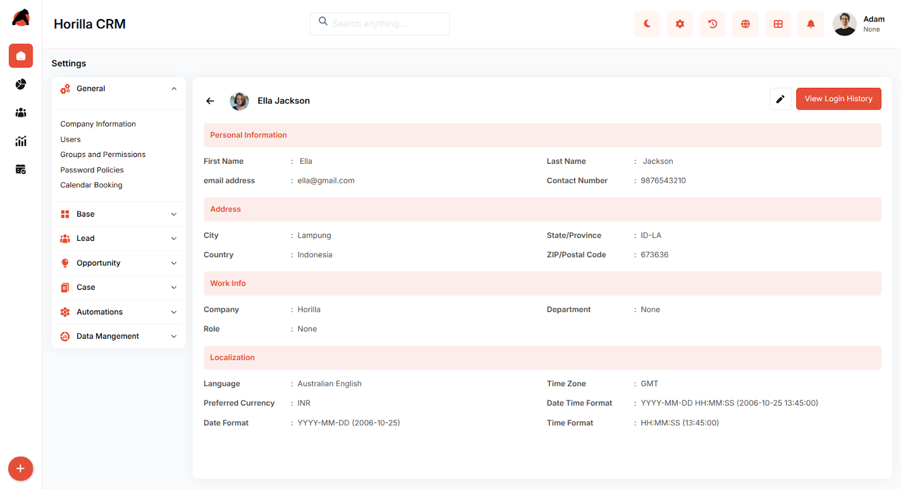
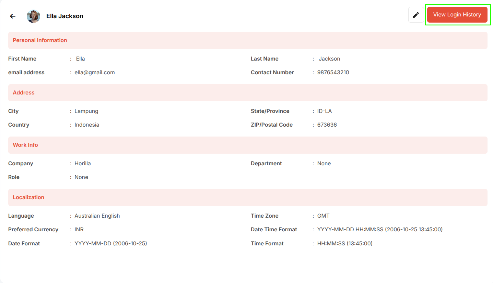
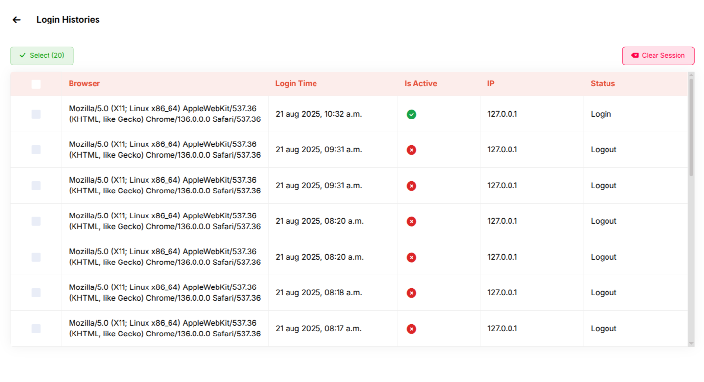

# **Horilla CRM User Management – Functional Guide**

##  **Introduction**

The Horilla CRM User Management Module stands as a cornerstone feature designed to streamline and enhance the administration of system users within your organization. This comprehensive module provides users with a secure, efficient, and user-friendly platform to manage user accounts, monitor access patterns, and maintain organizational security standards. The module supports complete user lifecycle management,while offering detailed insights into user activities and login histories to ensure optimal system governance and compliance.

##  **Key Features and Functionalities**

### **1.1 Users Overview** 

**Purpose:** Provide users with a centralized dashboard of all users for simplified monitoring and management.

* Accessible via **Settings → Users**.

* Displays key user details: **First Name, Department, Role, Contact Number, Country, State/Province**, and available actions.

* Built-in **search bar** allows quick filtering by name, department, or other attributes.

* Supports **bulk operations** (update, export, with multi-select checkboxes.  
  

### **1.2 User Creation Workflow**

**Purpose:** Enable smooth onboarding of new users through a guided setup.

* New users are added via the **“New” button** on the Users page.

* A **multi-step wizard** streamlines the process, covering **personal, address, work, and localization details**.

* Navigation controls allow moving between steps, and validation ensures data accuracy.

* On completion, clicking **Save** creates and activates the user account.  
  

### **1.3 Kanban View**

**Purpose:** Provide a visual representation of users for easier management and quick insights.

* Users can be viewed in **Kanban boards**, grouped by criteria such as department or role.

* Each card shows **key user details** (name, role, contact, status).

* Supports **drag-and-drop** to update assignments or groupings.

* Switch between **List** and **Kanban** views seamlessly.

### 

### **1.4 User Profile Management**

**Purpose:** Provide detailed viewing and editing of individual user profiles.

* Accessing the detailed view is possible by clicking a user's name from either the list or Kanban view.  
* Profiles include **personal, address, work, and localization details**.

* Information is organized into clear sections for easy access.

### **1.5 Login History Monitoring**

**Purpose:** Track and review user login activities to enhance **security and compliance**.

* Available in user profile under **“View Login History”**.

* Displays:

  * **Browser & OS Information**

  * **Login Timestamp**

  * **Active/Inactive Status** (green/red indicators)

  * **IP Address**

  * **Session Status** (Login / Logout events)  
    

      

## **Conclusion**

The **Horilla CRM User Management Module** delivers a powerful yet user-friendly platform for managing organizational users. By supporting full lifecycle management and security monitoring, it ensures that administrators can maintain **secure, efficient, and well-governed CRM environments**. Seamless integration with other Horilla CRM modules further strengthens workflow continuity, security compliance, and operational efficiency.
