# Asset

The [asset module](https://www.horilla.com/features/asset/) is a key feature of our HRMS that enables employees to request and manage assets, such as computers or equipment, needed for their work. The system categorizes assets by type and tracks requests until they are approved and made available to the employee. With easy asset categorization, employees can quickly find the resources they need, and administrators can manage and allocate resources more efficiently. Overall, our Asset Management System is a powerful tool for organizations to manage and track assets in a streamlined and effective manner.

   
    <iframe width="1006" height="566" src="https://www.youtube.com/embed/QwrfCg40qZQ" title="How to Manage Employee Assets in Horilla HRMS | Free HR Software | An Overview of Assets Management" frameborder="0" allow="accelerometer; autoplay; clipboard-write; encrypted-media; gyroscope; picture-in-picture; web-share" referrerpolicy="strict-origin-when-cross-origin" allowfullscreen></iframe>

## Dashboard

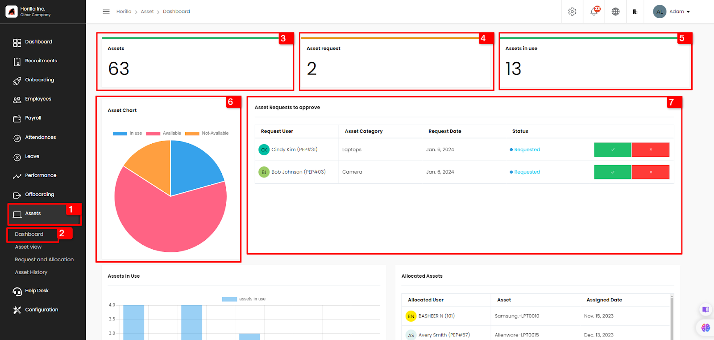

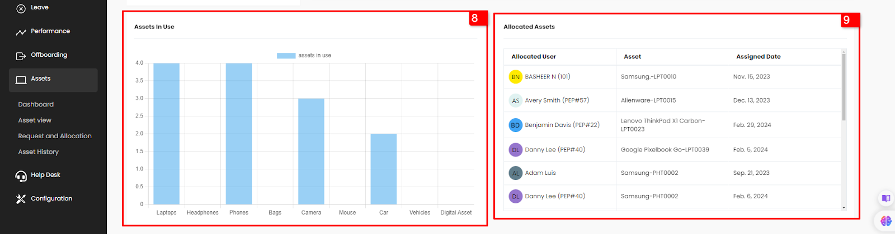

Clicking on the asset and clicking on the dashboard will open the Asset dashboard. This view is restricted to only employees with permission.  
Here an admin can easily find the details related to the Asset module.  
The Asset tab shows the total number of assets (marked as 3). The asset request tab shows the number of asset requests that are yet to be processed (marked as 4).  
The assets in use tab shows the number of assets that are currently being used by the employees.

The asset chart (marked as 6\) shows the pie chart displaying the details of available not-available and in-use assets.  
The asset request to approve (marked as 7\) shows all the asset requests to approve in the dashboard and the admin can allocate the asset from the dashboard itself.  
The assets in use chart (marked as 8\) shows the assets used by employees in each category.  
The allocated asset table (marked as 9\) shows the employees and their allocated assets and the assigned date.

## Asset Category

- **Accordion-Style Category**  
  One of the key features of our Asset Management System is the accordion-style category navigation. This feature allows users to easily navigate and find the assets they need. The functionality is available to:
- **Super Admins**
- **Users with the permission to view**  
  This ensures that authorized users can efficiently access and manage asset information.

With this feature, each asset category is displayed as a separate accordion tab. When a user clicks on a category tab, a table opens that displays all assets associated with that category. This layout is designed to improve the efficiency of asset management processes by organizing assets by category and making it easier for users to locate specific assets or groups of assets. Each asset has an individual view showing its details and edit or delete the asset as shown below,

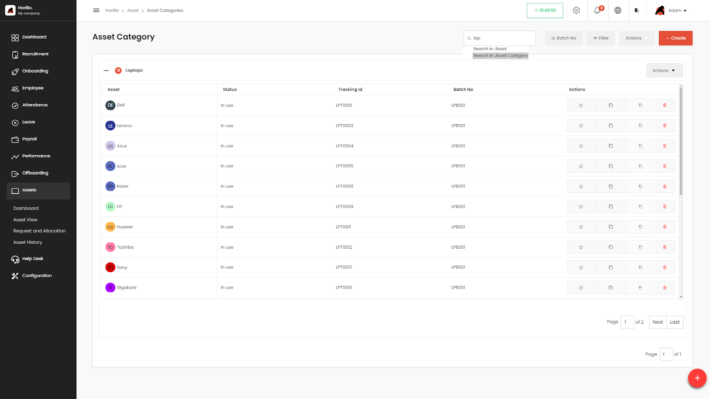

- **Search Functionality in the Asset Category Page**  
  The Asset Category page in the Horilla HRMS allows users to efficiently search and filter through asset categories and individual assets within those categories. The search functionality is a key feature designed to help users quickly locate the information they need.

### **Search Options**

**Search in Asset Category :**

**Purpose** : This search option allows the user to search for specific asset categories by their name.

**Usage** : In the search bar, start typing the name of the asset category you are looking for. The system will dynamically filter and display the matching categories as you type.

**Search in Asset :**

**Purpose** : This search feature is used to find specific assets within the asset categories displayed on the page.

**Usage** : Type the name or identifier of the asset in the search bar. The system will filter the assets within the visible asset categories, showing only the relevant results.

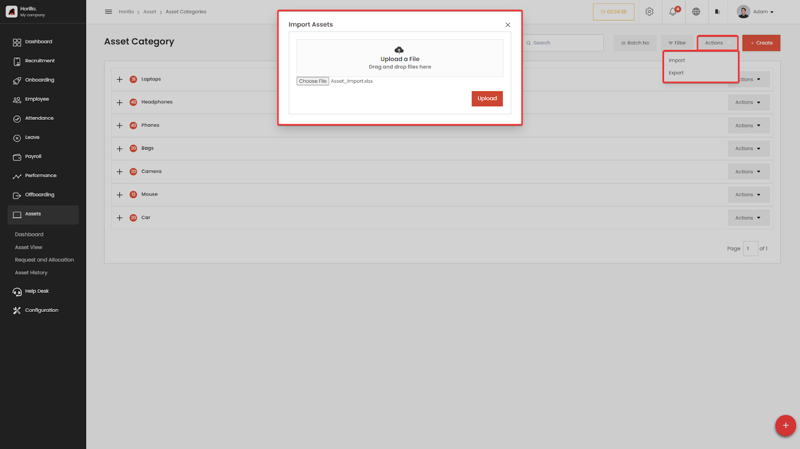

- **Efficient Asset Management with Asset Import**

The Asset Import feature in our Asset Management System allows users to upload large amounts of asset data, such as asset name, purchase date, description, batch number, and category, from an external source, such as an Excel file. This feature streamlines data processing and makes it easy to add large numbers of assets to the system at once, improving the efficiency of asset management processes. You can explore the benefits of the Asset Import feature and how it can help organizations maximize productivity in managing their assets.

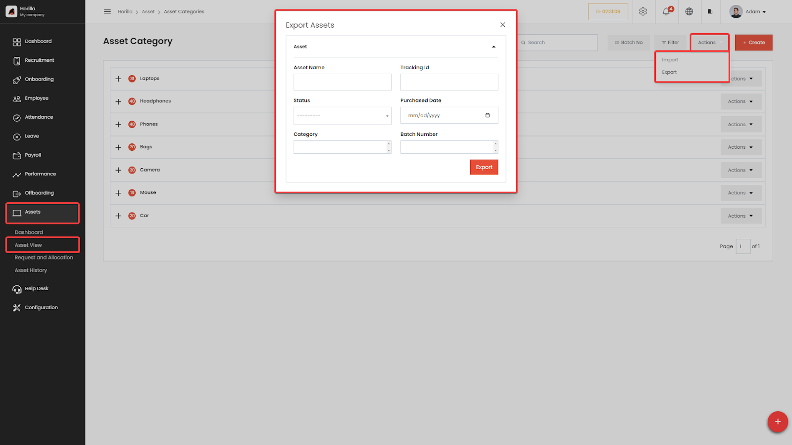

- **Streamlining Asset Management with Asset Export**

The Asset Export feature in Horilla HRMS offers flexibility for users to download asset data either filtered or in full. Users can access this feature through the Actions dropdown on the Asset Category page.

To export a specific subset of assets based on criteria, users can utilize the Export Assets form by filling in fields such as Asset Name, Tracking ID, and Status. Once the desired filters are set, users click Export to download the filtered data. Alternatively, if a user wishes to export all asset data without applying any filters, they can simply click the Export button without filling in the form. This design ensures that users can either export precise, filtered data or obtain a comprehensive dataset of all asset records.

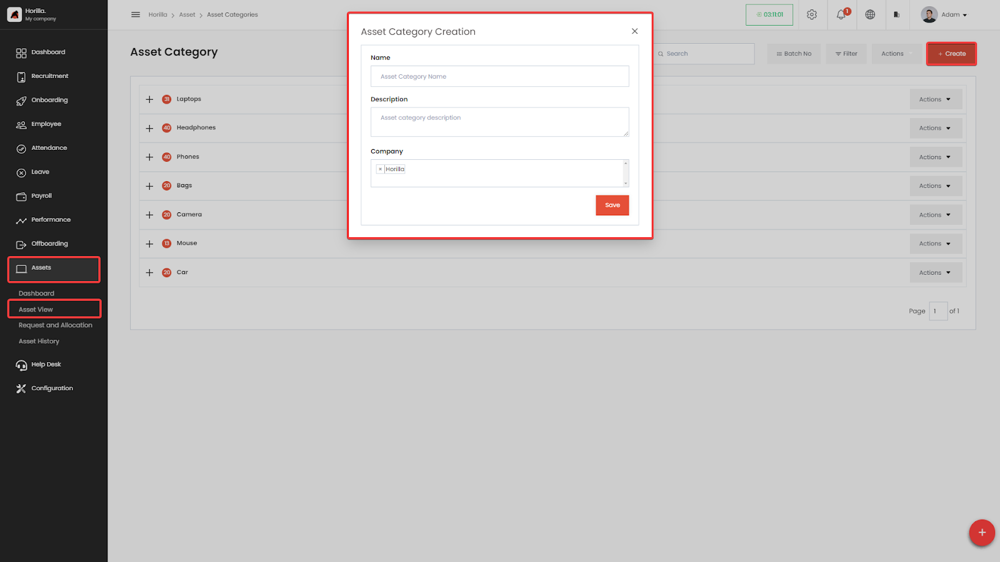

### **Asset Category Creation**

The Asset Category Creation form in Horilla HRMS is a tool used to define and categorize different types of assets within an organization. By creating asset categories, you can effectively manage, track, and report on various assets, such as laptops, headphones, phones, cameras, and more.

#### **Form Fields :**

**Name** **:** This field requires the user to enter a unique name for the asset category. The name should be descriptive and easily recognizable.

**Description :** This field provides an optional space to add a detailed explanation or definition of the asset category. This can be helpful for clarity and understanding.

**Company**: This field allows you to associate the asset category with a particular branch of the companies within the organization. This can be useful for tracking asset ownership and usage.

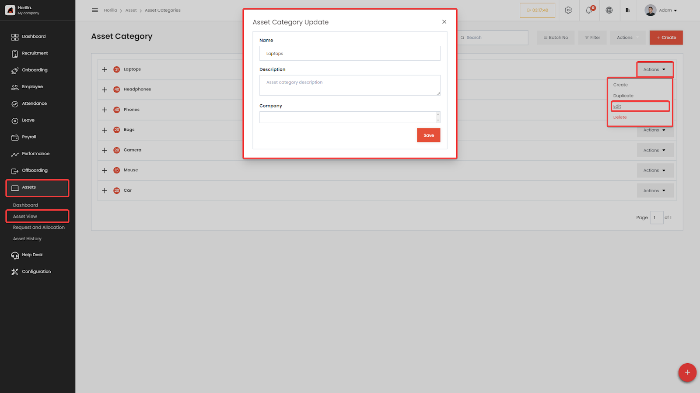

### **Update Asset Category**

The Asset Category Update form in Horilla HRMS is used to modify existing asset categories. This allows you to make changes to the name, description, or company association of a category as needed. Asset category row contains Dropdown option named “Actions” from that user can select “Edit” option for updation

#### **Form Fields :**

**Name :** This field displays the current name of the asset category. You can edit the name by typing a new value.

**Description :** This field displays the current description of the asset category. You can edit the description by typing a new value or modifying the existing text.

**Company :** This field displays the current companies associated with the asset category. You can edit the company by selecting a different option from the dropdown list.

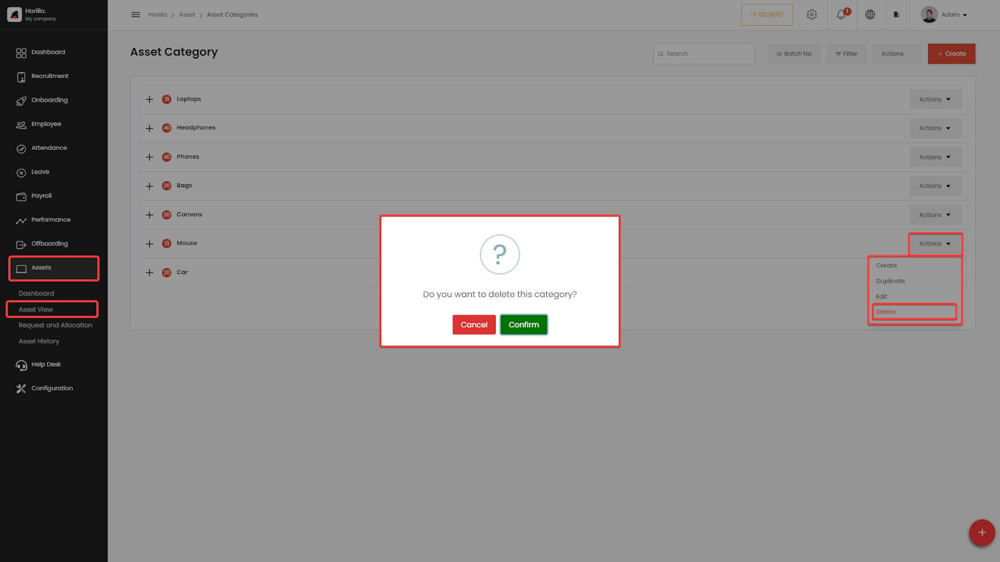

### **Deleting an Asset Category :**

In Horilla HRMS, deleting an asset category is a straightforward process, but it's subject to a crucial condition: the category must be empty. If there are any assets associated with the category, the system will prevent deletion and display a warning message.  
 To delete an asset category, find the specific category to delete,Click on the "Delete" option associated with the chosen category from the “Actions” dropdown menu.A confirmation prompt will likely appear to Confirm or Cancel the Asset Category Deletion . If the category has assets, the system will display a warning message preventing the deletion.

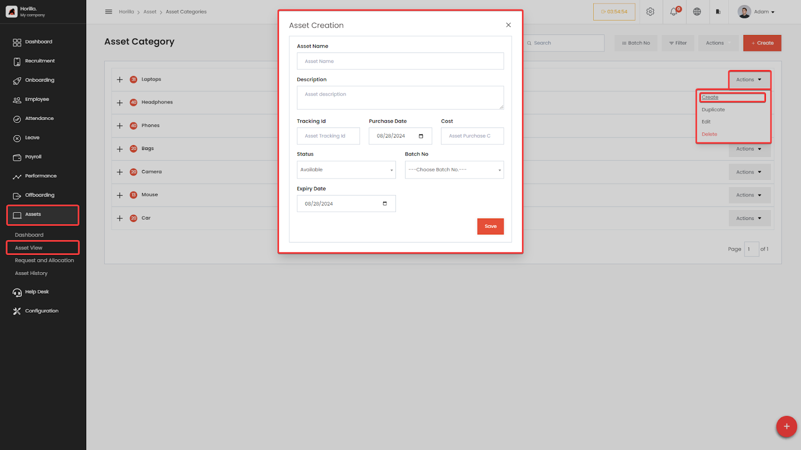

## **Creating Assets**

Horilla HRMS provides an efficient platform for managing organizational assets.Asset categories help group similar assets, making management and tracking easier. To create an asset, start by logging into your Horilla HRMS account and navigating to the "Assets" module from the sidebar.It will render a list of available asset categories. Choose the relevant category based on the type of asset want to create, such as "Headphone" or “Laptops”.  
Next, locate the "Action" button associated with the chosen category. Clicking this button will give a dropdown menu, Select the "Create" option. A form will appear to fill

#### **Form Fields :**

**Asset Name:** A unique identifier for the asset.  
 **Description:** A detailed description of the asset's purpose and specifications.  
 **Tracking ID:** A reference number for tracking the asset.  
 **Purchase Date:** The date when the asset was acquired.  
 **Cost:** The purchase price of the asset.

**Status:** The current status of the asset (e.g., "In Use," "Available," "Not Available").  
 **Batch No :** the batch number associated with the asset. This can be useful for tracking assets purchased together or as part of a specific project.In this select field find an option "Create new batch number." by click on this , new form will appear, prompting you to provide information for the new batch number  
 **Expiry Date:** If applicable, the date when the asset's warranty or useful life expires.  
 **Notify Before (days):** If you've entered an expiry date, this field allows you to specify the number of days before the expiry date that you want to receive a notification. This feature helps you proactively plan for asset replacement or maintenance.

By following these steps, you can efficiently add new assets to organization's inventory within Horilla HRMS, ensuring accurate records and effective asset management.

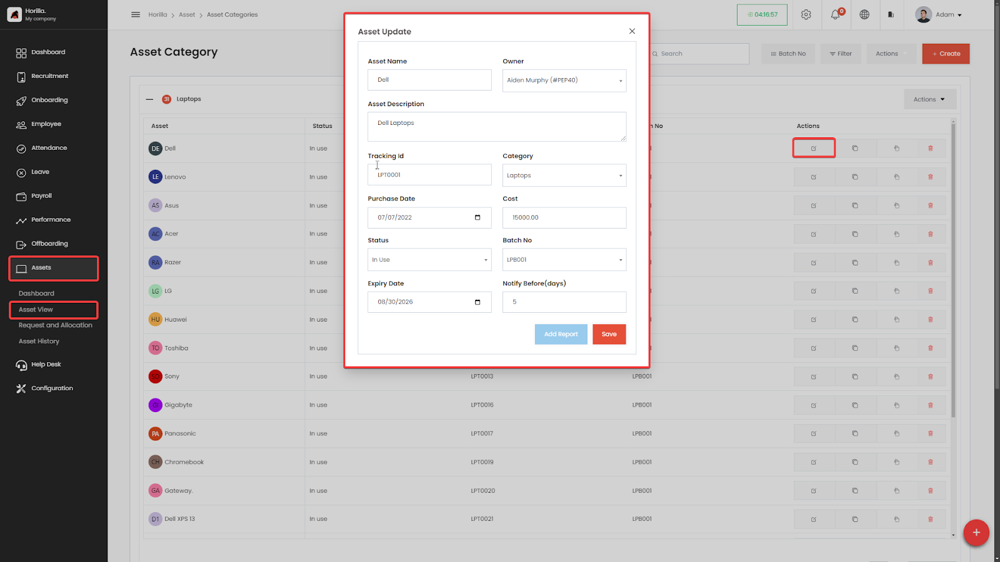

### **Update Asset**

The Asset Updation feature in Horilla HRMS provides a straightforward process for users to modify asset details within the system. To update an asset, users first navigate to the "Asset View" section and select the relevant asset category from the Accordion-Style Category option. This action displays a list of assets within the chosen category, allowing users to identify and select the specific asset they wish to update. By click on the Edit button from table will pop up a form with some fields

#### **Form Fields**

**Asset Name:** This field displays the current name of the asset. You can edit the name by typing a new value.

**Description:** This field displays the current description of the asset. A detailed description of the asset's purpose and specifications.

**Tracking ID:** A reference number for tracking the asset.  
 **Purchase Date:** The date when the asset was acquired.  
 **Cost:** The purchase price of the asset.

**Status:** The current status of the asset (e.g., "In Use," "Available," "Not Available").  
 **Batch No :** the batch number associated with the asset. This can be useful for tracking assets purchased together or as part of a specific project.In this select field find an option "Create new batch number." by click on this , new form will appear, prompting you to provide information for the new batch number  
 **Expiry Date:** If applicable, the date when the asset's warranty or useful life expires.  
 **Notify Before (days):** If you've entered an expiry date, this field allows you to specify the number of days before the expiry date that you want to receive a notification. This feature helps you proactively plan for asset replacement or maintenance.  
 The form also includes an "Add Report" button, enabling users to attach additional reports or documentation related to the asset, such as maintenance records or issue logs.Once the necessary updates are made, users can save the changes by clicking the "Save" button, ensuring the asset information is current and accurately reflected in the system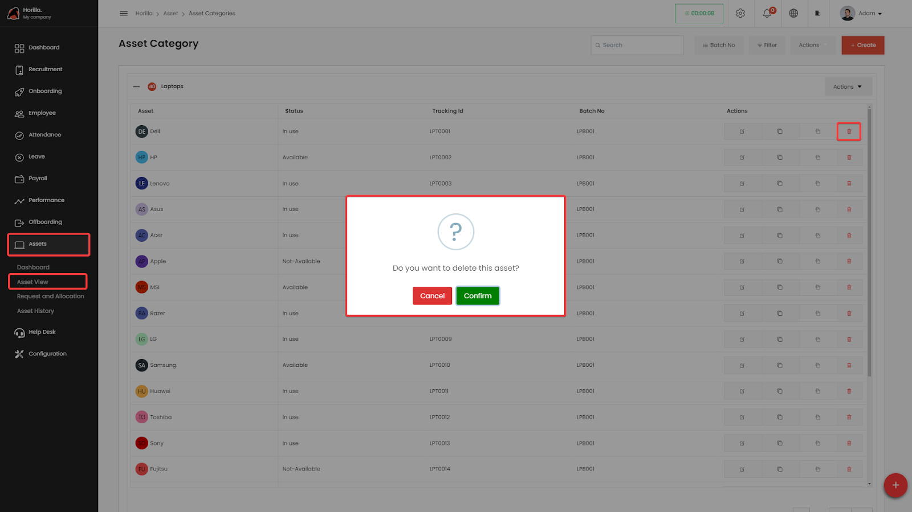

### **Deleting an Asset**

In Horilla HRMS, deleting an asset is a straightforward process, but it's subject to a crucial condition: the asset must not be in use. If the asset's status is marked as "In Use," the system will prevent deletion and display a warning message.

To delete an asset, navigate to the Assets section from the main sidebar and access the “Asset View”. Select the specific asset category that contains the asset to delete. Within the displayed table, locate the asset and click on the delete icon in the last column of the asset's row. A confirmation prompt will appear, asking to confirm or cancel the asset deletion.

If the asset is not in use and confirm the deletion, the system will successfully delete the asset. However, if the asset is currently in use, the system will display a warning message, preventing the deletion from taking place.

## Asset Request and Allocation

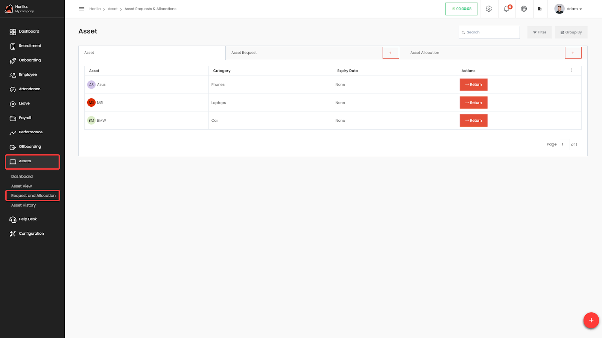
In Horilla HRMS, the Asset Request and Allocation feature is invaluable for managing asset allocation to employees and handling asset requests submitted by employees. For an admin user or a user with the necessary permissions, the Asset Request and Allocation page includes three tabs: Asset, Asset Request, and Asset Allocation. For an employee, this page contains two tabs: Asset and Asset Request.

#### **Own Asset Tab**

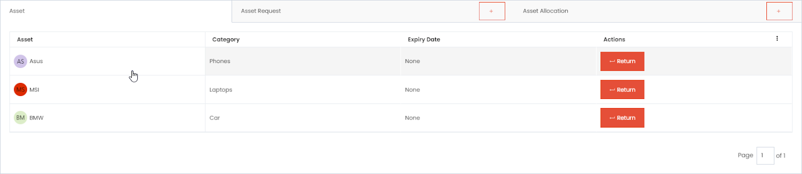

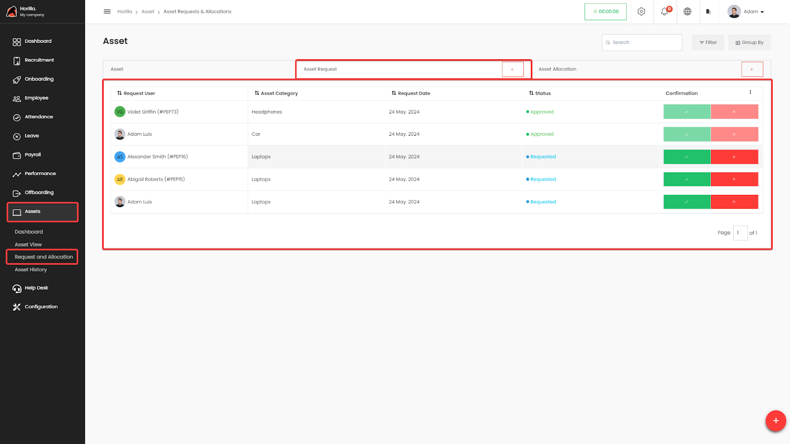

This tab displays a list of assets currently allocated to the employee. By clicking on each row, detailed information about the asset is shown. The first image illustrates the admin page, where the table includes a Return button that is used to return the asset. Clicking this button opens a pop-up box with fields for Return Status, Return Date, and Return Condition. Once the form is completed, the asset is returned to the company, and it no longer appears in the Asset tab.

The last image shows the Asset tab for a regular employee. Each row contains a Return Request button, which the employee can click to submit a return request. This action informs the admin or authorized users that the employee wishes to return the asset.

This tab contains a list of assets that the user currently owns or is responsible for managing. The user can view asset information, user can also return the asset

#### **Asset Requests**

This tab contains a list of asset requests submitted by users to either request new assets or request changes to existing ones. The admin user can view, approve, or reject these requests based on the availability and suitability of the requested assets by using the Approve and Reject buttons.

Asset requests can be created by clicking the Plus button on the Asset Request tab. This action opens a form with fields for Asset Category and Description. Select the appropriate asset category, add a description for the request, and submit the form. Once submitted, the request will appear in the list.

#### **Asset Allocation**

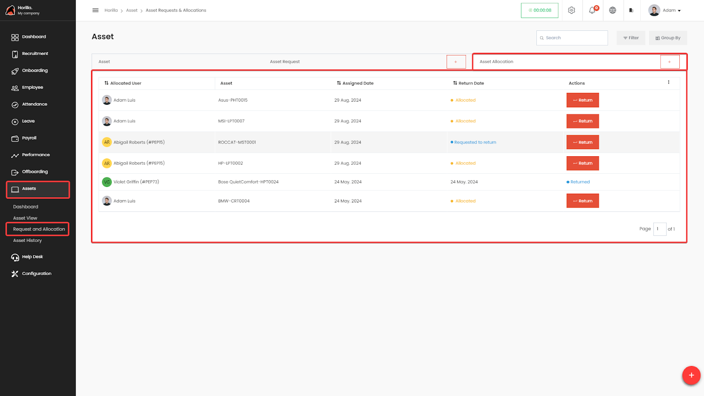

This tab contains a list of assets allocated to employees, along with the assigned date and, if asset returned, the returned date. It also includes a button to return the asset. Only admins and users with the necessary permissions can view this page.

By using the Plus button in the Asset Allocation tab, an admin user can allocate assets by filling out the form fields: Assigned To, Asset, and Assign Condition Images.

## Asset History

This view tracks the history of the asset.

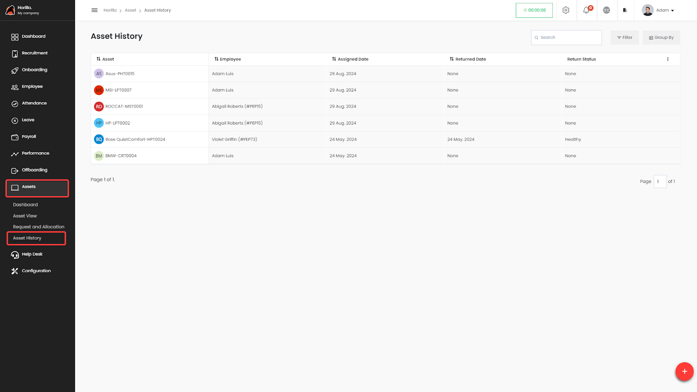

Asset history helps the users to track the assets, default returned asset filter is applied for view. By clicking on the asset, users can further details as shown in the image below. Users can filter and group and sort the results according to their needs.
