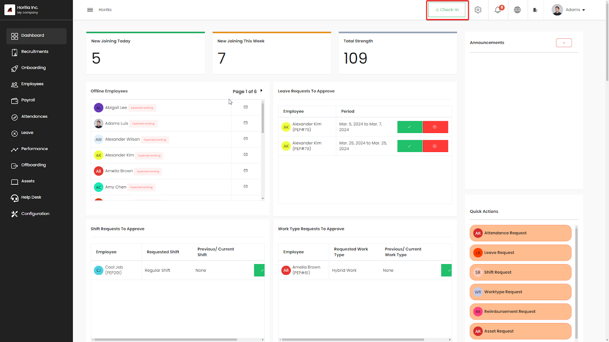
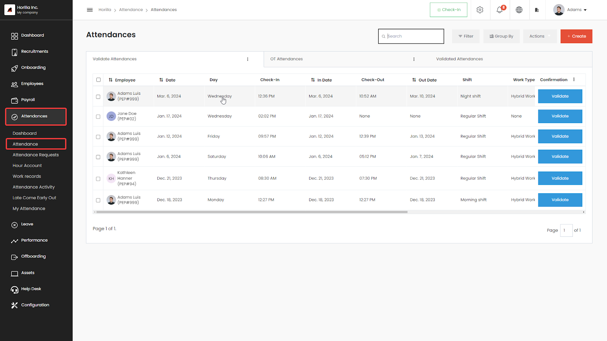
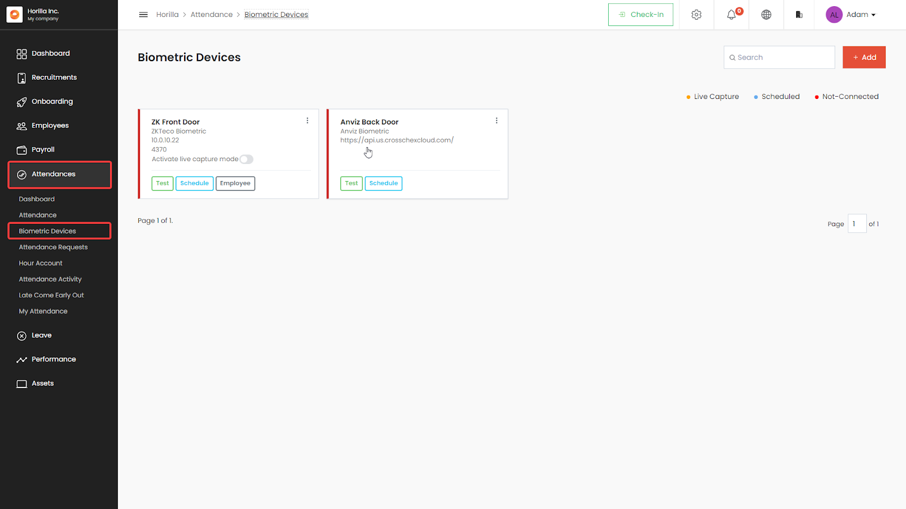
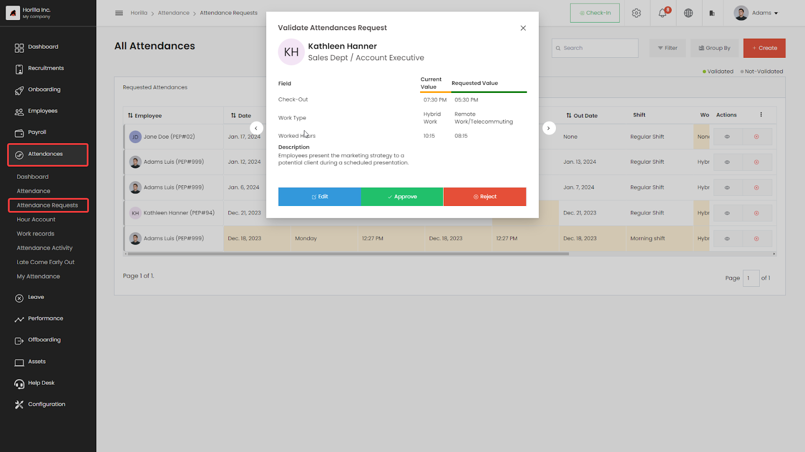
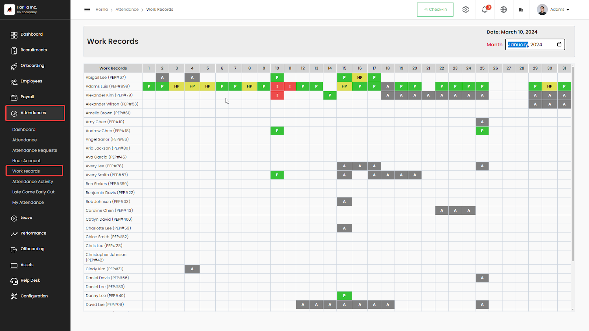
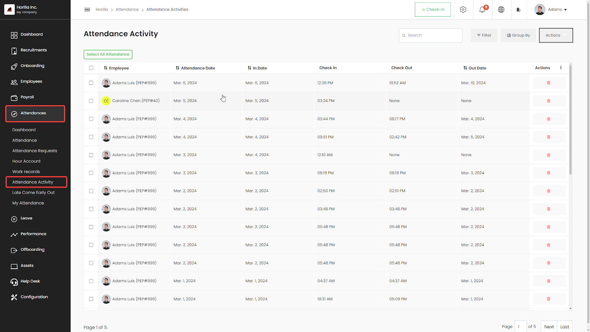
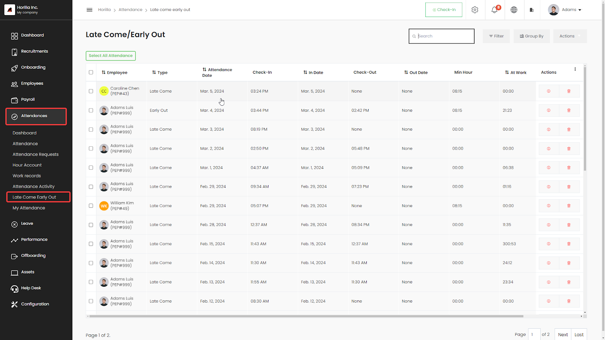
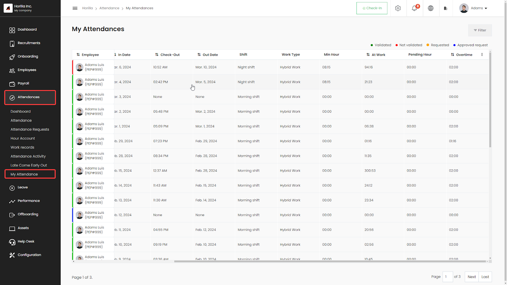

# Attendance

The [attendance module](https://www.horilla.com/features/attendance/) is the main module to track and manage employee attendance.By utilizing the attendance module, employees can seamlessly mark their attendance, incorporating the secure and accurate method of biometric attendance integration alongside the check-in/out system. The module tracks overtime and finds late comes and early outs and also allows for verification of mistake attendances like forgetting to checkout or exceeding attendance validation conditions defined in the settings and so on.

    <iframe width="840" height="500" src="https://www.youtube.com/embed/KuumiMA_1xU" title="How to Manage Attendance in Horilla | Attendance Management System in Horilla #opensource" frameborder="0" allow="accelerometer; autoplay; clipboard-write; encrypted-media; gyroscope; picture-in-picture; web-share" referrerpolicy="strict-origin-when-cross-origin" allowfullscreen></iframe>

## **Check-In Check-Out**

Check-in/out is the system that marks attendance activity, used to calculate how much duration the employee works, and from the activities, attendances are created. Which tracks all the in-out activities of the employees.  

## **Attendance View**

The attendance view manages the attendance which is not validated and the attendance that contains overtime. The attendance in the tab validate attendance is the attendance which needs to be verified may the attendance be corrupted or mistakes are there. The second tab contains the attendance that has been validated and overtime exists. Approving the overtime hour will update the attendance account of the employee. The third tab contains all the attendance which has been validated.

## **Biometric Devices**

Horilla HRMS seamlessly integrates with biometric devices to efficiently manage attendance records. Users can effortlessly connect and synchronize attendance data from popular biometric devices such as ZKTeco and Anviz. Additionally, our advanced system allows users to effortlessly add employees to the biometric devices directly through the Horilla HRMS interface. This streamlined process enhances the overall functionality and user experience, ensuring a seamless and sophisticated attendance management system for companies.  

## **Attendance Requests**

The Attendance Request feature oversees requests to edit employee attendance records. Occasionally, employees may forget to mark their attendance or need to modify data in their existing attendance records. Through the Attendance Request functionality, employees can submit requests to alter their attendance entries. This includes instances where they need to edit existing attendance or create new entries using the 'Create' option in Horilla. This advanced capability empowers employees to manage their attendance records more efficiently and accurately within the Horilla system.  

## **Hour Account**

The attendance account manages the employee contribution to the company by hour. From this view, you can track all of the employee total worked hours by month and year.

## **Work Records**

The Work Records manages employee monthly attendance data, capturing daily statuses such as present, absent, validated, half day, and half-day validated. These statuses are then compiled into monthly records.  

## **Attendance Activity**

Attendance activities are generated during check-in or checkout events, as well as when attendance is fetched from biometric devices. This page serves as a useful tool to manage all employee activities related to attendance.

## **Late Come Early Out**

Late come early out is identified by the clock-in/out system with the shift schedules for the day. If an employee mark check-in after the shift scheduled start time then the attendance will mark as late come and leave before the shift ends marked as early out

## **My Attendance**

My attendance page is used to view the previous attendance of individual employees who don’t have any access level on the attendance software module.

