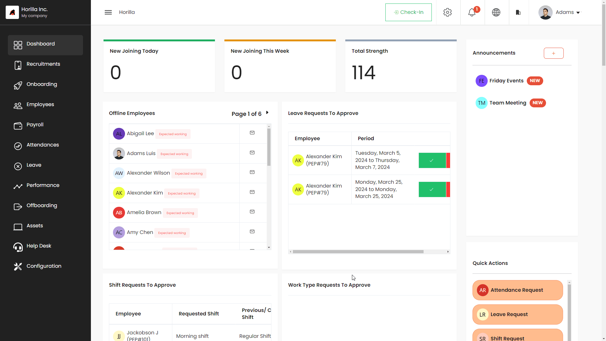

# Dashboard

Horilla HRMS redefines the HR management experience through its innovative Dashboard, strategically organized into three distinct sections, each catering to specific functionalities. 

  <iframe width="560" height="315" src="https://www.youtube.com/embed/TB4BOS8F_TQ?si=BVwjXoniwxy-NRZs" title="YouTube video player" frameborder="0" allow="accelerometer; autoplay; clipboard-write; encrypted-media; gyroscope; picture-in-picture; web-share" referrerpolicy="strict-origin-when-cross-origin" allowfullscreen></iframe>

The user-friendly interface seamlessly integrates top and side charts, sticky elements, and rearrangeable canvas cards, offering a dynamic and customizable platform for efficient workforce management.

## Top and Side Charts
At the forefront of the Horilla Dashboard are top and side charts, presenting a comprehensive overview of key metrics and performance indicators. The top charts deliver instant insights into critical HR elements, such as recruitment analytics, monthly worked hours, and leave allocation statistics. Meanwhile, the side charts offer easy navigation and quick access to various modules, ensuring that users can swiftly delve into specific aspects of HR management.

## Sticky Elements
Horilla’s Dashboard incorporates sticky elements strategically placed for quick and convenient access to essential functions. These sticky elements include options for direct email communication, quick actions like leave requests and shift changes, and an announcement feature. The sticky elements ensure that crucial functionalities are easily accessible, promoting a seamless workflow and timely decision-making for HR professionals.

## Canvas or Rearrangeable Cards
The heart of customization lies in the canvas or rearrangeable cards section of the Horilla Dashboard. This feature empowers users to tailor their Dashboard layout according to their preferences and priorities. Whether it’s tracking offline and online employees, managing leave allocations, or monitoring recruitment progress, the rearrangeable cards allow HR teams to prioritize the information that matters most. This flexible approach ensures that the Dashboard adapts to the unique needs of each organization, promoting a personalized and efficient HR management experience.

## Module Details Tracking
The Dashboard in Horilla ensures meticulous tracking of all modules, offering real-time insights into various aspects of HR management. From recruitment to onboarding, employee attendance, leave allocation, performance evaluation, offboarding, asset management, and help desk functions, the Dashboard provides a comprehensive overview for informed decision-making.

## Offline and Online Employee Tracking
Horilla’s Dashboard empowers HR professionals to monitor both offline and online employees effortlessly. This feature contributes to a holistic understanding of the workforce, allowing organizations to adapt and optimize their strategies accordingly.

## Announcement Option
The Dashboard serves as a communication hub with an announcement option, enabling HR teams to disseminate important information, updates, or company-wide communications efficiently.

## Quick Actions
With quick action buttons, users can effortlessly initiate various requests, including leave requests, shift changes, work type adjustments, and reimbursement submissions. This streamlines the process, enhancing overall productivity and responsiveness.

## Direct Email Options
For users who are not logged in, the Dashboard provides direct email options. This ensures that important notifications, such as leave requests, shift changes, or work type adjustments, reach the intended recipients promptly.

## Approve/Reject Options
The Dashboard facilitates quick decision-making by offering seamless approve/reject options for leave requests, shift changes, work type adjustments, and attendance allocations. This feature ensures that HR personnel can efficiently manage and respond to various employee requests.

## Recruitment Analytics
Included in the Dashboard is a recruitment analytics feature that provides valuable insights into the hiring process. This includes charts and metrics to help HR professionals make data-driven decisions and optimize their recruitment strategies.

## Hour Chart for Monthly Worked Hours
The Dashboard further enhances transparency by presenting an hour chart detailing the monthly worked hours of employees. This feature aids in monitoring employee performance, compliance with work-hour policies, and resource allocation.

---

In essence, Horilla’s Dashboard is a dynamic and user-friendly interface, catering to the diverse needs of HR professionals and ensuring a seamless, transparent, and efficient management experience within the organization.
