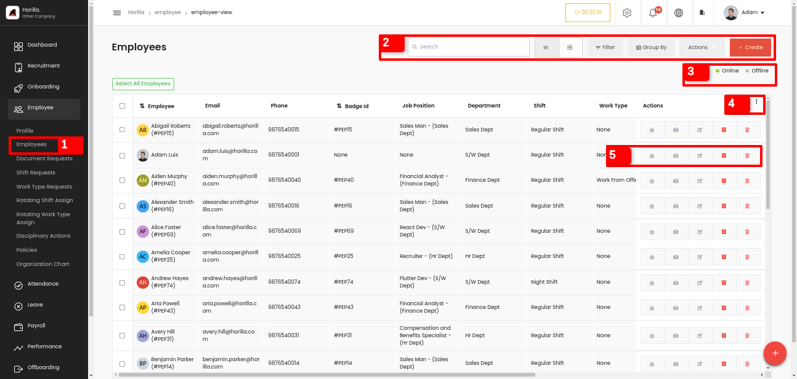
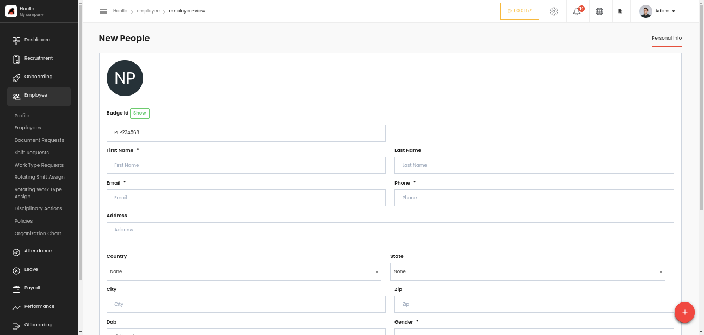
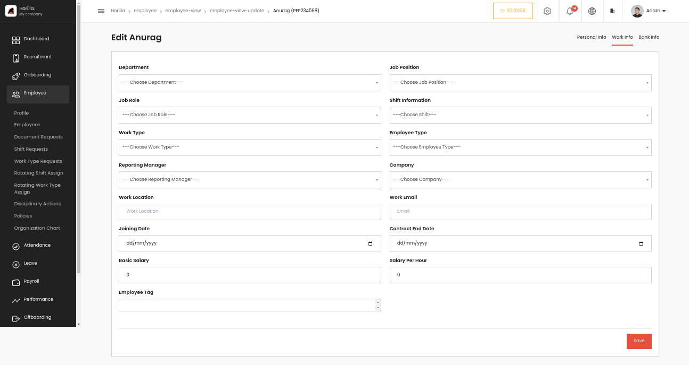
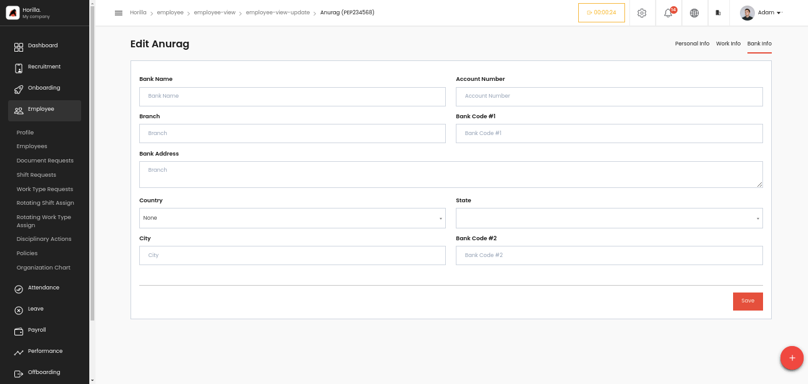
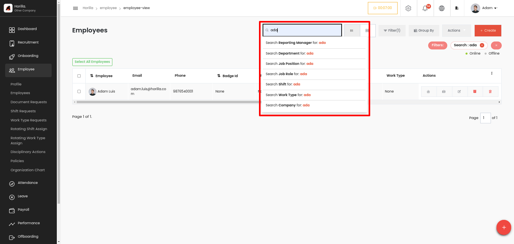
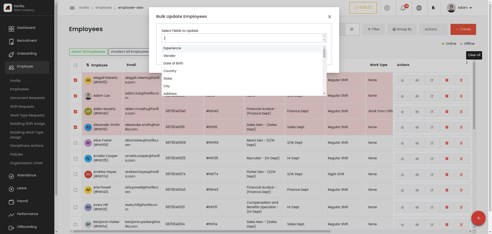
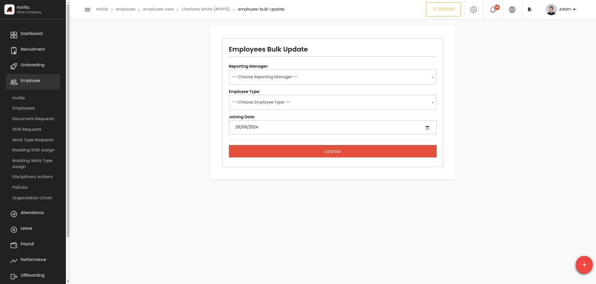
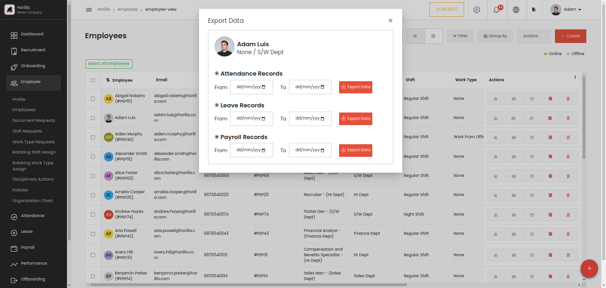
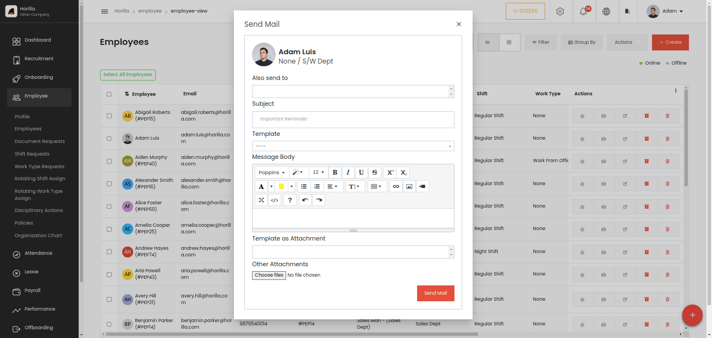
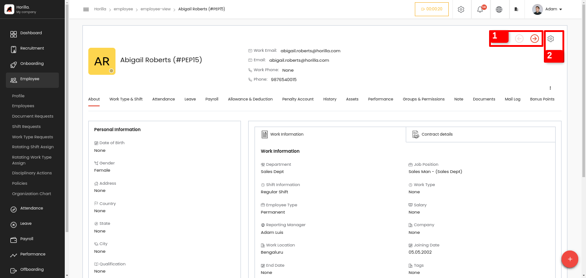

# Employee

The [employee module](https://www.horilla.com/features/employee/) allows HR professionals to manage the employee database which includes employee’s personal, bank, and work details.

    <iframe width="840" height="500" src="https://www.youtube.com/embed/0lowB3awogs" title="How to Manage Employee Database in Horilla HR Software? #opensource" frameborder="0" allow="accelerometer; autoplay; clipboard-write; encrypted-media; gyroscope; picture-in-picture; web-share" referrerpolicy="strict-origin-when-cross-origin" allowfullscreen></iframe>

---

# Employee

By clicking the Employee under the main tab Employees marked as 1 You can view the employee directory or the employee database view. There are Mainly two views available for now: card and list. From here you can view all the details of the employee’s or create an employee from here by clicking the create button.

First, we get a form to fill in all the personal details of the employee.

- **Badge ID:** Will be automatically created; every employee should have a unique badge ID.
- **First Name and Last Name:** For entering the name of the employee.
- **Email:** Email ID of the employee.
- **Phone:** Contact number of the employee.
- **Address:** Residential address of the employee.
- **Country:** The country in which the employee resides.
- **State:** The state of the employee's residence.
- **City:** The city where the employee lives.
- **Zip:** Postal or ZIP code of the employee's address.
- **DOB:** Date of birth of the employee.
- **Gender:** Gender of the employee.
- **Qualification:** Educational qualifications of the employee.
- **Experience:** The employee's work experience, typically in years.
- **Marital Status:** Marital status of the employee (e.g., Single, Married).
- **Children:** Number of children the employee has, if applicable.
- **Emergency Contact:** Phone number of the employee's emergency contact.
- **Emergency Contact Name:** Name of the emergency contact.
- **Emergency Contact Relation:** Relationship of the emergency contact to the employee (e.g., Spouse, Parent).
- **Is Active:** Indicates whether the employee is currently active in the system.  
   After submitting the personal information form the next form will appear it is for filling up the employee work information.

Let’s go through the work information form,

- **Department:** The department to which the employee belongs.
- **Job Position:** The specific job position for the employee, it will be filtered based on the selection of the Department.
- **Job Role:** The role or responsibilities associated with the employee's job position.
- **Shift Information:** Details about the employee’s work shift (e.g., Day Shift, Night Shift).
- **Work Type:** The type of work the employee performs (e.g., Full-time, Part-time, Contract).
- **Employee Type:** Classification of the employee (e.g., Permanent, Temporary).
- **Reporting Manager:** The manager to whom the employee reports.
- **Company:** The company or organizational entity the employee is part of.
- **Work Location:** The physical location or office where the employee works.
- **Work Email:** The official email address assigned to the employee for work.
- **Joining Date:** The date the employee joined the company.
- **Contract End Date:** The end date of the employee’s contract (if applicable).
- **Basic Salary:** The base salary of the employee before any allowances or deductions.
- **Salary per hour:** The hourly wage of the employee (if applicable).
- **Employee Tag:** A label or identifier that can be used to categorize or tag the employee for easy reference.  
   After submission of the above form will reach the final stage that is Bank details form.

- **Bank Name:** The name of the employee’s bank.
- **Account Number:** The bank account number of the employee.
- **Branch:** The specific branch of the bank where the account is held.
- **Bank Code \#1:** A code associated with the bank, such as the SWIFT code or routing number.
- **Bank Address:** The address of the bank branch.
- **Country:** The country where the bank is located.
- **State:** The state where the bank branch is located.
- **City:** The city where the bank branch is located.
- **Bank Code \#2:** Another code associated with the bank, such as an IBAN or another identifier (if applicable).  
   By clicking the save button after filling up the 3rd form employee will be created, we can check it in the employee view. The newly created employee will be available there.  
  The search bar section marked as 2 has something more let’s check it, and there are all options for filter, group by view etc.

In the above picture we can see more searching option in the search bar. While typing a keyword, we get more search options, such as if the searched word is present in an employee’s:

- **Reporting manager**
- **Department**
- **Job position**
- **Job role**
- **Shift**
- **Work type**
- **Company**

And will show resulted employee based on your selection.

In the Action menu there are so many options such as import, export, bulk archive, bulk unarchive, bulk update and bulk delete.We can select and have these actions for bulk-selected data. Let’s check how bulk updation is working.

- Select the employees and click the “Bulk Update” option inside the Action button dropdown menu.
- Then the form will appear shown as above, all fields of an employee will be available in that drop down menu, select the fields that we need to update bulk. _(Here I am choosing Reporting manager, Employee Type and Joining Date)._
- By selecting the fields and click the update button a new form will appear for the fields selection will look like below,

- By choosing the appropriate datas from the selected fields and click the update button, the datas will be updated bulky to the selected employees.

The quick filters marked as 3 are for quick filtration of data that contain employees who are online and offline. The Select all instance at top of the table is common in all the list views of the whole software. That button is to select all the data by a single click and the selected count is also shown beside the button after selection, and export and unselect option will also be available.

The 3 dot marked as 4 is for employee selection for which column should be visible in the table. Inside the table there are 5 actions. First one is to export the individual employee data. By clicking on the first icon we get a form like this,

- From this form, the admin can download an employee’s individual Attendance, Leave, and Payroll data by filtering with a date range and exporting it as Excel files.

And the next one is send mail, admin can send mail to employees just by clicking their corresponding mail icon.

This is the form for sending a mail to employees,

- **Also send to:** This field is a selection of the employees. If we want to send the same mail to another employee we can simply select the employee in this field. Otherwise make it blank.

- **Subject:** Subject of the mail.

- **Template:** If we set any mail templates earlier we can select it here. Mail templates can be created from the side bar go to the menu Configuration-\>Mail templates

- **Message Body:** This is the body of the mail. If you select any template the body will automatically filled up.

- **Template as Attachment:** If you want to send the same template as an attachment then select the template here it will send as pdf with the mail.

- **Other Attachments:** If we have any other attachments to send with the mail we can choose it here.

And the other buttons are update archive & unarchive and delete respectively.

We have the individual view for all employees by clicking on them. We have a profile like view there with small changes.

The major change between profile and individual view is marked in the above picture. The 2 arrow marks marked as 1 in the picture is for switching the employee's Next and Previous employees from the same view.

The next settings marked as 2 button have 2 more options one is **Edit** for editing the employee which we will get the earlier explained 3 forms Personal info, Work info and Bank info forms.

The next option in the settings menu is **Send password reset link** this one is to send the link for resting the password of the software of the user to the employee’s email address. From there the employee can reset the password.

All other sections are same as in the profile view which we disussed in the profile section.
