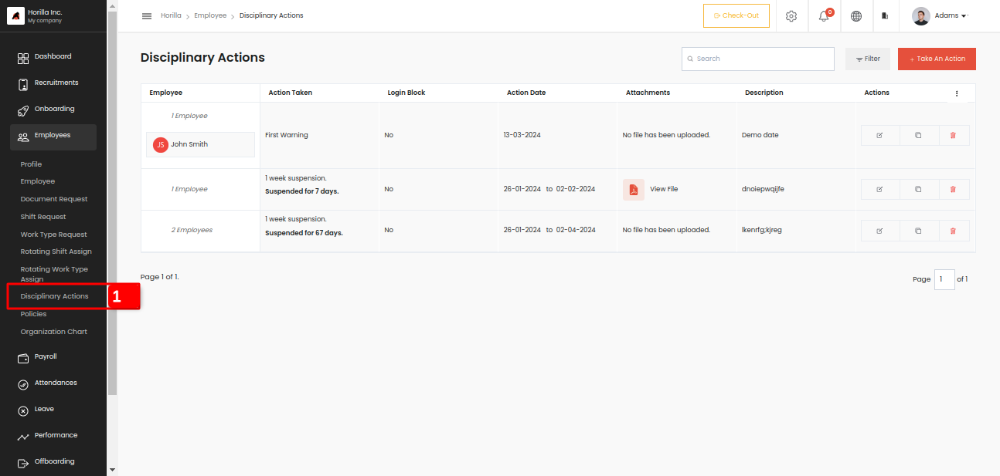
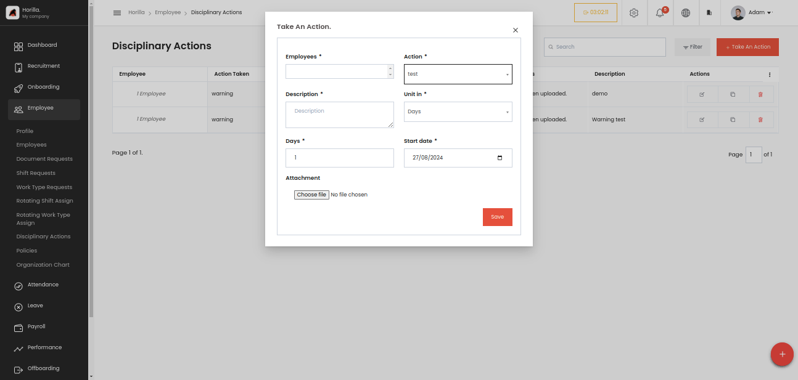

# Disciplinary Actions

Disciplinary action is used if any misbehaving or anything is done by the employee in the organization, then the admin can take actions against him like a warning, suspension or dismissal like that. So in the settings page, we need to create the action that should be taken against an employee. At that time the admin can decide if the action is taken then the employee's login needs to be blocked or not, if it is turned on a suspended or a dismissed employee's login credentials get blocked he/she cannot log in to the software for the period of the action dates. The disciplinary action can be accessed by clicking the Disciplinary action marked as 1 in the submenu of Employees. We have a tabular view that shows all the details of that action taken. In the suspension type, we have 2 options for how the suspension should be taken, can take suspension for day-based or hour-based. If the actions login is blocked is turned on then after the period based on hour or day, the blocked login will be removed automatically.

Now lets check how can we take an action against an employee. Admin can get a form by clicking on the button Take An Action in the right corner. The form will look like this,

* **Employees:** A dropdown menu where the administrator selects the employee to take action against.

* **Action:** A dropdown list where the administrator selects the type of action to be taken (e.g., suspension, dismissal). These actions are predefined in the settings page.

* **Description:** A text field where the administrator provides details or reasons for the action.

* **Unit in:** A dropdown menu where the administrator chooses whether the action will be based on "Days" or "Hours." This is relevant for actions like suspensions, where the duration is set.

* **Days:** A numeric input field to specify the number of days (or hours) the action will last. The label and functionality change depending on the selection made in the "Unit in" field.

* **Start Date:** A date picker to set the starting date for when the action should be effective.

* **Attachment:** An option to upload files (e.g., supporting documents, evidence) related to the action.

  **Additional Functionality (Background Details):**

* **Login Blocking:** When setting up actions in the settings page, administrators can determine whether the action should block the employee’s login credentials. If this option is enabled, the employee won’t be able to log into the system during the disciplinary period.  
* **Suspension Types:** The system allows two types of suspensions: day-based or hour-based. The selection made in the “Unit in” field determines the mode of suspension.  
* **Automatic Restoration:** If login blocking is enabled, the system will automatically restore the employee’s login access once the disciplinary period ends.  
  

  