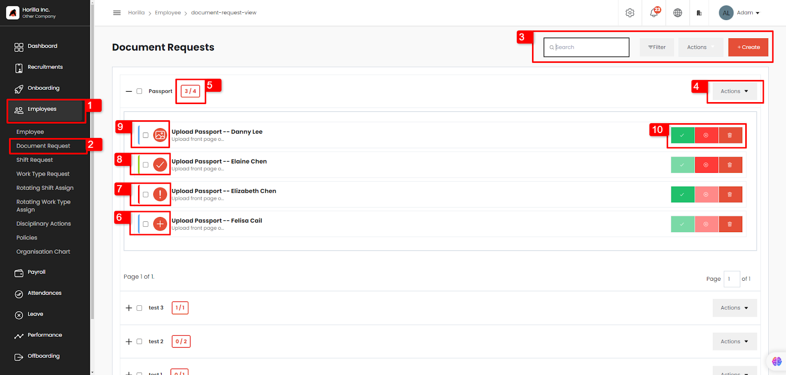
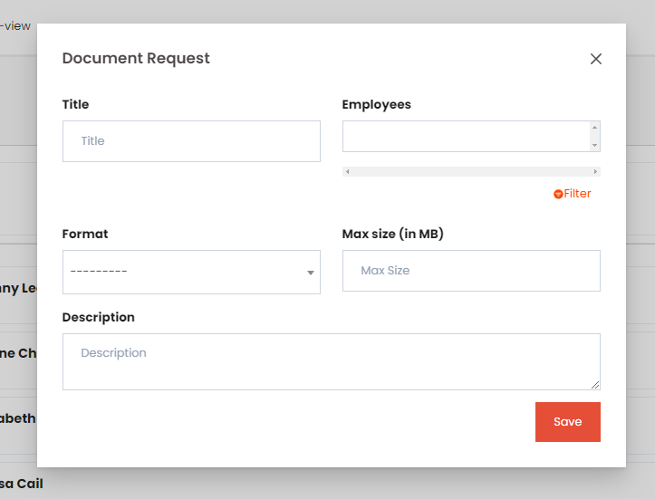
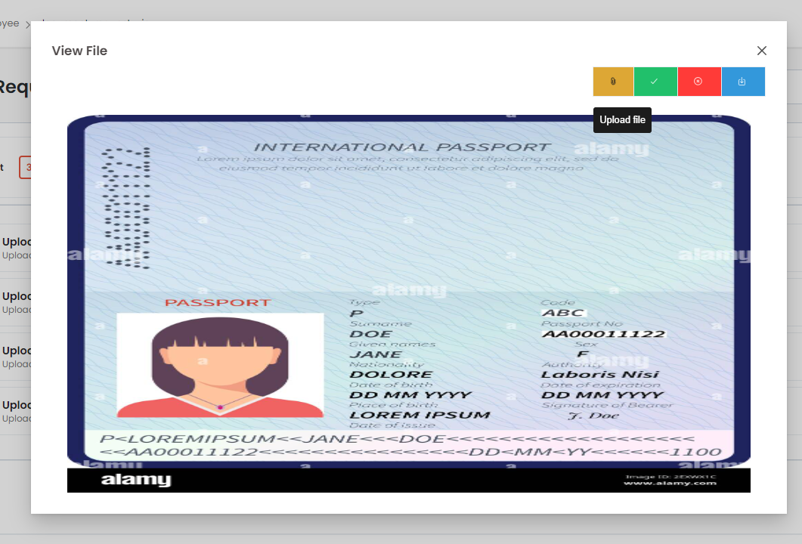
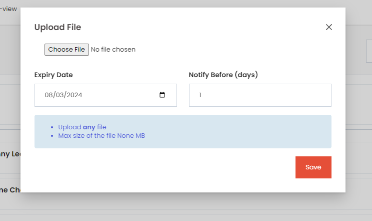

# **Document Request.**

The document request view can only be accessed by the administrators, employees with permission to view it, and the reporting managers.  
To open the document request view, click on employees (marked as 1\) → Document request (marked as 2). The image shown above shows the document request view.  
The user can search or filter the data in the view by using search and filter. The action button will show a drop-down list for bulk approving and bulk rejecting the documents.   
The user can create a document request by clicking on the create button.  

This is the form to create a document request. The fields in the title are:

* **Title:** The title of the document request.  
    
* **Employees:** The employees from the document are needed, employees can be chosen by filtering using the filter widget by clicking on the filter button near the input field.  
    
* **Format:** The format in which the document is needed. The format includes PDF, TXT, DOCX, XLSX, JPG, PNG, and JPEG. By choosing any option, the employee can upload the document in any given format.  
    
* **Max size:** The maximum size of the document an employee can upload. It is calculated in megabytes.  
    
* **Description:** The description for the document request.

By creating a document request here each employee will get a notification and they can upload the document from their profile.

The action button (marked as 4\) can be used to edit and delete the document request.

The count of total requested employees to the count of employees who uploaded the document is shown in the box near the title (marked as 5).

The buttons marked from 6 to 9 show the different stages of document upload.

The icon 6 indicates that the document needs to be uploaded, icon 9 indicates the document is uploaded and waiting for approval, icon 8 indicates approved document, and icon 7 indicates rejected document. 

The admin or the reporting managers can approve, reject, or delete the document uploaded by the employees by using the corresponding buttons.

Clicking on the document will show the preview of the document uploaded as shown below.

From this modal the managers can verify and approve or reject the document.  
The document can be re-uploaded using the ‘Upload file’ button and can be downloaded by clicking on the download button.

By clicking on icon 6 or on the upload file button a form to upload the file will be shown as below.  

From this form, employees can upload the document and if the document has any expiry date (like visa documents) expiry date can be mentioned in the field and can provide the days before the employee needs to get an expiration notification in the notify before field. The notify before field will only be available if the expiry date is set. The expiration field is optional and can be left blank for no expiration.

In each document request batch, 10 employees are shown on each page and pagination can be used for accessing others.
