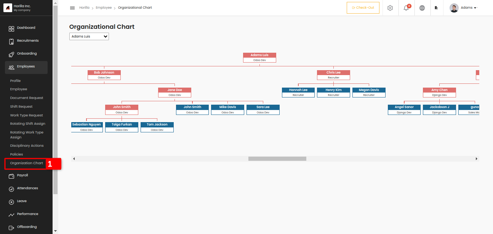

# **Organization Chart.**  

The organization chart is a simple view to see the employees who are working under. The main view can be accessed by clicking the organization chart marked as 1 in the picture. At the top of the view, there is a selection field to select the managers of the company, so by selecting the managers we can easily sort out the employees.
