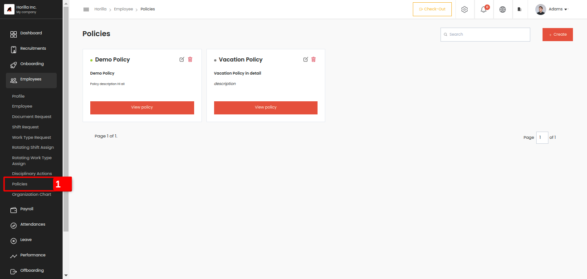
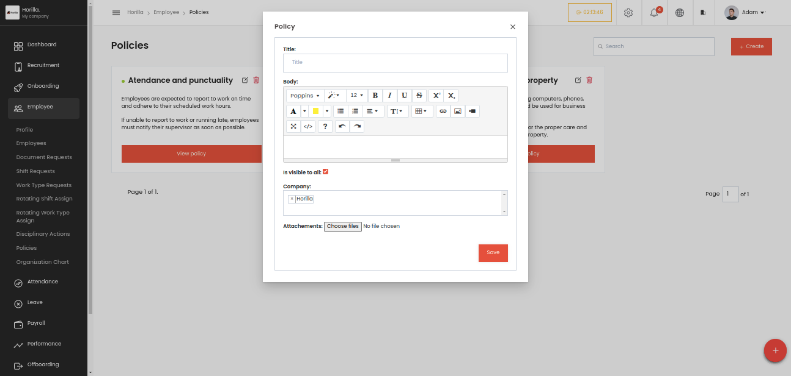

# Policies
    
    
Company policies are a set of guidelines and rules established by an organization to govern the behaviour, actions, and decision-making of its employees. These policies serve several purposes, including ensuring compliance with laws and regulations, promoting a safe and respectful work environment, protecting company assets, and maintaining consistency and fairness in organizational practices. Here the admin can create the company policies and all the employees can access this for reading purposes by clicking the Policies menu marked as 1 under the Employees menu.  
    

This is the from to create a company policy, lets go through the fields:

* **Title**:This is a text field where you input the title of the policy.

* **Body**:This is a rich-text editor where you can enter and format the content of the policy. You can change the font, size, color, and apply styles like bold, italics, underline, etc. Additional features include adding links, lists, and images.

* **Is visible to al**l:This is a checkbox option that, when selected, makes the policy visible to all employees. If unchecked, the policy might only be visible to specific users or groups.

* **Company**:This dropdown lets you select the company or organizational entity the policy applies to. In the image, the company "Horilla" is selected.

* **Attachments**:This field allows you to attach files to the policy, such as PDFs, documents, or images, that might be relevant for users.
