# Profile 
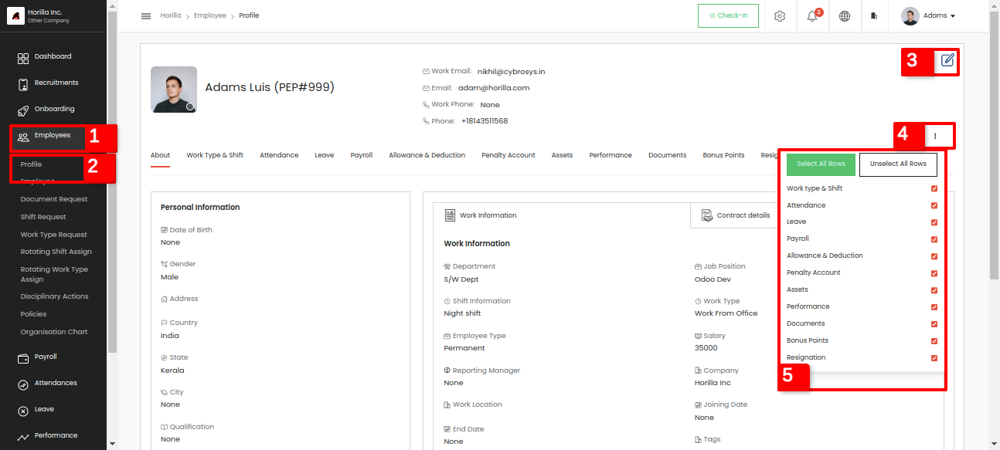

This is the first view of Horilla’s Employee section. In the above picture marked as 1 is the main section Employee module and in the sidebar marked as 2 is the profile view of an employee. Here a login user can see all the details from this view. At the right top the edit button marked as 3 will lead us to another form view for updating the employee's personal information and bank information. By clicking the 3 dots marked as 4 in the picture will appear a small tabular view of all the tabs available for employee view along with a checkbox marked as 5\. Employees can decide which tabs should appear in the profile view, if we disable the tick of a particular tab it will disappear from the view.

So let's go through the tabs. First one is the About tab for showing the employee personal, work and bank information and the contract details. Shown in the above picture.

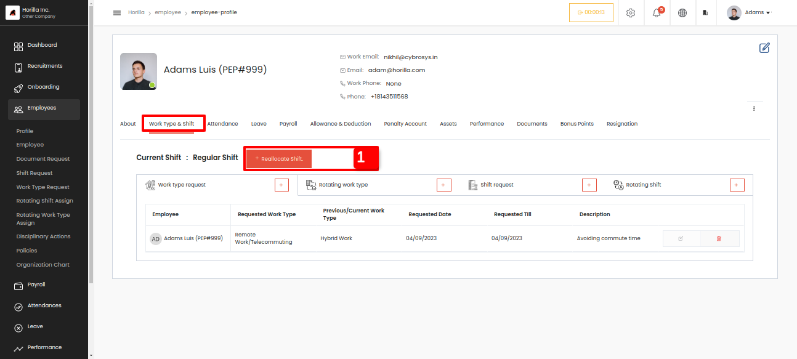

The next one is Worktype & shift. In this view an employee will get a tabular view of all his Work type requests, Rotating work type, Shift request and Rotating shift requests. From that view, employees can request for all the mentioned requests.  

There is a feature called shift reallocation for employees available inside this view. The form and the field details are explained in the Shift Request section. There is a button named “**Reallocate shift**” marked as 1 for shift reallocation, if an employee needs to change his shift for a short period he/she should reallocate the shift it means the employee should request for reallocation by including the employee who is reallocating and to which shift with the start and end date with description. Then the request will go to the reallocated employee and the admin, the reallocated employee can show some response that he is available for this shift change or not and the admin can approve or reject the request. After approval from admin both employees shift will interchange at the start date of request. 

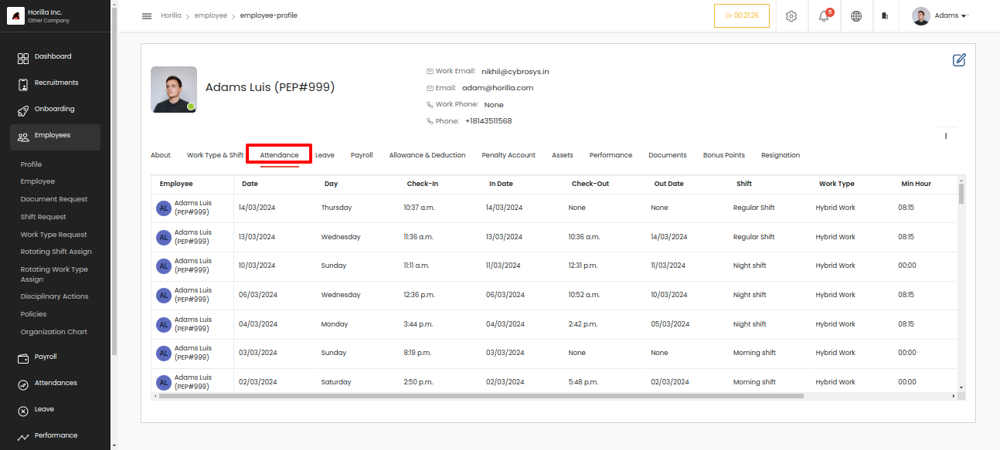

The next tab is Attendance for showing all of his attendance with all the details in a tabular view. By clicking the row it will populate individual view of that attendance.

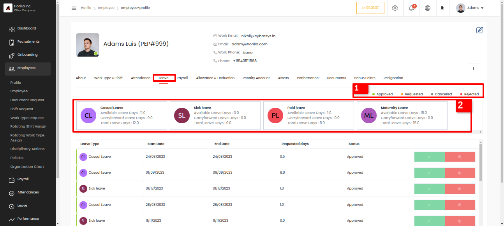

The Leave tab will give a view of all leave request details and also shows the available leave types for the employee and the employee can request for a leave from this view. At the right top the tag indicates that marked as 1 is to show the status of the requests that color given at the left side of the data row. The leave type marked as 2 is the available leave types for the employee and by clicking each user can request for leave in that leave type.

The Payroll tab shows the payslip generated for that employee. By clicking the single row it will redirect to a single detailed view of that payslip. By using the download button marked as 1 user can download the corresponding payslip in a pdf format.

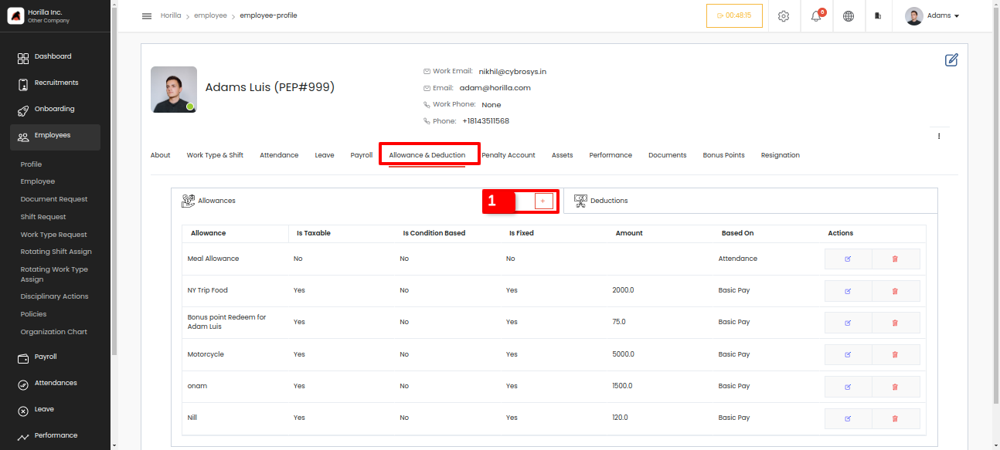

The next one is allowance & deduction which will give all allowances and deductions available for that employee and if he is an admin he can create by clicking the \+ button marked as 1  in the table.

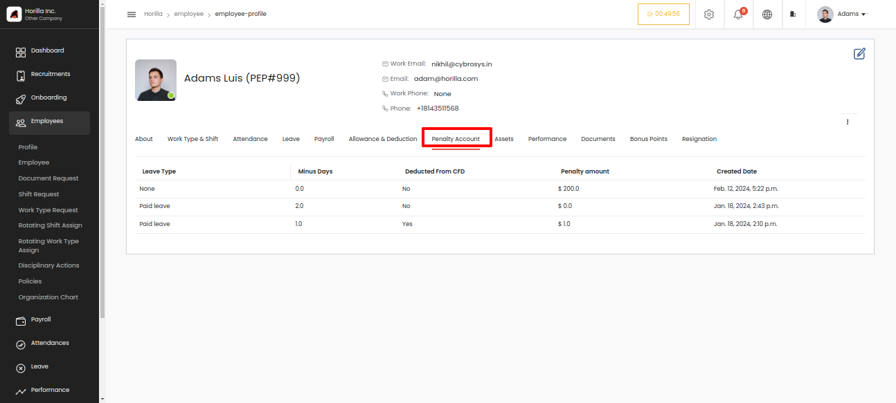

The Penalty account tab is for showing the penalty that the employee got. If the employee takes extra leaves or having LOP days then admin can add penalty by an amount or leave days , if a payslip generated is coming under the period of penalty the amount will be deducted.

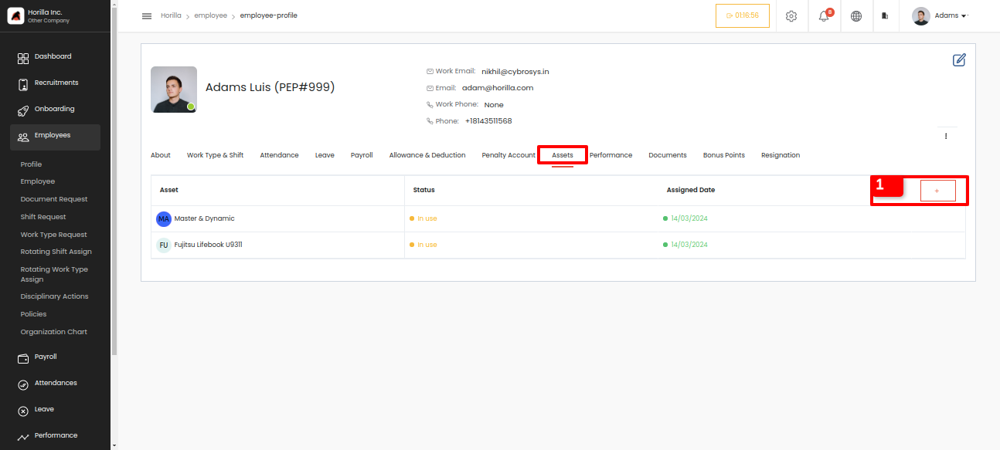

In the Asset tab will give the detailed view of the asset that the employee currently using, and from there the employee can request for a new asset by clicking the button marked as 1\. In the individual view by clicking the row there is option to return the asset.

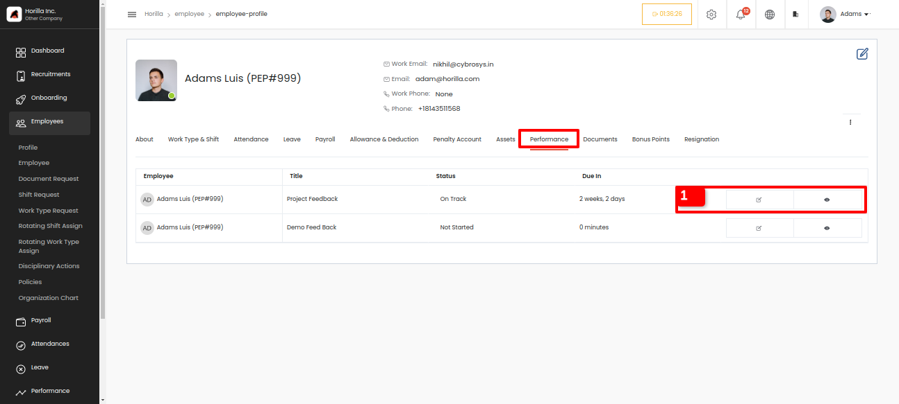

And the Performance tab is for showing the feedback that an employee is involved in. If the employees feedback is already answerd he can view the answers by clicking the eye button or is not answered user can answer by clicking the icon beside the eye button inside the data row marked as 1\.

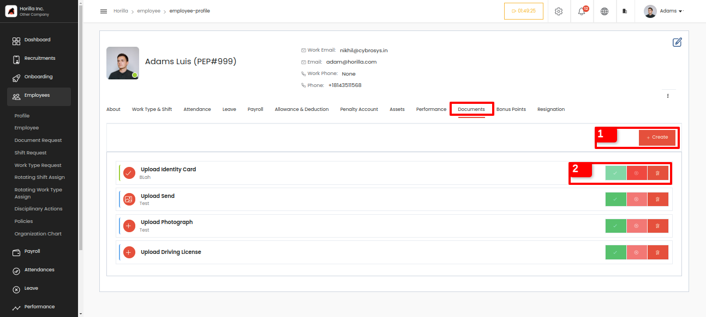

The next tab is Documents which can be used for keeping the employee documents in his profile page. Using the create button marked as 1 the user can keep his/her document in the tab. And if any document is requested by the admin the request will be visible in the tab and the user should be able to upload the file. The action buttons is visible because the employee is the admin for normal employees the buttons marked as 2 is not available. The buttons are for approve reject and delete the files that are uploaded by the employees. This will be explained in Document request section.

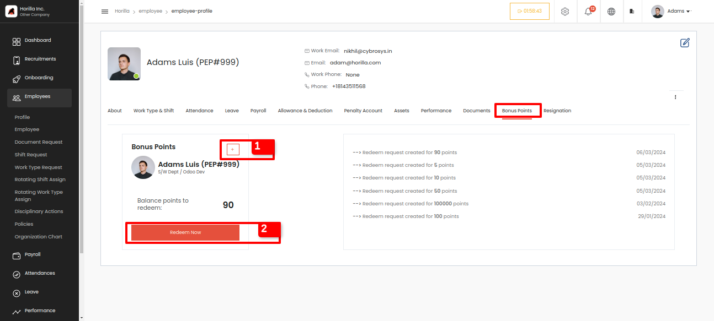

The Bonus point tab is for redeeming the bonus point that was given to the employee by his manager or admin. In the admin view, the adding button appears marked as 1 admin can add bonus points to employees by giving through the employee profiles from the employee view.

This is the form to create the employee bonus points. 

* **Points:** Add the points from here. It is a number field.  
* **Reason:** It also a description to  mention why the point given to the employee.

   Bonus points can be redeemed by clicking the Redeem Now button marked as 2 and giving the points that you want to convert. The redeemed bonus point will appear as the amount in that month's generated payslip. The bonus point per amount can be set in the settings page Settings-\>General Settings-\>Encashment Redeem Condition. 

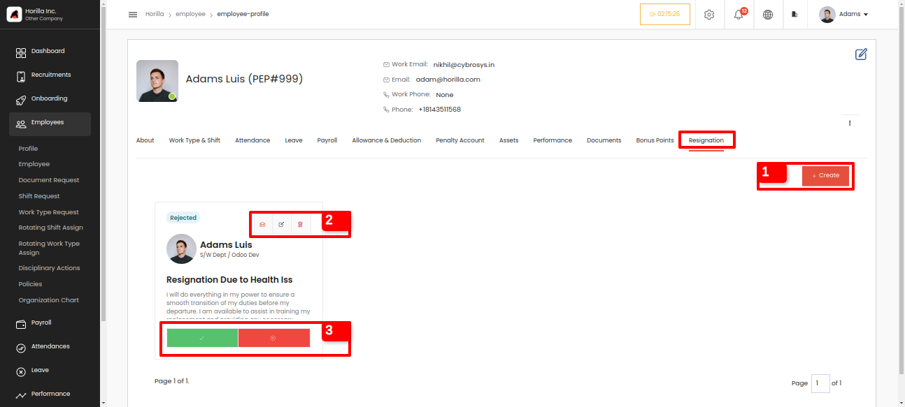

  If an employee wants to resign from the company he can request for resignation by clicking the create button marked as 1 from the Resignation tab available in the profile view. Other options are visible only for the admin view. The top of the card view marked as 2 are send mail, edit the request and delete respectively. The approve and reject are marked as 3 to approve the resignation request and to reject. If the request is approved the employee will be sent to the off-boarding section. 

  The Resignation section will only be available if the admin enables the **Resignation Request** option in the General Settings in the Settings menu.

  Let's check the resignation form, 

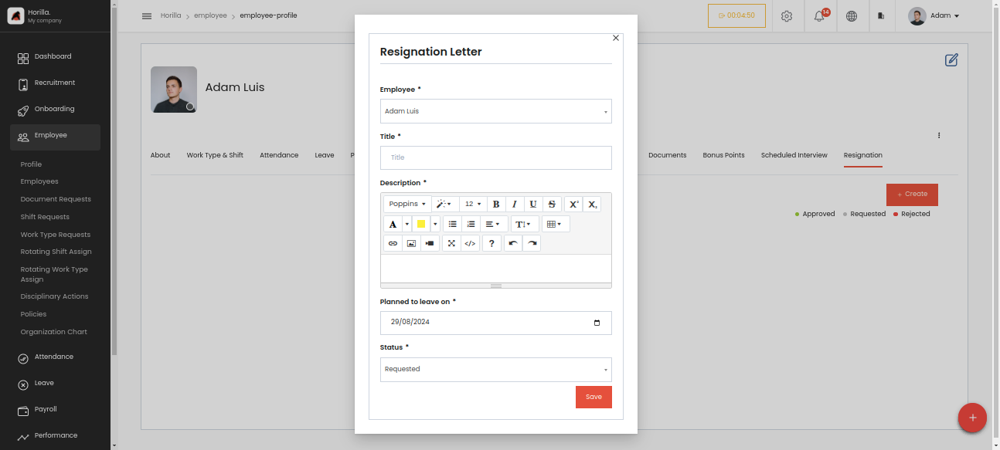

* **Employee:** The field is available because this is the admin view so all employees will be available as a dropdown, If it is a normal employee the field will not be available.  
* **Title:** To give a title to the Resignation form.  
* **Description:** Description of the Resignation.  
* **Planned to leave on:** For mention the date, which the employee planing to leave the company.  
* **Status:** This field is shown in the form because of he is the admin, admin can request, approve or reject the request from the form itself. For normal employees, this field will not be visible.
