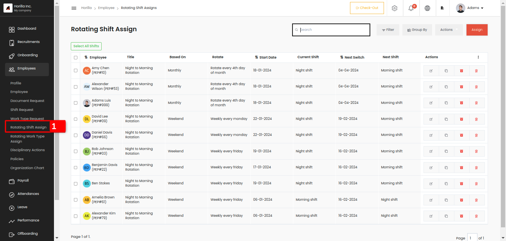
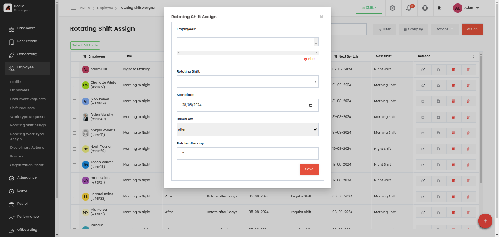

# Rotating Shift Assign
         

Rotating shift assign is used to manage the frequently changing shift information of employees. You can create rotating shift assign with some based on conditions. There are mainly three conditions after, weekend, and monthly.  
Rotating shift can easly assign to employees by clicking the assign button at the right top corner, by clicking that a form will appear.  
    
     

* **Employees:** The field is to select the employees, and it is a multi-selection field, that can select multiple employees and also by filtering.

* **Rotating Shift:** This field is used to select the work type that assign to employees. This can be created from Settings \-\> Employee \-\> Rotating Shift. First of all, we should have the shift in the same section.

* **Start date:** A date field to choose when the rotation should start.

* **Based on:** There are 3 types,   
- After: Update the shift information with fixed intervals of days  
- Weekend: Update the shift information on any weekday that you choose.  
- Monthly: Update the shift information on every date that you choose.

* **Rotate:** This field depends on the above mentioned field “Based On”.

   If the based on field is “**After**” the field will be “**Rotate after day”** and is a number field to select a value. 

   If the based on field is “**Weekend”** the field will be “**Rotate every weekend”** and is a field to select the day in a week. 

  If the based on field is “**Monthly”** the field will be “**Rotate every weekend”** and is a field to select the date in a month 

