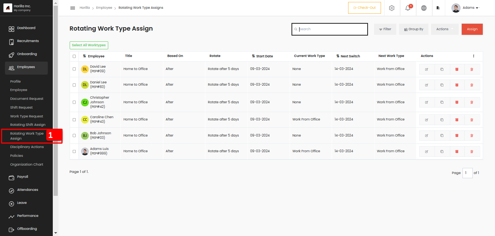
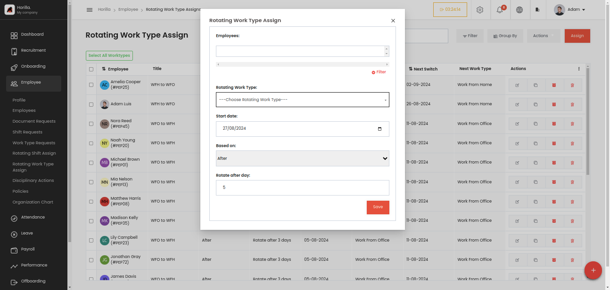

# Rotating Work Type Assign

Rotating work-type assign is used to manage the frequently changing work type like rotating shift. You can create rotating work-type assign with some based on conditions. There are mainly three conditions after, weekend, and monthly like the rotating shift assign.

Admin can assign work type to multiple employees at a time, we can go through the form, 

   

* **Employees:** The field is to select the employees, and it is a multi-selection field, that can select multiple employees and also by filtering.

* **Rotating Work Type:** This field is used to select the work type that assign to employees. This can be created from Settings \-\> Employee \-\> Rotating Work Type. First of all, we should have the work types in the same section.

* **Start date:** A date field to choose when the rotation should start.

* **Based on:** There are 3 types,   
- After: Update the work type information with fixed intervals of days  
- Weekend: Update the work type information on any weekday that you choose.  
- Monthly: Update the work type information on every date that you choose.

* **Rotate:** This field depends on the above mentioned field “Based On”.

   If the based on field is “**After**” the field will be “**Rotate after day”** and is a number field to select a value. 

   If the based on field is “**Weekend”** the field will be “**Rotate every weekend”** and is a field to select the day in a week. 

  If the based on field is “**Monthly”** the field will be “**Rotate every weekend”** and is a field to select the date in a month 
