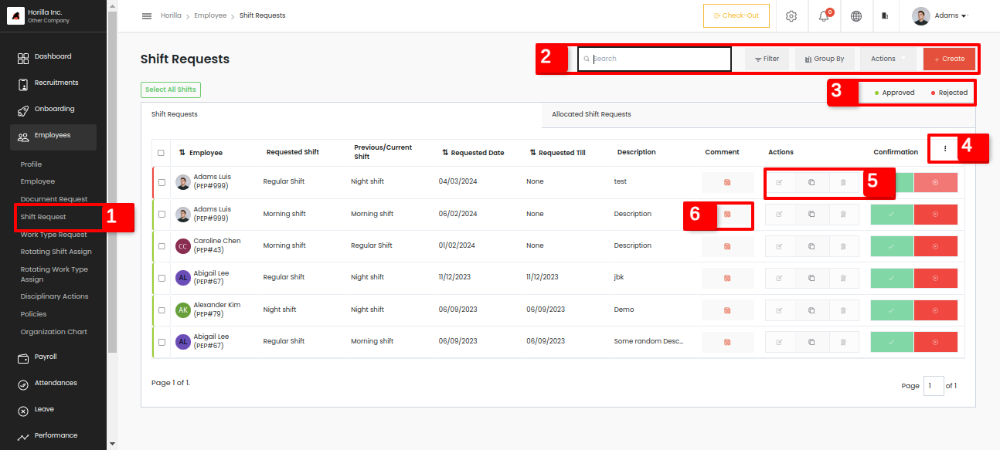
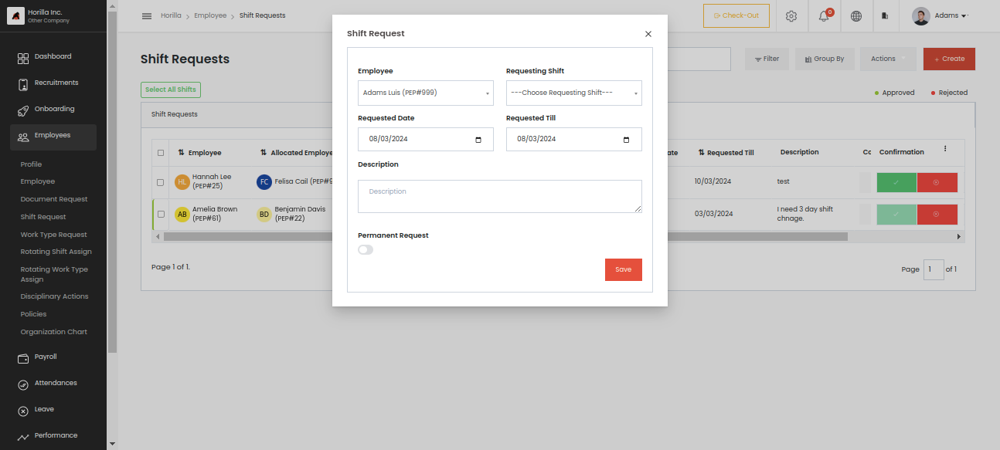
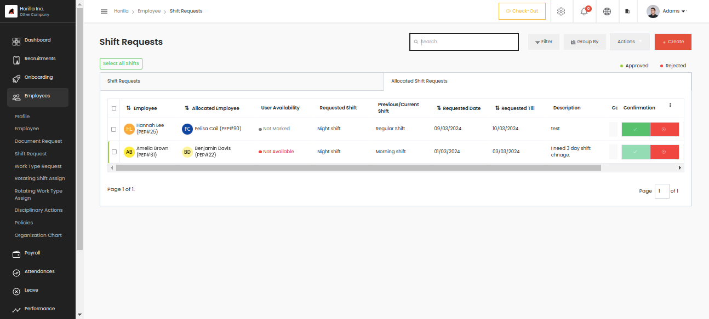
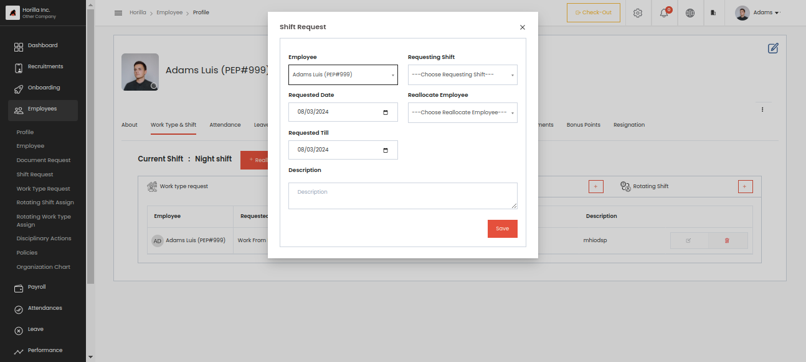

# Shift Request.
    

Shift request page can be accessed by clicking the shift request marked as 1 from the side bar under the Employee tab. Here we have a tabular view of all shift requests, for employee view it will show their own requests and for managers their subordinates request also. At the top navbar marked as 2 we have filter, group by, actions such as export, bulk approve, bulk reject and bulk delete options.  
    
Shifts are the schedules for an employee to work for a day, for example when a night shift employee needs a regular shift for a particular period then the employee can request using the Horilla feature to manage employee work information. So no need to update the details manually on the work information of the employee, shift and work type requests are automated so it will automatically update the previous shift back when the requested period ends. A manager or the administrator can approve, cancel and delete the requests. The requested employee can cancel the request if he/she wants to cancel the request. To change the employee shift on the requested day then the administrator or the manager need to approve the request first.  
    
We can create a shift request by using the create button in the same page.  
    

This is the form for a shift request. For all requests and approval corresponding notifications will be sent.  
     
* **Employees:** A dropdown menu where the administrator selects the employee. Only for admin view all employees will be available if a normal employee only sees his/her name.

* **Requesting Shift:** This field is to select the shift that the employee wants to work. Ensure that Shifts are created earlier from the settings page by the admin. Settings-\>Employee-\>Employee Shift.

* **Requested Date:** A date field to choose when the employee should start the shift.

* **Requested Till:** A date field to choose when the shift will end, it’s like the end date for the shift of the employee.

* **Description:** The description for the shift request.

* **Permanent Request:** This one is a toggle field, if the button is enabled the field **“Requested till”** will disappear from the form because it is a permanent request so there is no end date for the request.

From the table we get a clear idea about that request and have an individual view also by clicking the row. And the table heading indicating an arrow to show the alignment of sorted data. By clicking the table heading data will be aligned according to the ascending or descending order of the clicked head data. So we can simply sort the data by just clicking the heading where the arrow mark is present.

In the table we have a Comment option marked as 6 for all each request which the employee and manager can add comments under some request if they have some queries. And the 3 actions marked as 5 are used for update, duplicate and delete a request respectively. The duplicate option is to create a new element with the same data which can be simply called duplicate, by clicking the icon a form will appear along with the data of the particular request. At the top of the table there are quick filters marked as 3 available for  Approved and Rejected shift requests, by clicking that tag result will be filtered and shown. The 3 dots marked as 4 is for the employee to select which column should show in the table.

We can see the table has 2 tabs Shift Request and Allocated Shift Requests. We already discussed the reallocation of shifts from the employee profile section. The requests that are created from there will appear under this tab.

This is the request from some employees for reallocation to some shift along with an allocated employee, so the same view appears in the allocated employees' shift request. If the allocated employee is available for the shift change he can show the response by clicking the tick mark or cross mark along with the request. 

In the admin or manager side view there is an extra field in the table called User Availability which will show the response of the allocated employee as Not Marked, Available or Not Available. So the admin can approve or reject the request. If he approves the request the shifts will be interchanged between the requested employee and allocated employee at the start date. We can see the form of allocated request creation.

Employee-\> Profile-\> work type& shift there is the button for creation.

* **Employees:** A dropdown menu where the administrator selects the employee. Only for admin view all employees will be available if a normal employee only see his/her name.

* **Requesting Shift:** This field is to select the shift that the employee wants to work. Ensure that Shifts are created earlier from the settings page by the admin. Settings-\>Employee-\>Employee Shift.

* **Requested Date:** A date field to choose when the employee should start the shift.

* **Requested Till:** A date field to choose when the shift will end, it’s like the end date for the shift of the employee.

* **Reallocate Employee:** This is also a selection field of employee but is based on the field “**Requesting Shift”** in the form. Employees who are working in the selected shift will appear in this field.

* **Description:** The description for the shift allocation request.  
    
So in this form an employee should select the requesting shift and an allocated employee, along with a start and end date. After approval requested employee’s shift to allocated employee and vice-versa.  
    
    