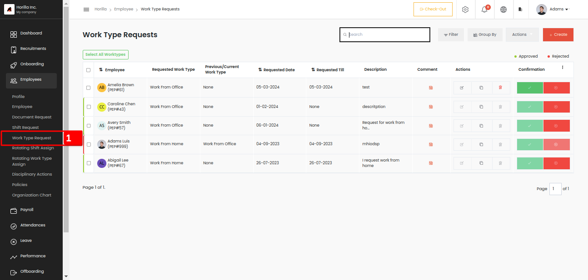
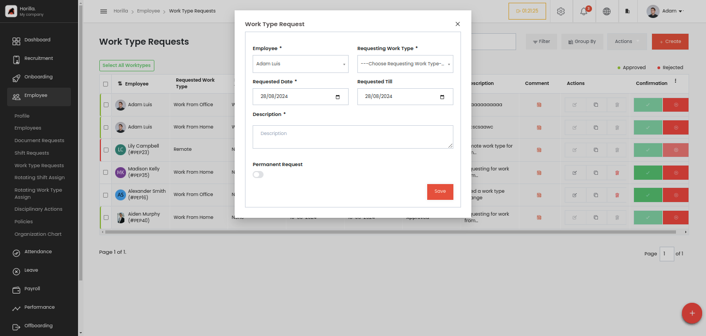

# Work Type Request
     

Employee work type request view can be accessed by clicking the work type marked as 1 under Employees view. Work types are the work nature of how the employee should work like from the office, home, etc. Similarly to the shift requests, the employee can request a different work type if he/she wants to work with a different work type for a particular period. When the period ends, the previous work type should be updated automatically.  To change the employee worktype on the requested day then the administrator or the manager need to approve the request first. Here we have all the work type request view as tabular view as the same as our shift request view. All features in the list tabular view are the same in almost all views. The 3 dots, quick filters, the actions, duplicates etc all options.  
Now let’s go through the form and fields to create a work type request,  
    
     

* **Employees:** A dropdown menu where the administrator selects the employee. Only for admin view all employees will be available if a normal employee only see his/her name.

* **Requesting Work Type:** This field is to select the work type that the employee wants to work. Ensure that Work types are created earlier from the settings page by the admin. Settings-\>Employee-\>Work Type.

* **Requested Date:** A date field to choose when the employee should start the work type.

* **Requested Till:** A date field to choose when the work type will end, it’s like the end date for the work type of the employee.

* **Description:** The description for the work type request.

* **Permanent Request:** This one is a toggle field, if the button is enabled the field **“Requested till”** will disappear from the form because it is a permanent request so there is no end date for the request.
