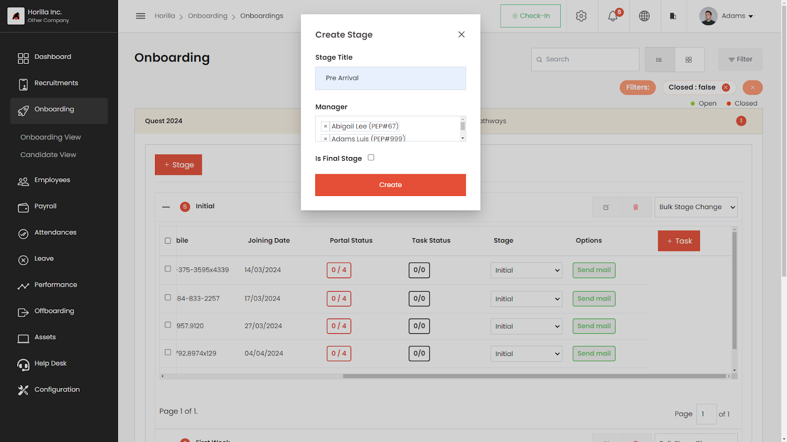
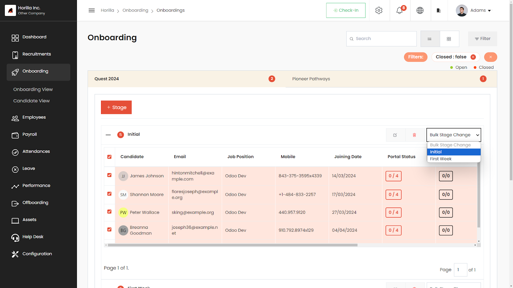
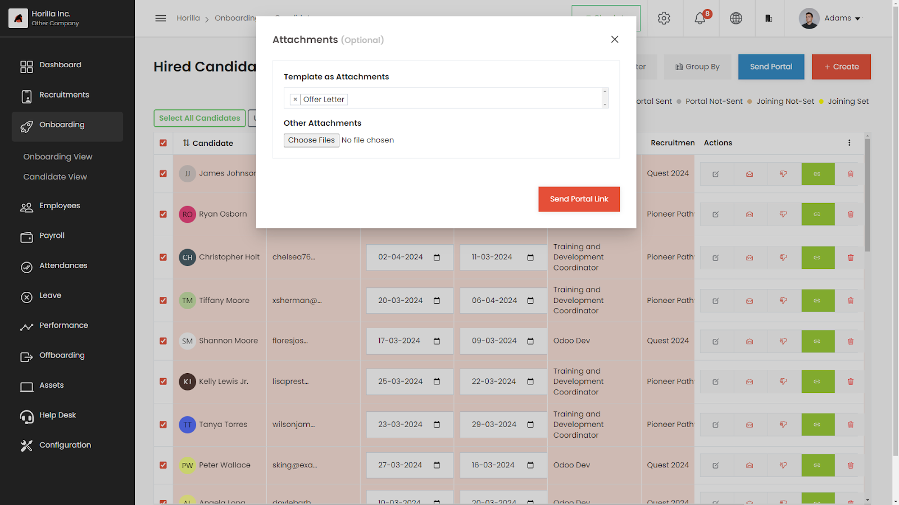
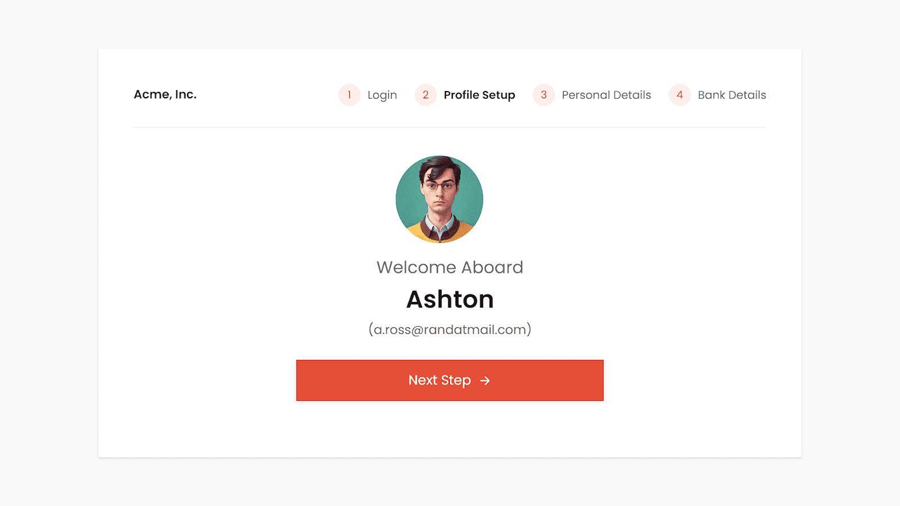
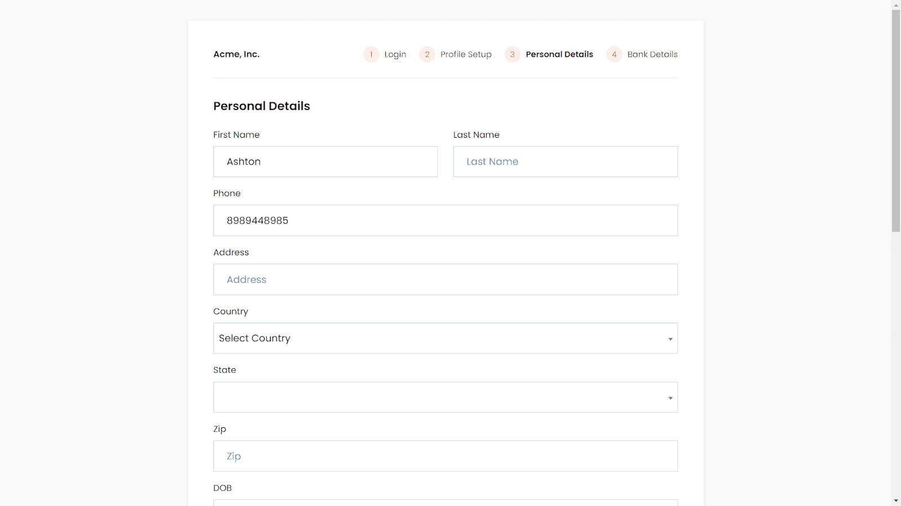
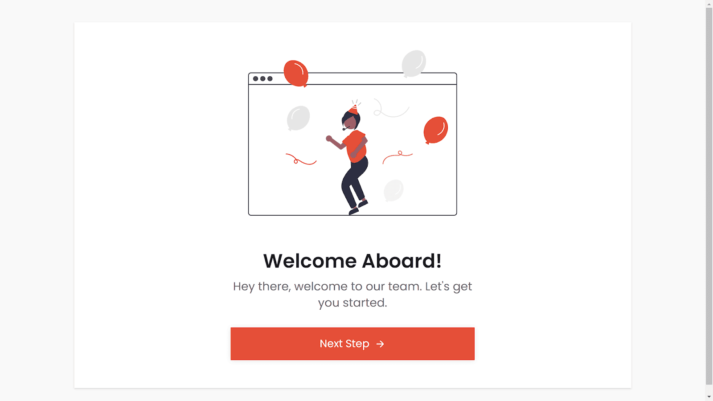

# Onboarding

Onboarding in HRMS means helping new employees fit into a company. It includes steps like pre-boarding, where they get ready before starting, orientation to learn about the company, compliance to follow rules, integration to join the team smoothly, and follow-up to make sure they’re settling in well. Onboarding is super important because it helps new employees feel comfortable, understand how things work, and feel like they’re part of the team. It’s like giving them a warm welcome and helping them get ready to do their best work for the company. Good onboarding sets the stage for a great work experience!

    <iframe width="840" height="500" src="https://www.youtube.com/embed/nIP3_0dQsCw" title="How Does Employee Onboarding Process Works in Horilla HR Software? #opensource" frameborder="0" allow="accelerometer; autoplay; clipboard-write; encrypted-media; gyroscope; picture-in-picture; web-share" referrerpolicy="strict-origin-when-cross-origin" allowfullscreen></iframe>

## **Onboarding View**

The Onboarding View is a vital part of [onboarding module](https://www.horilla.com/features/onboarding/), helping recruiters manage the process for new hires. It organizes candidates based on their onboarding stage and lists all tasks required during the process. Recruiters track each candidate's progress and ensure tasks are completed on time. They can assign tasks to team members, ensuring smooth progress. This view centralizes onboarding management, keeping recruiters organized and efficient. It ensures new hires receive a seamless onboarding experience, helping them integrate into the organization smoothly. With the Onboarding View, recruiters can efficiently guide new hires through the process, ensuring a positive start to their journey with the company.

### **Stage Create Button**

The "Stage Create" button on the onboarding view (marked as 1 on the image) lets users create new stages for managing candidates during onboarding. Users can define each stage and assign a stage manager, customizing the process to their needs. This feature simplifies candidate management, allowing for tailored organization of stages. It also centralizes all stages and associated candidates in one place, making it easy to track progress. With this button, users can efficiently design and oversee the onboarding journey, ensuring candidates move smoothly through each stage. It's a user-friendly tool that enhances organization and efficiency in managing the onboarding process for new hires.

### **Task Create Button**

The onboarding task create button (marked as 2 in the image) simplifies task management for new employee onboarding. Users can create, assign, and track tasks easily. They assign tasks to team members, set deadlines, and monitor progress. This feature centralizes all onboarding tasks, ensuring nothing falls through the cracks. It streamlines the process, preventing delays or missed steps. With this button, users have a clear overview of all tasks, making it easier to ensure everything is completed on time. It's a user-friendly tool that enhances efficiency and organization, ensuring that new employees receive a smooth and timely onboarding experience, setting them up for success within the organization.

### **Candidate stage Bulk Update**

The candidate stage bulk update feature (marked as 3 in image) allows the person overseeing candidate onboarding to update multiple candidates' stages simultaneously. This feature speeds up the onboarding process by eliminating the need to update each candidate individually. Users can select multiple candidates at once and move them to their appropriate stages, saving time and effort. It streamlines the process, making it more efficient and less time-consuming for the onboarding team. With this feature, the onboarding process becomes faster and more streamlined, ensuring that candidates progress smoothly through their onboarding journey and join the organization quickly and seamlessly.

## **Candidate View**

The candidate view in the onboarding system shows all hired candidates and their details like joining date, recruitment source, email, and job position. Users can easily access candidate info and track their progress during onboarding. It allows single or multi-selection of candidates, helpful for batch onboarding or mass communication. Once chosen, users can start the onboarding process directly from the view. This tool streamlines onboarding management, improves communication with new hires, and ensures a smooth transition for both candidates and the company. It's a convenient and efficient way to handle the onboarding process and keep everything organized.  

### **Candidate Create Button**

The candidate create button in the candidate view (marked as 2 in image) enables HR personnel to generate a candidate profile within the onboarding module. This feature is handy when the candidate's recruitment details aren't already in the [recruitment module](https://www.horilla.com/features/recruitment/). With this button, HR personnel can initiate the onboarding process for the candidate directly from the onboarding module. It simplifies the process of adding new candidates to the system and ensures that the onboarding process can begin smoothly without delays. This tool helps HR teams efficiently manage candidate information and kick-start the onboarding journey for new hires with ease.

### **Send Portal**

By clicking Send Portal (marked as 1 in image) tool kickstarts the onboarding process for new employees. Clicking the button triggers an email with the onboarding portal link to the candidate, enabling them to create their employee account. Once accessed, candidates enter the onboarding view to complete initial stages. The HR team then manages the remaining onboarding steps. This method streamlines onboarding, enhancing efficiency for both candidates and HR teams. It simplifies the process, ensuring candidates swiftly begin their onboarding journey while allowing HR to efficiently oversee and guide them through the process. Overall, it's a user-friendly and effective way to initiate and manage employee onboarding.

## **Onboarding Portal**

The onboarding portal is a digital platform companies use to help new employees start smoothly. It lets new hires do important tasks like creating their employee profile, sharing personal and bank details, and other needed info. This streamlines onboarding, easing the burden on HR from collecting all these details manually. It's the initial step for employees joining a company, offering an efficient way to handle the onboarding process. The portal makes it easier for employees to get started, ensuring a smoother transition into the company and making the onboarding process more straightforward and manageable for both the employee and the HR team.

### **User Creation**

Creating a user account with a strong password is essential for keeping it secure. A strong password should be 12-14 characters long and include uppercase and lowercase letters, numbers, and symbols. Avoid using easily guessable information and never use the same password for different accounts. Follow platform guidelines when setting up your account to ensure your password is strong. This helps protect your account from unauthorized access and keeps your personal information safe. By creating a strong password, you add an extra layer of security to your online accounts, making it harder for hackers to break in and compromise your data.

### **Profile View**

In the onboarding portal, once a user creates an account, they can see their profile information. This includes their name, email ID, job position, and profile picture. Users have the option to update their profile image to something they prefer. This feature allows users to personalize their account and make it more unique to them. By updating their profile image, users can add a personal touch to their account and make it reflect their personality or professional identity. It's a simple way for users to customize their experience within the onboarding portal and make it feel more personal to them.

### **Personal Details Creation**

Once a user creates their profile, they'll be taken to a form where they can input their personal details. This form collects necessary information like contact details, address, and other relevant data. Once all required fields are filled in correctly, an employee account is created for the user. This process ensures that the user's information is securely stored in the system and accessible for future reference. By completing the form accurately, users establish their presence within the organization's network, enabling them to access various resources and participate in company activities effectively. It's a straightforward way to initiate their involvement in the company's systems.

### **Bank Detail Creation**

After creating an employee account, the employee will be guided to complete a form containing their bank details. This step saves time for the HR department because they won’t have to gather this information manually. By entering their bank details directly into the system, employees ensure that their payment process is smooth and accurate. This digital approach streamlines administrative tasks, reducing the likelihood of errors and improving efficiency. With the bank details securely stored in the system, the HR team can proceed with payroll processing promptly, ensuring employees receive their salaries on time. It's a convenient and efficient process for all involved parties.

### **Welcome Onboard**

After submitting their bank details, the employee will receive a welcome aboard message. They'll then be directed to the employee dashboard, marking the completion of the user onboarding portal. This message serves as a warm greeting, acknowledging the employee's successful account setup and welcoming them officially to the company. The employee dashboard provides a centralized hub for accessing various resources, managing tasks, and staying updated on company news. With the onboarding portal completed, employees are fully equipped to engage with the company's systems and contribute effectively to their roles. It's a seamless transition into the organization's environment for new hires.  

