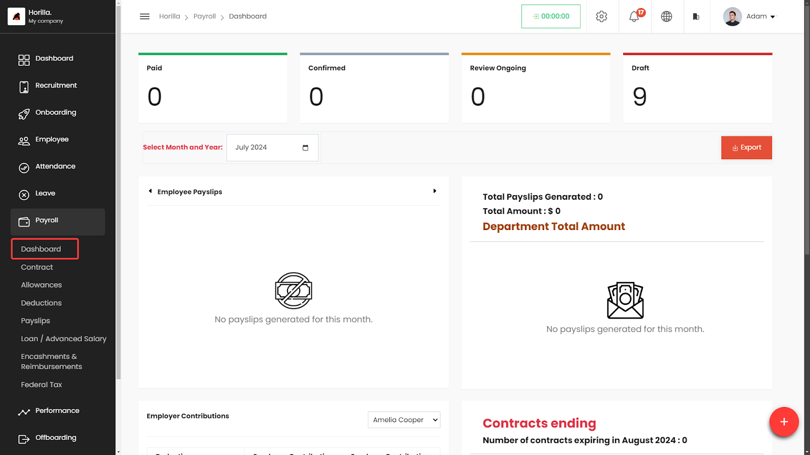

# Payroll

Horilla HRMS Software offers a comprehensive and efficient [payroll module](https://www.horilla.com/features/payroll/) within its suite of features. The payroll software module in Horilla enables businesses to effectively manage employee allowances, deductions, taxes, and the generation of accurate payslips. With Horilla’s payroll software, you can streamline your payroll processes and ensure timely and accurate salary calculations for your employees.

    <iframe width="840" height="500" src="https://www.youtube.com/embed/NOI5UGXeAFc" title="How to Manage Payroll in Horilla HRMS Software? | Open Source Payroll Management Software" frameborder="0" allow="accelerometer; autoplay; clipboard-write; encrypted-media; gyroscope; picture-in-picture; web-share" referrerpolicy="strict-origin-when-cross-origin" allowfullscreen></iframe>

## Dashboard Overview
The **Payroll Dashboard** within the HRMS provides HR professionals with a comprehensive overview of payroll activities. The dashboard displays key metrics related to payslip processing, enabling users to monitor and manage payroll status effectively.

## **Accessing the Payroll Dashboard**

- **Navigate to Payroll:**
  - On the left side menu, click on **Payroll**.
  - Select **Dashboard** from the dropdown list.
  - The Payroll Dashboard displays a summary of payroll activities in a graphical and tabular format.

## **Key Components of the Payroll Dashboard**

### **1\. Payroll Status Overview**

- **Paid:** Displays the number of payslips marked as paid for the selected month and year.
- **Confirmed:** Shows the number of confirmed payslips.
- **Review Ongoing:** Indicates the number of payslips currently under review.
- **Draft:** Displays the number of payslips saved as drafts.
- **Month and Year Selection:**
  - Use the dropdown menu to select a specific month and year to filter the payroll data displayed on the dashboard.

### **2\. Employee Payslips Graph**

- **Graph Display:**
  - A bar graph representing the status of employee payslips (Draft, Review Ongoing, Confirmed, Paid) is displayed.
  - The Y-axis represents the amount, and the X-axis employee.
  - Color coding helps distinguish between different statuses:
    - **Red:** Draft
    - **Yellow:** Review Ongoing
    - **Blue:** Confirmed
    - **Green:** Paid

### **3\. Payslip Summary**

- **Total Payslips Generated:**
  - Indicates the total number of payslips generated for the selected period.
- **Total Amount:**
  - Displays the total amount processed in payslips.
- **Department Total Amount:**
  - Breaks down the total amount by department, listing individual department totals.

### **4\. Export Option**

- **Export Button:**
  - The **Export** button allows users to download the payroll data in various formats (e.g., CSV, PDF).
  - Located at the top right of the Payroll Status Overview section.

### **5\. Employer Contributions**

- **Employee Selection:**
  - A dropdown menu to select an employee to view their specific employer contributions.
- **Contribution Summary:**
  - Displays a breakdown of contributions made by the employer for the selected employee.

## **Filtering and Exporting Data**

- **Filtering:**
  - Use the filtering options to narrow down payroll data by specific criteria such as month, year, or employee.
- **Exporting Data:**
  - Click on the **Export** button to save payroll data in your preferred format. This allows for easy reporting and record-keeping.
