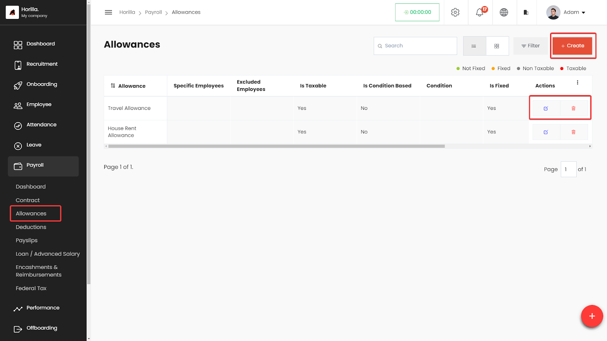
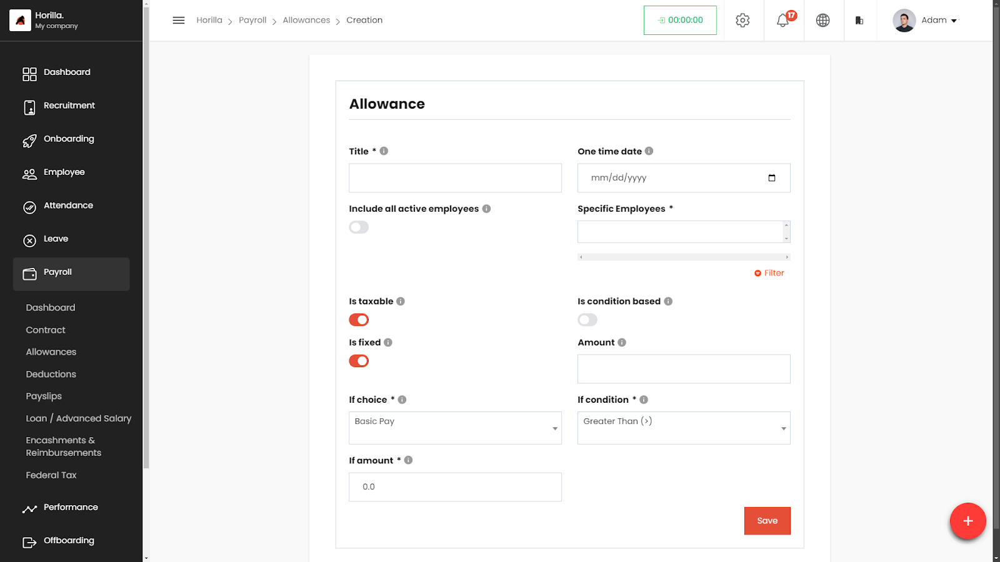

# Allowance Management
The Allowances section within the Payroll module of the HRMS enables HR professionals to manage employee allowances effectively. Users can create, view, edit, and delete allowances, ensuring all allowance-related details are accessible and organized.

## **Accessing the Allowances Section**

* **Navigate to Payroll:**  
  * On the left side menu, click on **Payroll**.  
  * Select **Allowances** from the dropdown list.  
  * The Allowances page displays a list of all allowances in a table format.

### **Working with the Allowances Table**

The Allowances table provides a detailed view of all defined allowances, with columns for:

* **Allowance:** The name of the allowance.  
* **Specific Employees:** Employees selected to receive this allowance.  
* **Excluded Employees:** Employees excluded from receiving this allowance.  
* **Is Taxable:** Indicates if the allowance is taxable.  
* **Is Condition Based:** Shows if the allowance is based on specific conditions.  
* **Condition:** The criteria used to determine eligibility for the allowance.  
* **Is Fixed:** Indicates if the allowance amount is fixed.  
* **Amount:** The monetary value of the allowance.  
* **Based On:** The attribute used for conditional allowances (e.g., Basic Pay).  
* **Actions:** Buttons to view, edit, or delete the allowance.

## **Filtering and Grouping Allowances**

* **Filter Allowances:**  
  * Click on the **Filter** button to narrow down allowances based on specific criteria like taxable status, condition, or specific employees.

## **Creating a New Allowance**

* Click on the **\+ Create** button at the top-right corner of the Allowances page.  
* Fill in the allowance details:  
  * **Title:** Enter the name of the allowance.  
  * **One-Time Date:** Set a specific date for one-time allowances, if applicable.  
  * **Include All Active Employees:** Toggle on if the allowance applies to all employees.  
  * **Specific Employees:** Select specific employees, if applicable.  
  * **Is Taxable:** Toggle on if the allowance is taxable.  
  * **Is Fixed:** Toggle on if the allowance amount is fixed.  
  * **Amount:** Enter the amount of the allowance.  
  * **If Condition Based:** Toggle on if the allowance depends on conditions.  
  * **Condition:** Select the condition and value (e.g., Basic Pay \> 5000).  
  * **Filter:** Further filter based on criteria such as department, position, etc.  
* Save the allowance by clicking the **Save** button.

## **Editing and Deleting Allowances**

* **To Edit an Allowance:**  
  * Click the **Edit** icon next to the allowance in the Actions column.  
  * Make the necessary changes and save.  
* **To Delete an Allowance:**  
  * Click the **Delete** icon next to the allowance in the Actions column.  
  * Confirm the deletion.
