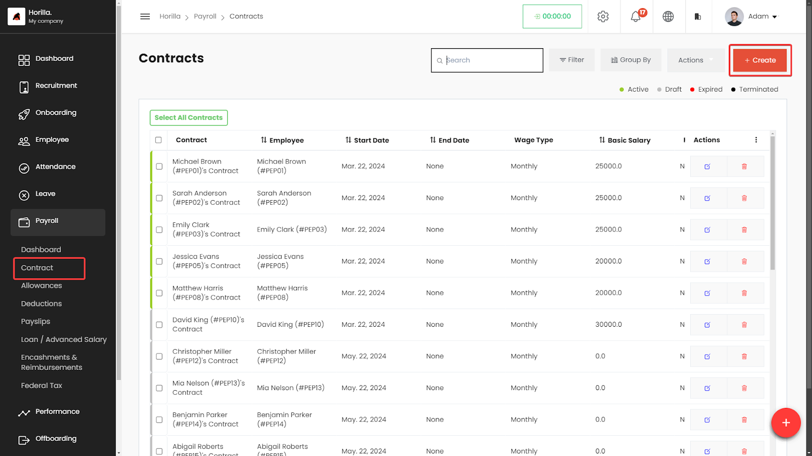
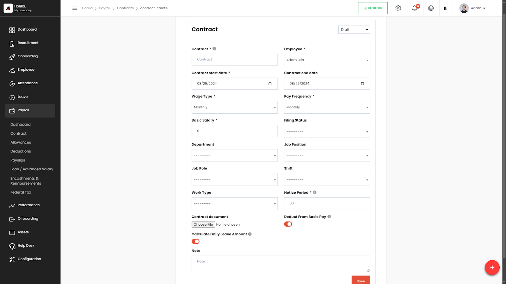

# Contracts

The **Contracts** section within the Payroll module of the HRMS allows HR professionals to manage employee contracts efficiently. Users can create, view, edit, and delete contracts, ensuring all employee contractual information is accessible and organized.

## **Accessing the Contracts Section**

* **Navigate to Payroll:**  
  * On the left side menu, click on **Payroll**.  
  * Select **Contracts** from the dropdown list.  
  * The Contracts page displays a list of all employee contracts in a table format.

### **Working with the Contracts Table**

The Contracts table provides a detailed view of all contracts, with columns for:

* **Contract**: The name and unique identifier of the contract.  
* **Employee**: The employee associated with the contract.  
* **Start Date**: The starting date of the contract.  
* **End Date**: The contract's end date, if applicable.  
* **Wage Type**: The type of wage (e.g., Monthly).  
* **Basic Salary**: The base salary defined in the contract.  
* **Filing Status**: The tax filing status for the contract.  
* **Status**: Indicates the contract's state (Active, Draft, Expired, Terminated).  
* **Actions**: Buttons to view, edit, or delete the contract.

**Filtering and Grouping Contracts**

* **Filter Contracts:**  
  * Click on the **Filter** button to narrow down the contracts based on specific criteria like employee name, start date, status, etc.  
* **Group By:**  
  * Use the **Group By** feature to organize contracts by categories like employee name, contract status, or wage type.

## **Creating a New Contract**

* **Click on the \+ Create button** at the top-right corner of the Contracts page.  
* **Fill in the contract details:**  
  * **Employee**: Select the employee.  
  * **Contract start date**: Set the start date.  
  * **Wage Type**: Choose the wage type (e.g., Monthly).  
  * **Basic Salary**: Enter the base salary.  
  * **Filing Status**: Select the filing status.  
  * Additional fields such as Department, Job Position, Work Type, etc., can also be filled in as needed.  
* **Save the contract** by clicking the **Save** button.

## **Editing and Deleting Contracts**

* **To Edit a Contract:**  
  * Click the **Edit** icon next to the contract in the Actions column.  
  * Make the necessary changes and save.  
* **To Delete a Contract:**  
  * Click the **Delete** icon next to the contract in the Actions column.  
  * Confirm the deletion.

## **Exporting Contracts**

**Exporting Individual Contracts:**

* **Select Contracts:** Select the contracts you wish to export by checking the boxes next to them.  
* **Export Button:** Once contracts are selected, an **Export** button will appear next to the **Select All** option.  
* **Export Format:** Choose the desired format (e.g., CSV, PDF).  
* **Download:** Download the file to save a copy of the contract details.

**Bulk Exporting via the Actions Menu:**

* **Bulk Status Change:**  
  * Select multiple contracts from the table.  
  * Use the **Bulk Status Change** feature in the **Actions** menu to change the status of all selected contracts at once.  
* **Export with Filter:**  
  * In the **Actions** menu, select the **Export** option.  
  * Use the filter options provided to refine which contracts to export based on specific criteria.  
  * Choose the desired format (e.g., CSV, PDF) and download the file.  
* **Bulk Deletion:**  
  * Similar to bulk status changes, contracts can be selected and deleted in bulk using the **Delete** option in the **Actions** menu.
