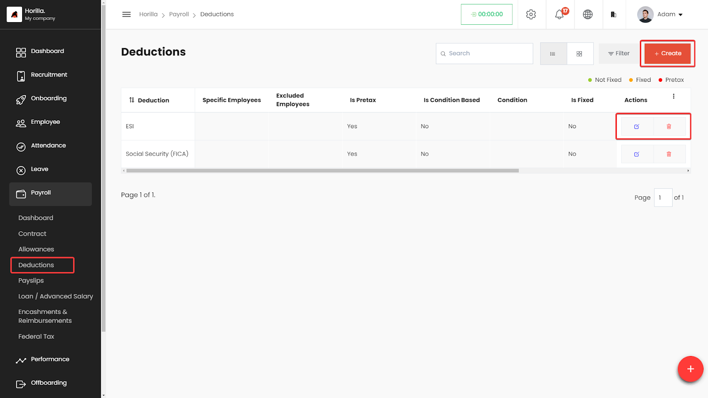
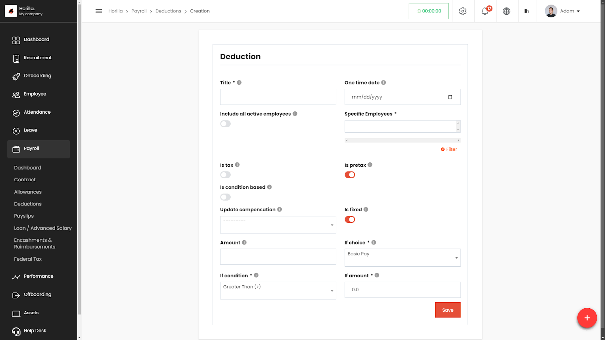

# Deduction Management

The Deductions section within the Payroll module of the HRMS allows HR professionals to manage employee deductions efficiently. Users can create, view, edit, and delete deductions, ensuring all deduction-related details are accessible and organized.

### **Accessing the Deductions Section**

* **Navigate to Payroll:**  
  * On the left side menu, click on **Payroll**.  
  * Select **Deductions** from the dropdown list.  
  * The Deductions page displays a list of all deductions in a table format.

### **Working with the Deductions Table**

The Deductions table provides a detailed view of all defined deductions, with columns for:

* **Deduction:** The name of the deduction.  
* **Specific Employees:** Employees selected to have this deduction applied.  
* **Excluded Employees:** Employees excluded from this deduction.  
* **Is Pretax:** Indicates if the deduction is applied before taxes.  
* **Is Condition Based:** Shows if the deduction is based on specific conditions.  
* **Condition:** The criteria used to determine eligibility for the deduction.  
* **Is Fixed:** Indicates if the deduction amount is fixed.  
* **Based On:** Shows whether the basic pay or gross pay.  
* **Actions:** Buttons to view, edit, or delete the deduction.

### **Filtering and Grouping Deductions**

1. **Filter Deductions:**  
   * Click on the **Filter** button to narrow down deductions based on specific criteria like pretax status, condition, or specific employees.

### **Creating a New Deduction**

* **Click on the \+ Create button** at the top-right corner of the Deductions page.  
* **Fill in the deduction details:**  
  * **Title:** Enter the name of the deduction.  
  * **One-Time Date:** Set a specific date for one-time deductions, if applicable.  
  * **Include All Active Employees:** Toggle on if the deduction applies to all employees.  
  * **Specific Employees:** Select specific employees, if applicable.  
  * **Is Tax:** Toggle on if the deduction is taxable.  
  * **Is Pretax:** Toggle on if the deduction is applied before taxes.  
  * **Is Condition Based:** Toggle on if the deduction depends on conditions.  
  * **Update Compensation:** Choose whether the deduction will update the compensation package.  
  * **Is Fixed:** Toggle on if the deduction amount is fixed.  
  * **Amount:** Enter the amount of the deduction.  
  * **If Condition Based:** Set the conditions and values (e.g., Basic Pay \> 5000).  
  * **Filter:** Further filter based on criteria such as department, position, etc.  
* **Save the deduction** by clicking the **Save** button.

### **Editing and Deleting Deductions**

* **To Edit a Deduction:**  
  * Click the **Edit** icon next to the deduction in the Actions column.  
  * Make the necessary changes and save.  
* **To Delete a Deduction:**  
  * Click the **Delete** icon next to the deduction in the Actions column.  
  * Confirm the deletion.